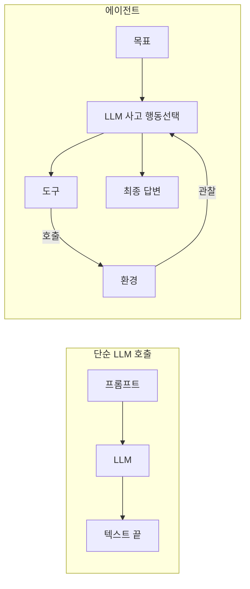
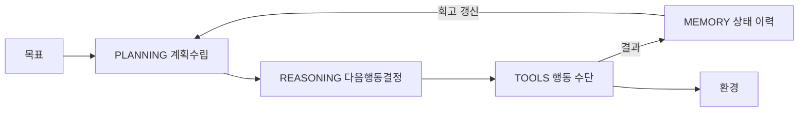
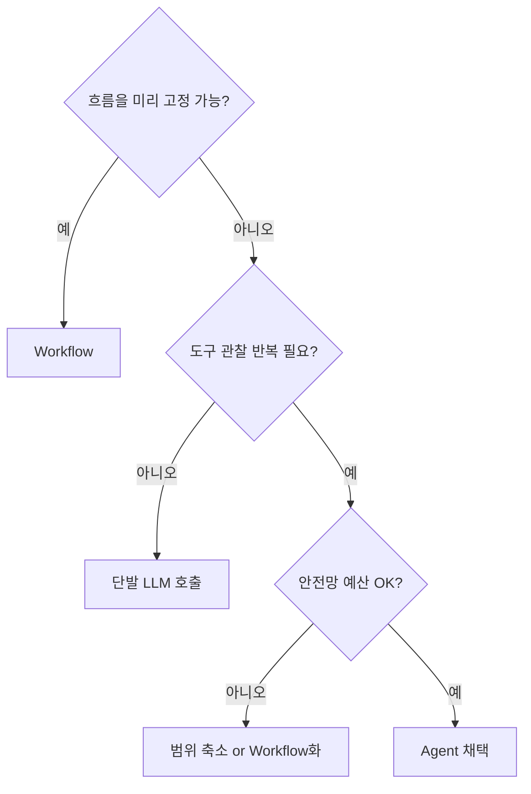

# Session 01 — AI 에이전트 개요 & 패러다임

> 대상: Python에 익숙하고 LLM API를 사용해 본 중급–고급 개발자
> 형식: 개념/이론 중심 (라이브 코딩 아님), 60–90분
> 스택: raw OpenAI/Claude API + LangChain/LangGraph

---

## 학습 목표

이 회차를 마치면 수강생은 다음을 할 수 있다.

1. **단순 LLM 호출(one-shot)과 에이전트(agent)의 근본적 차이**를 자율성·행동·환경·루프 4축으로 설명할 수 있다.
2. 에이전트의 4대 구성요소(**Reasoning – Tools – Memory – Planning**)를 구분하고 각각의 역할을 말할 수 있다.
3. Anthropic의 *"Building Effective Agents"* 관점에서 **Workflow ↔ Agent 스펙트럼**상에 임의의 시스템을 배치할 수 있다.
4. 대표 패러다임(**ReAct, Plan-and-Execute, Reflection**)의 핵심 아이디어와 차이를 개관할 수 있다.
5. 어떤 문제에 에이전트가 **적합/부적합**한지 판단 기준을 세울 수 있다.

---

## 회차 타임라인 (총 80분 기준)

| 구간 | 시간 | 내용 |
|------|------|------|
| 복습 / 오프닝 | 5분 | 과정 전체 지도, 본 회차가 차지하는 위치 |
| 개념강의 ① | 15분 | LLM 호출 vs 에이전트 (자율성/행동/환경/루프) |
| 개념강의 ② | 12분 | 4대 구성요소: Reasoning–Tools–Memory–Planning |
| 개념강의 ③ | 15분 | Workflow vs Agent 스펙트럼 (Anthropic 관점) |
| 개념강의 ④ | 13분 | 대표 패러다임 개관: ReAct / Plan-and-Execute / Reflection |
| 데모 | 10분 | 단순 체인 vs 에이전트 동작 비교 (trace 관찰) |
| 토론 | 8분 | 적합/부적합 케이스 + 토론 질문 |
| 마무리 / 예고 | 2분 | 다음 회차 예고 |

---

## 1. LLM 호출 vs 에이전트: 무엇이 다른가

대부분의 수강생은 이미 `client.chat.completions.create(...)` 같은 **단발성 호출**을 경험했다.
프롬프트를 넣으면 텍스트가 나온다. 이것은 강력하지만 본질적으로 **함수 한 번 호출**이다.

에이전트는 같은 LLM을 쓰되, ==루프 안에서 환경과 상호작용하며 스스로 다음 행동을 결정==한다.
차이를 4개의 축으로 정리한다.

| 축 | 단순 LLM 호출 | 에이전트 |
|----|---------------|----------|
| **자율성(Autonomy)** | 없음. 입력→출력 1회 | 목표만 주면 중간 단계를 스스로 결정 |
| **행동(Action)** | 텍스트 생성만 | 도구(tool) 호출로 외부 세계에 영향 |
| **환경(Environment)** | 없음(닫힌 시스템) | 검색·DB·파일·API 등 외부 상태 관찰/변경 |
| **루프(Loop)** | 단방향 1패스 | 관찰→사고→행동을 **반복**, 정지 조건까지 |

### 핵심 직관: "텍스트 생성기"에서 "의사결정 루프"로



> [!TIP] 한 줄 요약
> LLM 호출은 *함수*, 에이전트는 ==루프를 도는 프로그램==이다.
> LLM은 그 루프의 "두뇌(정책, policy)"일 뿐이다.

---

## 2. 에이전트의 4대 구성요소

에이전트를 분해하면 거의 항상 다음 4가지가 보인다.



| 구성요소 | 역할 | 예시 / 구현 형태 |
|----------|------|------------------|
| **Reasoning** | 현재 상태에서 *다음 한 수*를 정한다 (정책) | LLM 추론, chain-of-thought, tool 선택 |
| **Tools** | 외부 세계에 실제로 영향을 준다 | `web_search`, `calculator`, DB 쿼리, 코드 실행 |
| **Memory** | 과거 관찰/결정을 보존한다 | 단기: 대화 메시지 누적 / 장기: 벡터스토어, 요약 |
| **Planning** | 목표를 하위 단계로 분해·정렬한다 | Plan-and-Execute, todo 리스트, 작업 그래프 |

**관찰 포인트:** 가장 단순한 에이전트(ReAct)는 Planning을 *명시적으로* 두지 않고 Reasoning 안에 녹인다.
즉 4요소가 항상 별도 모듈로 존재하는 게 아니라, **설계 선택**이다. 이 점이 다음 절(스펙트럼)로 이어진다.

---

## 3. Workflow vs Agent 스펙트럼 (Anthropic "Building Effective Agents")

Anthropic의 *[Building Effective Agents](https://www.anthropic.com/research/building-effective-agents)*는 "agentic system"을 둘로 구분한다.

- **Workflow:** LLM과 도구를 ==미리 정해진 코드 경로==로 엮은 것. 흐름을 개발자가 고정. [[chip:info: 결정성↑]]
- **Agent:** LLM이 ==스스로 자신의 프로세스와 도구 사용을 동적으로 지휘==하는 것. 흐름을 모델이 결정. [[chip:info: 유연성↑]]

이 둘은 이분법이 아니라 **연속 스펙트럼**이다. 자율성(=흐름을 모델에 위임한 정도)이 클수록 오른쪽이다.

```
자율성 / 위임 정도 →→→→→→→→→→→→→→→→→→→→→→→→→→→→→→→→→→→→→→→→

단발 LLM 호출   Prompt Chaining   Routing   Parallel.   Orchestrator   자율 Agent
  (1 pass)      (고정 순서)       (분기)    (병렬+합성)   -Workers       (루프+자기지휘)
   |--------------|----------------|----------|-----------|--------------|
   < ----------- WORKFLOW (개발자가 흐름 통제) ----------- > < --- AGENT --- >
   결정성↑ / 예측가능 / 디버깅 쉬움 ←                  → 유연성↑ / 비용·지연↑ / 통제 어려움
```

### 대표 Workflow 패턴 (참고용 요약)

| 패턴 | 아이디어 | 적합 상황 |
|------|----------|-----------|
| Prompt chaining | 출력→다음 입력으로 직렬 연결 | 작업을 깔끔한 순차 단계로 쪼갤 수 있을 때 |
| Routing | 입력을 분류해 전용 경로로 분기 | 입력 유형이 뚜렷이 갈릴 때 |
| Parallelization | 여러 LLM 호출을 병렬→합성 | 독립 하위작업 / 다수결·검증 |
| Orchestrator-workers | 중앙 LLM이 하위작업을 동적 분배 | 하위작업 수를 미리 모를 때 |

> [!IMPORTANT] Anthropic의 실무 원칙
> "가장 단순한 해법부터. 필요할 때만 복잡도를 추가하라."
> 많은 프로덕션 문제는 ==에이전트가 아니라 잘 설계된 워크플로==로 충분하다.
> 에이전트는 유연성을 사는 대신 **지연·비용·예측불가능성**이라는 비용을 치른다.

---

## 4. 대표 패러다임 개관

세부 구현은 이후 회차에서 다루고, 여기서는 "사고의 형태"만 비교한다.

### 4-1. ReAct (Reason + Act)

생각(Thought) → 행동(Action) → 관찰(Observation)을 **한 스텝씩 인터리빙**한다.
계획을 미리 세우지 않고, 매 스텝 관찰을 보고 다음 한 수를 정한다. 가장 널리 쓰이는 기본형.

```
Thought: 수상자 정보가 필요하다
Action: web_search("2024 Nobel Prize physics winners")
Observation: ...수상자 발표, 상금 1,100만 SEK
Thought: 상금을 3으로 나눠야 한다
Action: calculator("11000000 / 3")
Observation: { result: 3666666.67 }
Thought: 답을 낼 수 있다 → 종료
```

### 4-2. Plan-and-Execute

먼저 **전체 계획(plan)**을 세우고, 그 다음 각 단계를 **순차 실행**한다.
중간에 계획을 재수립(replan)하기도 한다. 단계가 많고 방향이 흔들리기 쉬운 작업에 유리.

```
[Planner]  1) 수상자 검색  2) 상금 분배 계산  3) 결과 정리
              |
              v
[Executor] 1 실행 → 2 실행 → 3 실행  (필요 시 Planner로 되돌아가 replan)
```

### 4-3. Reflection (자기성찰)

산출물을 만든 뒤 **스스로(또는 별도 비평가 LLM이) 비판**하고 개선한다. 품질·정확성이 중요한 작업에 유효.

```
Draft  -->  Critique(자기비평)  -->  Revise  --> (만족? 아니면 반복)
```

| 패러다임 | 계획 시점 | 강점 | 약점 |
|----------|-----------|------|------|
| ReAct | 없음(매 스텝) | 단순, 반응적, 구현 쉬움 | 긴 작업에서 방향 상실 |
| Plan-and-Execute | 선행(앞에서) | 일관된 다단계 진행 | 초기 계획 오류에 취약 |
| Reflection | 산출 후 | 품질/정확도↑ | 호출 수·비용↑ |

> [!NOTE] 조합이 실무
> 이 셋은 배타적이지 않다. 실무에서는 ==Plan-and-Execute의 각 단계 안에 ReAct를, 마지막에 Reflection==을
> 끼워 넣는 식으로 조합한다.

---

## 5. 에이전트가 적합 / 부적합한 문제

| 에이전트가 **적합** | 에이전트가 **부적합** |
|---------------------|------------------------|
| 단계 수를 **미리 알 수 없는** 개방형 작업 | 입력→출력이 **결정적**이고 고정된 작업 |
| 도구·외부 환경 상호작용이 필수 | 단발 LLM 호출/규칙 코드로 충분 |
| 탐색·시행착오가 가치 있는 문제 (리서치, 디버깅) | **낮은 지연·낮은 비용·높은 예측성**이 최우선 |
| 실패 시 자기수정 여지가 있는 작업 | 한 번 실수가 치명적/비가역(되돌릴 수 없는 행동) |

### 부적합한 실무 케이스 3선 (구체 예시)

위 표의 ==**"낮은 지연·비용·예측성"**==과 ==**"한 번 실수가 비가역"**== 기준이 동시에 걸리는 영역들이다. 자율 흐름 위임이 곧 사고로 직결된다.

> [!WARNING] 에이전트에게 흐름을 위임하면 안 되는 곳
> **① 결제 승인 / 정산**
> 같은 입력에도 매번 다른 경로를 탈 수 있는 ==비결정성==과, 한 번 빠져나간 돈은 되돌리기 어려운 ==비가역성==이 동시에 치명적이다. 흐름은 결정적 코드로 고정하고, LLM은 분류·요약 등 보조 역할로 제한하라.
>
> **② 법적 문서 자동 제출**
> 잘못된 서류가 접수되는 순간 법적 책임이 발생하고 철회가 어렵다. 모델의 환각 한 번이 ==되돌릴 수 없는 제출==로 이어지므로, 제출 직전 반드시 사람 승인(human-in-the-loop)을 둬야 한다.
>
> **③ 운영 인프라의 비가역 변경 (프로덕션 DB 삭제 등)**
> `DROP TABLE`, 리소스 삭제처럼 ==한 번의 실수가 복구 불가==한 작업은 자율 도구 호출 범위에서 제외한다. 예측성이 최우선인 영역이며, 에이전트의 "유연성"은 여기서 순수한 위험으로 바뀐다.

**의사결정 체크리스트(강의 중 함께 풀기):**

1. 흐름을 코드로 미리 고정할 수 있는가? → **예면 Workflow**
2. 외부 도구/관찰이 반복적으로 필요한가? → 예면 에이전트 후보
3. 유연성의 대가(비용·지연·통제불가)를 감당할 수 있는가? → 아니면 범위를 좁혀라
4. 모델이 틀렸을 때 안전망(검증·승인·롤백)이 있는가?



---

## 6. 데모 워크스루 — 단순 체인 vs 에이전트 비교

> 표준 시나리오(이후 모든 회차 공통, demo-task-spec 기준):
> **"2024년 노벨 물리학상 수상자가 누구이고, 그 사람들 수가 받은 상금을 3으로 나누면 얼마야?"**
> 표준 도구: `web_search(query)` → 결과 스니펫 리스트 / `calculator(expression)` → `{result}`

### 6-1. 단순 체인 (Workflow) 으로 풀면

흐름을 개발자가 **고정**한다. 모델은 정해진 칸만 채운다.

```python
# 의사코드 — 고정 파이프라인 (라이브 실행 아님, 개념용)
hits   = web_search("2024 Nobel Prize physics winners")  # 1) 개발자가 검색을 강제
names  = llm_extract_winners(hits)                        # 2) 수상자 추출
share  = calculator("11000000 / 3")                      # 3) 상금 분배 강제 (mock 상금)
answer = llm_summarize(names, share)                      # 4) 정리
```

- 장점: 예측 가능, 디버깅 쉬움, 저렴.
- 한계: 사용자가 "수상 이유도 설명해줘" "수상자 국적별로 나눠줘"를 추가로 요구하면
  **파이프라인을 다시 코딩**해야 한다. 단계 수가 입력에 따라 달라지는 순간 워크플로는 깨진다.

### 6-2. 에이전트로 풀면 (관찰할 trace)

목표만 주면 모델이 **필요한 도구를 스스로, 필요한 횟수만큼** 호출한다.

```
[USER] 2024년 노벨 물리학상 수상자가 누구이고, 그 상금을 3으로 나누면 얼마야?

step1  Thought: 먼저 수상자를 알아야 한다
       Action : web_search("2024 Nobel Prize physics winners")
       Obs    : [{title:"...", snippet:"수상자 발표 ... 상금 1,100만 SEK", url:"..."}]

step2  Thought: 스니펫에서 수상자 파악 완료. 상금 1,100만을 3으로 나눠야 한다
       Action : calculator("11000000 / 3")
       Obs    : { result: 3666666.67 }

step3  Thought: 수상자 + 분배액 모두 확보 → 최종 답변 생성 (도구 호출 없음 → 종료)
       Final  : 2024년 노벨 물리학상 수상자는 ...이며, 상금 1,100만 SEK를
                3으로 나누면 약 3,666,667 SEK입니다.
```

**데모에서 짚을 점**

- 체인은 step 수가 **코드에 박혀** 있었지만, 에이전트는 step1의 검색 결과를 보고 나서야
  step2의 계산식을 만들 수 있었다 → 흐름을 모델이 결정 (자율성).
- 매 step의 Observation이 다음 Thought의 입력 → **루프**가 핵심.
- 동일 도구(`web_search`, `calculator`)를 쓰지만 *언제·몇 번* 부를지는 모델이 결정.
- 비용: 에이전트는 LLM 호출이 step 수만큼 늘어난다 → "유연성의 가격".

| 비교 항목 | 단순 체인 | 에이전트 |
|-----------|-----------|----------|
| 도구 호출 횟수 결정 | 개발자(고정) | 모델(동적) |
| 새 요구("이유 설명 추가") 대응 | 재코딩 필요 | 그대로 처리 |
| LLM 호출 수 / 비용 | 적음·예측가능 | 많음·가변 |
| 디버깅 난이도 | 쉬움 | 어려움(trace 필수) |

---

## 토론 질문

1. 여러분이 최근 만든 LLM 기능 중 하나를 골라, **§3 스펙트럼 어디**에 위치하는지 말해보자. 굳이 에이전트가 아니어도 됐을 것 같은 것은?
2. ReAct는 계획을 미리 세우지 않는다. **장점이자 약점**이 되는 구체적 작업 예를 각각 들어보자.
3. "에이전트는 비싸고 느리고 예측 불가능하다"는 비용을 감수할 만한 **여러분 도메인의 문제**는 무엇인가?
4. 단계 수가 입력에 따라 달라지는 문제를 만났을 때, 그래도 워크플로로 강제하는 게 나은 경우가 있을까? (안전·규제 관점)
5. Reflection을 넣으면 품질은 오르지만 호출 수가 는다. **언제** 그 트레이드오프가 정당화되는가?

---

## ✅ 학습 결과 체크리스트

오늘 세션을 마치면 다음을 할 수 있어야 합니다.

- ✅ 단발 LLM 호출과 에이전트를 **자율성·행동·환경·루프 4축**으로 구분해 설명할 수 있다
- ✅ 에이전트의 **4대 구성요소(Reasoning–Tools–Memory–Planning)**를 말할 수 있다
- ✅ 임의의 시스템을 **Workflow↔Agent 스펙트럼** 위에 배치할 수 있다
- ✅ 어떤 문제에 에이전트가 **부적합한지 판단 기준**을 댈 수 있다

---

## 다음 시간 예고

다음 회차에서는 에이전트의 심장인 **Tool Use / Function Calling**을 해부한다.
도구 스키마 설계부터 raw API로 에이전트 루프를 직접 `while`로 구현하며, "프레임워크는 이 루프를 감싼 것"임을 확인한다.

---

## 강사 노트 (흔한 오해 / 질문 대비)

- **오해 1: "에이전트 = 더 똑똑한 LLM".**
  아니다. 같은 모델이라도 에이전트는 *루프 + 도구 + 메모리*라는 **시스템 설계**다. 모델 성능이 아니라 *흐름의 위임*이 본질임을 강조하라. ("LLM은 루프의 정책일 뿐")

- **오해 2: "무조건 에이전트가 우월하다".**
  Anthropic의 권고를 반복하라 — *가장 단순한 해법부터*. 프로덕션 다수는 워크플로로 충분하며, 에이전트는 비용·지연·예측불가의 대가를 치른다. 적합성 판단(§5)이 실력이다.

- **자주 나오는 질문: "ReAct / Plan-and-Execute / Reflection 중 뭘 써야 하나요?"**
  "작업 성격에 따라 다르고, 실무에선 **조합**한다"가 정답. 짧고 반응적이면 ReAct, 다단계면 Plan-and-Execute, 품질 critical이면 Reflection을 얹는다고 안내하라. 이 회차는 *선택지 인지*가 목표이고, 깊은 구현은 후속 회차임을 명확히.
