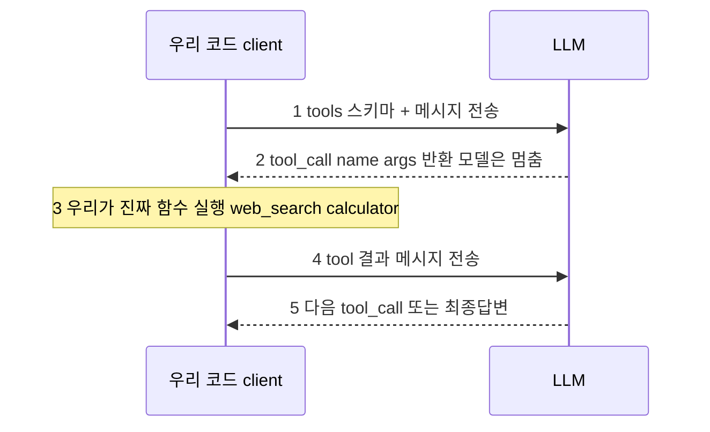
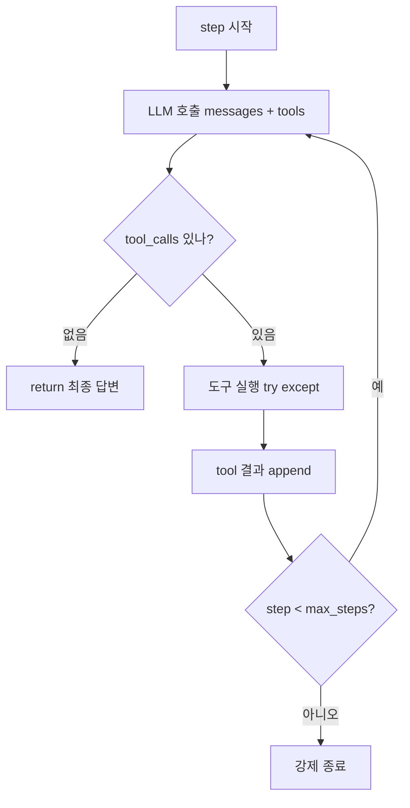

# Session 02 — Tool Use / Function Calling의 본질

> 대상: Python에 익숙하고 LLM API를 사용해 본 중급–고급 개발자
> 형식: 개념/이론 중심 (라이브 코딩 아님), 60–90분
> 스택: raw OpenAI/Claude API + LangChain/LangGraph

---

## 학습 목표

이 회차를 마치면 수강생은 다음을 할 수 있다.

1. tool/function calling의 **실제 메커니즘**(모델은 함수를 실행하지 않고 "호출 의도"만 출력한다)을 정확히 설명할 수 있다.
2. **도구 스키마(JSON Schema)**를 모델이 잘 쓰도록 설계하는 원칙을 적용할 수 있다.
3. **도구 선택 → 실행 → 결과 주입** 사이클을 메시지 수준에서 추적할 수 있다.
4. raw API만으로 **에이전트 루프를 `while`로 직접** 구현(의사코드)할 수 있다.
5. **정지 조건·무한루프 방지·에러를 도구 결과로 되돌리는** 견고화 기법을 적용할 수 있다.

> [!IMPORTANT] 이 회차의 핵심 메시지
> "프레임워크(LangChain/LangGraph)는 이 `while` 루프를 ==감싼 것일 뿐==이다."

---

## 회차 타임라인 (총 80분 기준)

| 구간 | 시간 | 내용 |
|------|------|------|
| 복습 | 5분 | Session 01: 루프·4대 구성요소 회상 |
| 개념강의 ① | 12분 | function calling 메커니즘 (모델은 실행하지 않는다) |
| 개념강의 ② | 13분 | 도구 스키마(JSON Schema) 설계 원칙 |
| 개념강의 ③ | 12분 | 선택→실행→결과주입 사이클 (메시지 흐름) |
| 개념강의 ④ | 13분 | raw API 에이전트 루프 `while` 의사코드 |
| 개념강의 ⑤ | 8분 | 정지 조건 / 무한루프 방지 / 에러 도구결과 처리 |
| 데모 | 10분 | 리서치 어시스턴트 한 사이클 trace |
| 토론 + 예고 | 7분 | 토론 질문 + 다음 회차 |

---

## 1. Function Calling 메커니즘 — 모델은 함수를 "실행"하지 않는다

가장 흔한 오해부터 깬다. LLM에 도구를 "붙여도" 모델이 코드를 돌리는 게 아니다.
모델은 ==이 함수를 이 인자로 부르고 싶다는 구조화된 의도(tool call)==를 출력할 뿐이다.
**실제 실행은 우리(클라이언트 코드)의 책임**이고, 실행 결과를 다시 모델에게 넣어줘야 한다.



> [!IMPORTANT] 결정적 통찰
> 모델 ↔ 실행 사이엔 ==사람이 만든 경계==가 있다.
> 그래서 우리는 권한을 통제하고(샌드박스), 인자를 검증하고, 에러를 가공해 되돌릴 수 있다.
> "에이전트 루프"란 위 1~5를 **정지 조건까지 반복**하는 것이다.

---

## 2. 도구 스키마(JSON Schema) 설계

모델이 도구를 *언제·어떻게* 부를지는 **스키마와 설명문(description)**에 거의 전적으로 달려 있다.
스키마는 모델에게 주는 **API 문서이자 프롬프트**다.

### 표준 도구 정의 (본 과정 공통 — demo-task-spec)

```jsonc
// 도구 1: 웹 검색 (출력: [{title, snippet, url}, ...] — 데모는 mock 고정 결과)
{
  "name": "web_search",
  "description": "주어진 검색어로 웹을 검색해 상위 결과 스니펫을 반환한다. 수상자·뉴스·사실 등 모델이 모르는 정보가 필요할 때 사용.",
  "parameters": {
    "type": "object",
    "properties": {
      "query": { "type": "string", "description": "검색어. 구체적 키워드로." }
    },
    "required": ["query"]
  }
}

// 도구 2: 계산기 (출력: { "result": number })
{
  "name": "calculator",
  "description": "수식 문자열을 계산해 결과를 반환한다. 나눗셈/곱셈 등 산술이 필요할 때 사용. 추측하지 말고 반드시 이 도구로 계산.",
  "parameters": {
    "type": "object",
    "properties": {
      "expression": { "type": "string", "description": "산술식. 예: '11000000 / 3'" }
    },
    "required": ["expression"]
  }
}
```

### 스키마 설계 체크리스트

| 항목 | 나쁜 예 | 좋은 예 |
|------|---------|---------|
| 이름 | `do_it`, `tool1` | `web_search`, `calculator` (동사+목적) |
| description | "검색함" | **언제 써야 하는지**까지: "수상자·뉴스 등 모델이 모르는 정보가 필요할 때" |
| 파라미터 수 | 한 도구에 10개 | 작게. 모델이 채우기 쉬운 최소 인자 |
| 타입/제약 | 자유 문자열 | `enum`, `required`, 포맷 명시 |
| 모호성 | 두 도구 역할 겹침 | 도구 간 경계 명확 (검색 vs 계산) |

> [!NOTE] 원칙
> 스키마는 "사람 주니어 개발자에게 함수 쓰는 법을 알려준다"는 마음으로 써라.
> 모델이 헷갈리면 ==90%는 description이 부실한 탓==이다. (모델 탓 아님)

### description은 LLM을 위한 프롬프트다 — BEFORE / AFTER

같은 `web_search` 도구라도 description 한 줄로 호출 품질이 갈린다.
description은 코드 주석이 아니라 ==모델이 읽는 프롬프트의 일부==임을 잊지 마라.

> [!EXAMPLE] BEFORE — 나쁜 설명 (모델이 언제 쓸지 모른다)
> ```jsonc
> {
>   "name": "web_search",
>   "description": "검색한다"          // ← 무엇을·언제 쓰는지 전혀 없음
> }
> ```

> [!EXAMPLE] AFTER — 좋은 설명 (호출 시점이 명확해진다)
> ```jsonc
> {
>   "name": "web_search",
>   "description": "주어진 검색어로 웹을 검색해 상위 결과 스니펫을 반환한다. 수상자·뉴스·최신 사실 등 모델이 모르는 정보가 필요할 때 사용."
> }
> ```

**호출 패턴이 어떻게 달라지는가:**

| | BEFORE("검색한다") | AFTER("…모델이 모르는 정보가 필요할 때") |
|------|--------------------|------------------------------------------|
| 호출 시점 | 언제 쓸지 몰라 ==과소호출==(필요할 때 안 부름) 또는 엉뚱한 호출 | "내가 모르는 사실"이라는 트리거가 명확 → 제때 호출 |
| 인자 품질 | 막연한 검색어 | 구체적 키워드로 채울 단서가 생김 |
| 결과 | 모델이 추측으로 때우거나 헛돌기 | 필요한 순간에만 정확히 도구 사용 |

> 즉 "언제 써야 하는지"를 description에 넣는 것만으로 호출 정확도가 급변한다.
> 모델이 도구를 안 부른다고 느끼면 ==description부터 의심==하라.

---

## 3. 선택 → 실행 → 결과 주입 사이클 (메시지 수준)

핵심은 **대화 메시지 배열이 계속 자라난다**는 것이다. 각 턴이 다음 턴의 컨텍스트가 된다.

```
messages = [
  {role: system, ...},
  {role: user,   content: "2024년 노벨 물리학상 수상자가 누구이고, 상금을 3으로 나누면 얼마야?"},
]
        │  ① LLM 호출(tools 포함)
        ▼
  assistant ─┐
  tool_calls: [web_search(query="2024 Nobel Prize physics winners")]   ← ② 모델의 선택
        │
        │  ③ 우리가 실행 → 결과 획득
        ▼
  {role: tool, name: web_search, content: "[{snippet: '...상금 1,100만 SEK...'}]"}  ← ④ 결과 주입(append)
        │
        │  ⑤ 늘어난 messages로 다시 LLM 호출 → 반복...
        ▼
   ... 도구가 더 필요 없으면 tool_calls 없는 최종 assistant 메시지 → 종료
```

| 메시지 role | 누가 만드나 | 내용 |
|-------------|-------------|------|
| `system` | 개발자 | 에이전트 정체성·규칙 |
| `user` | 사용자 | 목표/질문 |
| `assistant`(tool_calls) | **모델** | 어떤 도구를 어떤 인자로 부를지 |
| `tool` | **우리 코드** | 도구 실행 결과(또는 에러 메시지) |
| `assistant`(content) | 모델 | 도구가 끝났을 때의 최종 답 |

> 메모리(Session 01의 Memory)는 거창한 게 아니라 **이 messages 배열의 누적**이 1차 형태다.

---

## 4. raw API로 에이전트 루프 직접 구현 (`while` 의사코드)

> `demos/01_raw_agent_loop.py`가 정확히 이 구조로 `web_search` / `calculator`를 구현한다.

```python
# 의사코드 — 프레임워크 없이 '맨손'으로 짠 에이전트 루프
TOOLS = {
    "web_search": web_search,     # def web_search(query) -> str
    "calculator": calculator,     # def calculator(expression) -> str
}

def run_agent(user_goal, max_steps=6):   # demo-task-spec: MAX_TURNS = 6
    messages = [
        {"role": "system", "content": SYSTEM_PROMPT},
        {"role": "user",   "content": user_goal},
    ]

    for step in range(max_steps):                 # ← 무한루프 방지: 상한
        resp = llm.create(messages=messages,
                          tools=TOOL_SCHEMAS)     # ① 모델에 선택 요청

        msg = resp.choices[0].message
        messages.append(msg)                      # ② 어시스턴트 턴 누적

        if not msg.tool_calls:                    # ③ 정지 조건: 도구요청 없음
            return msg.content                    #     → 최종 답변 반환

        for call in msg.tool_calls:               # ④ 요청된 도구 실행
            fn   = TOOLS.get(call.name)
            args = json.loads(call.arguments)     # (검증 권장)
            try:
                result = fn(**args) if fn else f"ERROR: unknown tool '{call.name}'"
            except Exception as e:
                result = f"ERROR: {type(e).__name__}: {e}"   # ⑤ 에러도 결과로

            messages.append({                     # ⑥ 결과 주입 → 다음 루프 컨텍스트
                "role": "tool",
                "tool_call_id": call.id,
                "name": call.name,
                "content": str(result),
            })
        # 루프 계속 → ①로 (늘어난 messages로 재호출)

    return "STOP: max_steps 도달 — 부분 결과로 마무리"   # ⑦ 비상 정지
```

**구조를 한 장으로:**



> [!TIP] 핵심 메시지 반복
> LangChain의 `AgentExecutor`, LangGraph의 `create_react_agent`는
> 본질적으로 ==이 `while` 루프를 감싼 것==이다. 상태관리·재시도·관측가능성·분기를 더 줬을 뿐,
> 심장은 위 7줄짜리 사이클이다. 프레임워크가 마법이 아님을 확인하는 것이 이 회차의 목적이다.

---

## 5. 정지 조건 / 무한루프 방지 / 에러 처리

자율 루프는 **스스로 멈출 줄 알아야** 프로덕션에 올릴 수 있다.

### 5-1. 정지 조건 (언제 끝낼까)

| 정지 트리거 | 의미 |
|-------------|------|
| `tool_calls` 없는 응답 | 모델이 "이제 답할 준비됨"으로 판단 → 정상 종료 |
| `max_steps` 도달 | 안전 상한. 부분 결과로라도 마무리 |
| 예산 초과(토큰/시간/비용) | 운영 가드레일 |
| 명시적 종료 도구 `final_answer` | 종료를 도구로 강제하는 설계도 있음 |

### 5-2. 무한루프 방지

- **반드시 `max_steps` 상한**을 둔다 (위 의사코드의 `for step in range(...)`).
- **같은 tool_call(name+args) 반복 감지** → 중복이면 경고를 주입하거나 강제 종료.
- **진전 없음(no-progress) 감지**: N스텝 동안 새 정보가 안 들어오면 중단.
- 모델이 헷갈려 빙빙 도는 패턴은 보통 **스키마/시스템프롬프트 부실**의 신호다.

### 5-3. 에러를 "도구 결과"로 되돌리기 (가장 중요한 견고화)

도구가 실패해도 **예외를 던져 루프를 죽이지 말고**, 에러 문자열을 `tool` 결과로 모델에게 돌려준다.
그러면 모델이 **인자를 고쳐 재시도**하거나 다른 도구로 우회할 수 있다 (자기수정).

```
calculator("11000000 / ")     # 잘못된 식
   │  예외 발생
   ▼
{role: tool, content: "ERROR: SyntaxError: invalid syntax"}   ← 죽이지 말고 주입
   │
   ▼  모델이 관찰 후 스스로 교정
calculator("11000000 / 3")  → 3666666.67   ✅
```

> [!WARNING] 안티패턴 (글로벌 규칙과도 일치)
> 빈 `except: pass`로 에러를 삼키면 모델은 실패를 모른 채 잘못된 답을 낸다.
> 최소한 에러 메시지를 ==도구 결과로 주입==하고 로그(`console.error` 급)를 남겨라. Silent failure 금지.

---

## 6. 데모 워크스루 — 리서치 어시스턴트 한 사이클 trace

> 표준 시나리오(Session 01과 동일, demo-task-spec):
> **"2024년 노벨 물리학상 수상자가 누구이고, 그 사람들 수가 받은 상금을 3으로 나누면 얼마야?"**
> 도구: `web_search(query)`, `calculator(expression)` — `demos/01_raw_agent_loop.py`가 구현하는 바로 그 도구/시나리오.
> (검색은 mock 고정 결과, 상금은 mock 값 1,100만 SEK)

아래는 위 `while` 루프가 만들어내는 **messages 배열의 성장 trace**다. (각 step = LLM 1회 호출)

```
── step 1 ───────────────────────────────────────────────
  → LLM 호출 (messages: system, user)
  ← assistant.tool_calls = [ web_search(query="2024 Nobel Prize physics winners") ]
  ▷ 실행: web_search(...) → [{title:"...", snippet:"...상금 1,100만 SEK", url:"..."}]
  ▷ append {role: tool, name: web_search, content: "[{snippet:'...1,100만 SEK...'}]"}

── step 2 ───────────────────────────────────────────────
  → LLM 호출 (messages += 위 tool 결과)
  ← assistant.tool_calls = [ calculator(expression="11000000 / 3") ]
  ▷ 실행: calculator(...) → { "result": 3666666.67 }
  ▷ append {role: tool, name: calculator, content: "{\"result\": 3666666.67}"}

── step 3 (정지) ─────────────────────────────────────────
  → LLM 호출
  ← assistant.content = "2024년 노벨 물리학상 수상자는 ...이며, 상금 1,100만 SEK를
                         3으로 나누면 약 3,666,667 SEK입니다."
  ← tool_calls 없음  →  정지 조건 충족  →  루프 종료, 반환
```

**데모에서 강조할 포인트**

- step 수(여기선 3)는 **코드에 없다**. 모델이 관찰을 보며 동적으로 결정했다 (자율성·루프).
- step 1→2는 "검색 스니펫에서 상금을 읽고 나서야" 계산식을 만들 수 있었다 → **결과 주입이 다음 선택을 좌우**.
- 만약 step 2에서 `calculator("11000000 / ")`처럼 실패했다면? §5-3대로 에러를 주입 → 다음 step에서 모델이 식을 고쳐 재시도.
- 이 전체가 §4의 `while` 7줄에서 나온다. **프레임워크는 이걸 감싼 포장**이라는 점을 한 번 더 못박는다.

| 관찰 항목 | 이 trace에서의 증거 |
|-----------|---------------------|
| 동적 step 수 | 코드엔 `max_steps`만, 실제 3스텝은 모델이 결정 |
| 결과→다음선택 의존 | 검색 스니펫(step1) 관찰 후에야 계산식(step2) 생성 |
| 정지 조건 | step3에서 tool_calls 사라짐 → 종료 |
| 견고화 여지 | 도구 실패 시 에러 주입으로 자기수정 가능 |

---

## 토론 질문

1. `web_search`의 description을 어떻게 바꾸면 모델이 **불필요한 검색을 줄일** 수 있을까? 반대로 과소호출은?
2. 도구 결과가 매우 길 때(예: 검색 본문 수천 토큰) messages 누적이 컨텍스트를 폭파시킨다. **어떻게 다룰까?** (요약/잘라내기/메모리 분리)
3. `max_steps`를 너무 작게 / 너무 크게 잡으면 각각 어떤 실패가 나는가? 여러분 작업의 적정값은?
4. 에러를 "예외로 죽이기" vs "도구 결과로 주입하기"의 트레이드오프는? **죽여야 마땅한** 에러도 있을까?
5. 이 `while` 루프를 직접 짤 수 있다면, 왜 굳이 LangChain/LangGraph를 쓸까? **프레임워크가 실제로 더해주는 것**은?

---

## ✅ 학습 결과 체크리스트

- ✅ "모델은 함수를 실행하지 않고 호출 의도만 낸다"를 정확히 설명할 수 있다
- ✅ tool_call 결과를 메시지로 다시 주입해 루프를 이어갈 수 있다
- ✅ 정지 조건과 MAX_TURNS로 무한 루프를 막을 수 있다
- ✅ 도구 실패를 예외로 죽이지 않고 결과로 되돌려 자기수정을 유도할 수 있다
- ✅ 좋은 description이 호출 품질을 좌우함을 설명할 수 있다

---

## 다음 시간 예고

세션 03 **추론(Reasoning) & 계획(Planning) 패턴** — 이 `while` 루프 "안에서 다음에 무엇을 할지 결정하는 머리"를 다룬다. CoT·ReAct·Plan-and-Execute·Reflection을 같은 리서치 과제에 적용해 trace를 비교한다. (프레임워크 LangChain/LangGraph로의 이식은 세션 05~06)

---

## 강사 노트 (흔한 오해 / 질문 대비)

- **오해 1: "모델이 함수를 실행한다".**
  절대 아니다 — 모델은 *호출 의도(tool_call)*만 내고 멈춘다. **실행은 우리 코드**. 이 경계가 권한통제·검증·에러가공의 지점임을 §1 다이어그램으로 반복 강조하라. 수강생 대다수가 여기서 처음 "아하"를 한다.

- **오해 2: "도구가 안 불리는 건 모델이 멍청해서".**
  대개 **description/스키마 부실**이 원인이다. "언제 쓰는지"를 description에 넣으면 호출 품질이 급변한다. 모델 탓 전에 스키마부터 의심하라고 안내.

- **자주 나오는 질문: "그럼 프레임워크는 왜 쓰나요?"**
  "심장(`while` 루프)은 동일하고, 프레임워크는 **상태관리·재시도·스트리밍·관측가능성(tracing)·멀티에이전트 분기**를 얹어준다"가 답. 이 회차의 목표는 *프레임워크를 깐 뒤에도 무슨 일이 벌어지는지 아는 것*임을 분명히. (다음 회차 떡밥)
