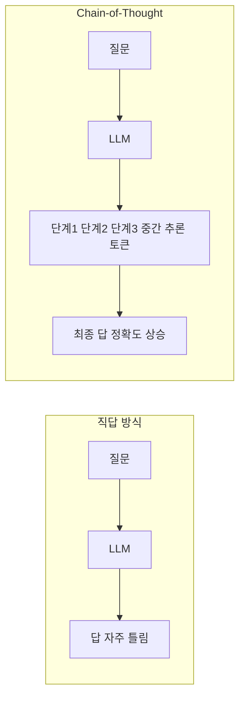
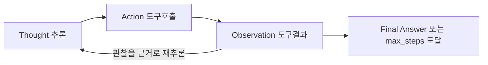
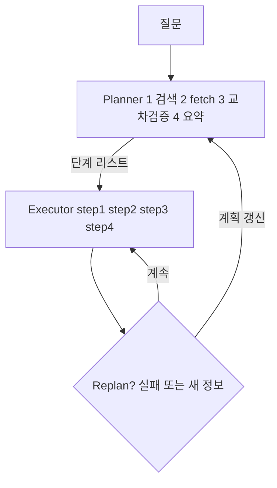
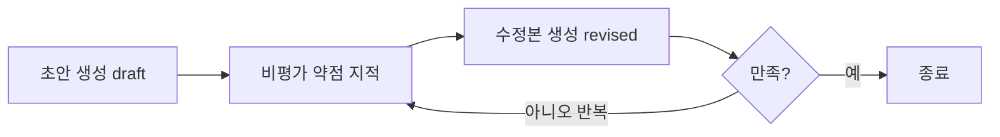
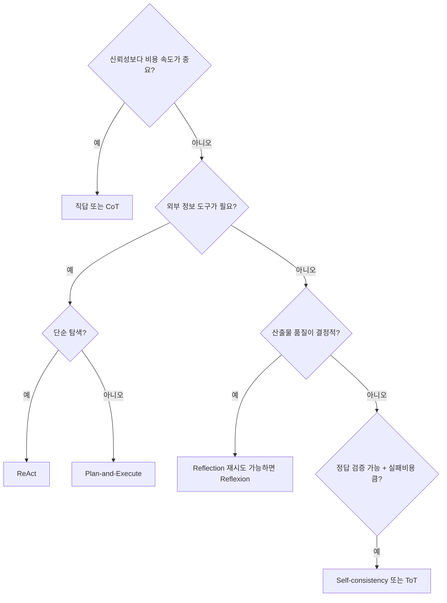
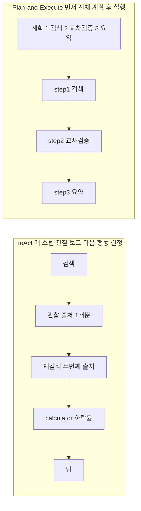

# 세션 03 — 추론(Reasoning) & 계획(Planning) 패턴

> AI Agent 개발 코스 · 중급~고급 개발자 대상 · 이론/개념 중심 · 60~90분
>
> 참고: 본 세션은 공용 토이 예제인 **리서치 어시스턴트(Research Assistant)** 태스크를 사용합니다.
> (도구: `web_search(query)`, `calculator(expression)`, `fetch_url(url)`, `summarize(text)`, `cite(claim, source)`)
> 동일 과제를 여러 추론 패턴으로 풀어보며 trace를 비교하는 것이 이 세션의 핵심 실습입니다.

---

## 학습 목표

1. Chain-of-Thought(CoT)가 왜 "추론을 토큰으로 외재화"하는 기법인지 설명할 수 있다.
2. ReAct의 `Thought → Action → Observation` 루프 동작 원리와 구조적 한계를 설명할 수 있다.
3. Plan-and-Execute, Reflection/Reflexion의 차이와 적용 시점을 판단할 수 있다.
4. Self-consistency, Tree-of-Thoughts의 핵심 아이디어를 한 문장으로 요약할 수 있다.
5. 패턴별 비용/지연 vs 정확도/신뢰성 trade-off를 기준으로 과제에 맞는 패턴을 선택할 수 있다.

---

## 회차 타임라인 (총 80분 기준)

| 구간 | 시간 | 내용 |
|------|------|------|
| 복습 | 5분 | 세션 02(에이전트 루프·도구 호출) 핵심 회상, 질문 받기 |
| 개념 강의 ① | 15분 | CoT → ReAct: 추론을 행동으로 잇기 |
| 개념 강의 ② | 15분 | Plan-and-Execute, Reflection/Reflexion |
| 개념 강의 ③ | 10분 | Self-consistency, Tree-of-Thoughts (개요) |
| 개념 강의 ④ | 8분 | 패턴별 trade-off 정리 |
| 데모 | 20분 | 동일 리서치 과제: ReAct vs Reflection trace 비교 |
| 토론 | 7분 | 토론 질문 3~5개 |

---

## 0. 복습 — 우리가 "추론"을 다루는 이유 (5분)

세션 02에서 우리는 "에이전트 = LLM + 도구 + 루프"라는 골격을 봤습니다.
하지만 루프만으로는 부족합니다. **루프 안에서 다음에 무엇을 할지 결정하는 머리**가 필요합니다.
그 머리가 바로 추론(reasoning)과 계획(planning) 패턴입니다.

핵심 질문: **"LLM은 한 번의 forward pass에서 얼마나 깊게 생각할 수 있는가?"**
답은 "생각보다 얕다". 그래서 우리는 추론을 **여러 토큰/여러 호출로 펼쳐(unroll)** 정확도를 끌어올립니다.

---

## 1. Chain-of-Thought (CoT) — 추론의 외재화 (개념 강의 ①)

### 1.1 핵심 아이디어

LLM은 정답을 곧바로 출력하면 자주 틀립니다. 그러나 "단계적으로 생각해보자(let's think step by step)"라고
유도하면, **중간 추론을 토큰으로 토해내면서** 그 토큰을 다시 컨텍스트로 활용해 정답 확률이 올라갑니다.
(원논문: [Chain-of-Thought Prompting](https://arxiv.org/abs/2201.11903))

즉 CoT는 모델 내부의 암묵적 계산을, ==컨텍스트 윈도우라는 외부 작업 공간(scratchpad)== 으로 끌어내는 기법입니다.



### 1.2 변형

- **Zero-shot CoT**: "차근차근 생각하자" 한 문장만 추가.
- **Few-shot CoT**: 추론 예시를 몇 개 제공해 추론 형식을 학습시킴.
- **구조화 CoT**: 추론을 JSON/단계 번호로 강제 → 파싱·검증 용이.

> [!WARNING] 주의
> CoT는 ==추론만== 한다. 외부 세계와 상호작용(도구 호출)하지 않는다.
> 리서치 어시스턴트처럼 "최신 정보 검색"이 필요한 과제에는 CoT 단독으로는 부족하다.

---

## 2. ReAct (Reason + Act) — 추론과 행동의 교차 (개념 강의 ①)

### 2.1 동작 원리

ReAct는 CoT의 "생각"에 **행동(도구 호출)** 과 **관찰(도구 결과)** 을 교차시킵니다.
한 스텝마다 다음 사이클을 돕니다:



리서치 어시스턴트 예 ("2024년 노벨물리학상 수상자와 그 핵심 업적은?"):

```
Thought:  최신 정보가 필요하다. 먼저 검색하자.
Action:   web_search("2024 Nobel Prize physics laureate")
Observation: [검색결과 스니펫 3건...]
Thought:  업적 세부가 부족하다. 공식 페이지를 열자.
Action:   fetch_url("https://nobelprize.org/...")
Observation: [본문 텍스트...]
Thought:  충분하다. 요약해서 답하자.
Action:   Final Answer: "수상자는 ... 업적은 ..."
```

### 2.2 한계

| 한계 | 설명 | 증상 |
|------|------|------|
| 근시안적 결정 | 매 스텝 지역 최적만 선택, 전역 계획 부재 | 같은 검색 반복, 옆길로 샘 |
| 루프/탈선 | 잘못된 Observation에 갇혀 빙빙 돎 | max_steps 소진, 토큰 폭증 |
| 누적 컨텍스트 | 모든 Thought/Observation이 쌓임 | 비용·지연 증가, 후반부 품질 저하 |
| 오류 전파 | 한 번의 잘못된 행동이 이후 추론을 오염 | 환각 도구 결과를 사실로 믿음 |

> [!NOTE]
> ReAct는 "탐색적·도구 의존적" 과제에 강하지만, ==장기 계획이 필요한 과제==에서는 흔들린다.

---

## 3. Plan-and-Execute — 계획과 실행의 분리 (개념 강의 ②)

### 3.1 핵심 아이디어

ReAct가 "한 걸음씩 생각하며 걷는다"면, Plan-and-Execute는 **먼저 전체 지도를 그리고(Planner)**,
그 다음 **각 단계를 실행(Executor)** 합니다. 계획과 실행을 분리하면 전역적 일관성이 올라갑니다.



### 3.2 LangGraph 복선

세션 06에서 이 구조를 **LangGraph의 노드/엣지**로 구현합니다. 미리 매핑해두면:

| Plan-and-Execute 개념 | LangGraph 대응 |
|------------------------|----------------|
| Planner | `planner` 노드 (계획을 state에 기록) |
| 단계 리스트 | `state["plan"]` (리스트) |
| Executor | `executor` 노드 (현재 단계 실행) |
| Replan 분기 | 조건부 엣지(conditional edge) |
| 종료 | `END` 노드 도달 조건 |

> 지금은 "계획을 state에 담고 노드 사이를 오간다" 정도만 기억하면 됩니다. 세션 06에서 손으로 짭니다.

---

## 4. Reflection / Reflexion — 자기비판과 재시도 (개념 강의 ②)

### 4.1 Reflection (자기비판)

생성 → **스스로 비판** → 비판을 반영해 재생성. 한 번 더 보는 "교정 루프"입니다.



### 4.2 Reflexion (메모리 기반 자기개선)

Reflexion([원논문](https://arxiv.org/abs/2303.11366))은 Reflection에 **언어적 메모리**를 더합니다. 실패한 시도에서 얻은 교훈을
텍스트로 저장하고, **다음 시도(에피소드)** 의 프롬프트에 주입해 같은 실수를 반복하지 않게 합니다.

```
시도 1 (실패) ─▶ "왜 실패했나" 성찰 텍스트 생성 ─┐
                                                  ▼
                                      [성찰 메모리에 누적]
                                                  │
시도 2 (성찰 주입) ─▶ 개선된 행동 ─▶ 평가 ─▶ ... ─┘
```

| 구분 | Reflection | Reflexion |
|------|-----------|-----------|
| 단위 | 한 응답 내 교정 | 여러 시도(에피소드) 간 학습 |
| 메모리 | 없음(또는 단발) | 성찰 텍스트를 누적·재사용 |
| 필요 신호 | 자기평가 | 환경의 성공/실패 피드백 |

---

## 5. Self-consistency & Tree-of-Thoughts (개념 강의 ③)

### 5.1 Self-consistency

같은 질문에 CoT를 **여러 번(temperature>0)** 돌려 서로 다른 추론 경로를 만들고,
**다수결(또는 집계)** 로 최종 답을 고릅니다. "한 번의 추론을 믿지 말고 표결하라."

```
질문 ─┬─▶ CoT 경로 A ─▶ 답: 42
      ├─▶ CoT 경로 B ─▶ 답: 42
      ├─▶ CoT 경로 C ─▶ 답: 17
      └─▶ CoT 경로 D ─▶ 답: 42   ⇒ 다수결: 42
```

### 5.2 Tree-of-Thoughts (ToT)

추론을 **선형(chain)** 이 아니라 **트리**로 확장합니다. 각 노드에서 여러 후보 생각을 펼치고,
중간 상태를 **평가(value)** 한 뒤 **탐색(BFS/DFS, 백트래킹)** 으로 유망한 가지를 선택합니다.

```
                 [문제]
                /  |  \
         생각A 생각B 생각C        ← 후보 생성
          (평가) (평가) (평가)      ← 상태 가치 추정
            │      X(가지치기)
        생각A1 생각A2              ← 유망 가지만 확장 (백트래킹 가능)
```

> [!WARNING] 강력하지만 비싸다
> ToT/Self-consistency는 ==호출 수가 곱으로 늘어난다(경로 수 × 깊이)==.
> 정답이 검증 가능하고 실패 비용이 큰 과제(수학·퍼즐·복잡 추론)에 한해 쓰는 게 합리적이다.

---

## 6. 패턴별 Trade-off 정리 (개념 강의 ④)

| 패턴 | LLM 호출 수 | 지연 | 정확도/신뢰성 | 도구 사용 | 적합 과제 |
|------|------------|------|---------------|-----------|-----------|
| 직답 | 1 | 최저 | 낮음 | X | 단순 변환/분류 |
| CoT | 1 | 낮음 | 중 | X | 단일 추론 문제 |
| ReAct | N(스텝수) | 중 | 중~상 | O | 탐색·검색·도구 의존 |
| Plan-and-Execute | 1(계획)+M | 중~상 | 상 | O | 다단계·장기 과제 |
| Reflection | 2~k배 | 상 | 상 | 선택 | 품질 민감 산출물 |
| Reflexion | 에피소드×k | 매우 상 | 상(반복학습) | O | 재시도 가능한 환경 |
| Self-consistency | k배 | 상 | 상 | X | 답이 수렴하는 추론 |
| Tree-of-Thoughts | ≫k배 | 매우 상 | 매우 상 | 선택 | 탐색형 난제 |

```chart
{
  "type": "bar",
  "data": {
    "labels": ["직답", "CoT", "ReAct", "Plan-Exec", "Reflection", "Self-consistency", "ToT"],
    "datasets": [{ "label": "상대적 비용·지연 (개념적)", "data": [1, 2, 5, 6, 8, 8, 12] }]
  },
  "caption": "패턴별 상대 비용·지연 — 상대적·개념적 수치(절대값 아님)"
}
```

### 의사결정 가이드



### 6.1 ReAct vs Plan-and-Execute 비교 trace

같은 리서치 과제 **"전기차 배터리 가격 추세 조사·교차검증"** 을 두 패턴으로 풀면
"언제 생각하느냐"의 위치가 다릅니다.



> ReAct는 ==관찰을 보고 그때그때 경로를 바꾸는 적응성==이 강하고, Plan-and-Execute는
> ==처음 세운 계획을 끝까지 따르는 일관성==이 강하다. 돌발 상황엔 ReAct, 예측 가능한 다단계엔 Plan-and-Execute.

### 6.2 Self-consistency / Tree-of-Thoughts — "언제 쓰나" 체크리스트

세 조건이 ==셋 다 '예'== 일 때만 쓰는 게 합리적이다:

- ☑ **정답이 수렴/검증 가능한가** — 다수결·상태평가가 의미 있으려면 "맞다/틀리다"가 갈려야 한다.
- ☑ **실패 비용이 큰가** — 한 번 틀리면 손해가 큰 과제여야 추가 호출이 정당화된다.
- ☑ **호출 수 폭증(경로 × 깊이)을 감당할 토큰 예산이 있는가** — 곱으로 늘어나는 비용을 감수할 수 있어야 한다.

> [!NOTE]
> 리서치 요약 같은 ==자유서술 과제는 "정답 수렴"이 약해== Self-consistency/ToT가 그대로는 부적합하다.

---

## 7. 데모 워크스루 — ReAct vs Reflection (20분)

**공통 과제(리서치 어시스턴트):**
> "최근 5년간 전기차 배터리 가격(kWh당) 추세를 조사하고, 출처 2개 이상으로 교차검증해 3문장 요약."

도구: `web_search`, `fetch_url`, `summarize`, `calculator`.

### 7.1 ReAct 골격 (의사코드)

```python
def react_agent(question, tools, max_steps=8):
    scratch = []                      # Thought/Action/Observation 누적
    for step in range(max_steps):
        prompt = REACT_TEMPLATE.format(q=question, history=scratch)
        out = llm(prompt)             # "Thought:... Action: web_search(...)"
        if out.is_final():            # "Final Answer:" 감지
            return out.answer, scratch
        obs = tools.run(out.action)   # 도구 실행
        scratch.append((out.thought, out.action, obs))
    return best_effort(scratch), scratch
```

예상 trace(요약):
```
Thought: kWh당 가격 추세 검색 필요
Action:  web_search("EV battery price per kWh 2019 2024 trend")
Observation: [BloombergNEF, IEA 스니펫...]
Thought: 출처 2개 확보. 수치 확인 위해 한 페이지 fetch
Action:  fetch_url("https://about.bnef.com/...")
Observation: [2019 ~$180/kWh → 2024 ~$115/kWh ...]
Thought: 교차검증 충분. 요약
Action:  Final Answer: "지난 5년 ... 약 36% 하락 ..."
```

### 7.2 Reflection 골격 (의사코드)

```python
def reflection_agent(question, tools, max_rounds=3):
    answer = react_agent(question, tools)[0]      # 1차 초안(도구 사용 포함)
    for _ in range(max_rounds):
        critique = llm(CRITIC_TEMPLATE.format(q=question, a=answer))
        if critique.is_satisfied():               # "수정 불필요"
            break
        answer = llm(REVISE_TEMPLATE.format(
            q=question, a=answer, c=critique))     # 비판 반영 재작성
    return answer
```

예상 비평/수정:
```
Critique: 출처가 1개로 보임. 수치의 연도 범위가 모호. 하락 '비율' 계산 누락.
Revise:   → fetch 두 번째 출처(IEA) 추가, 2019~2024 명시, calculator로 -36% 산출.
```

### 7.3 trace 비교 분석 (토론으로 연결)

| 관찰 포인트 | ReAct | Reflection |
|-------------|-------|------------|
| 호출 수 | 4~6 | 6~10 (초안+비평+수정) |
| 출처 교차검증 | 운에 따라 1개로 끝나기도 | 비평 단계가 누락을 잡아냄 |
| 수치 정확도 | 종종 근사/추정 | calculator 재호출로 보정 |
| 지연/비용 | 낮음 | 1.5~2.5배 |
| 실패 모드 | 검색 반복·조기 종료 | 비평이 무의미하면 라운드 낭비 |

**강조점:** trace를 눈으로 읽으면 "어디서 잘못됐는지"가 보인다.
디버깅의 첫걸음은 추론 trace 로깅이다(세션 07 관측/평가의 복선).

---

## 8. 토론 질문

1. 우리 리서치 과제에서 ReAct가 "같은 검색을 반복"하는 루프에 빠졌다. 코드를 바꾸지 않고
   **프롬프트/종료조건** 만으로 막을 방법은?
2. Reflection을 추가하면 품질은 오르지만 비용이 2배다. 어떤 **운영 신호**를 기준으로
   Reflection 라운드를 켜고 끌 것인가?
3. Self-consistency는 "답이 수렴"하는 과제에서 강하다. 리서치 요약처럼 **자유서술** 과제에는
   왜 그대로 적용하기 어려운가? 변형한다면?
4. Plan-and-Execute의 "계획"이 처음부터 틀렸다면? Replan을 언제 트리거하고, 무한 Replan은
   어떻게 막을 것인가?
5. ToT는 강력하지만 비싸다. 우리 과제 중 ToT가 **정당화되는 경우** 가 있는가? 없다면 왜?

---

## ✅ 학습 결과 체크리스트

- ✅ CoT가 "추론을 토큰으로 외재화"하는 기법임을 설명할 수 있다
- ✅ ReAct의 Thought→Action→Observation 루프와 한계를 설명할 수 있다
- ✅ ReAct vs Plan-and-Execute를 작업 성격에 따라 선택할 수 있다
- ✅ Self-consistency/ToT를 언제 쓸지(검증가능·고실패비용·예산) 판단할 수 있다
- ✅ 패턴별 비용·지연 vs 정확도 trade-off를 비교할 수 있다

---

## 9. 다음 시간 예고

세션 04 **메모리 & 컨텍스트 관리** — 추론이 길어질수록 쌓이는 trace를 어떻게 압축·기억할지,
단기/장기 메모리와 RAG를 다룹니다.

---

## 10. 강사 노트 (흔한 오해/질문)

- **오해 1: "CoT를 쓰면 모델이 더 똑똑해진다."**
  → 아니다. 모델 능력은 그대로다. CoT는 추론을 토큰으로 펼쳐 **기존 능력을 더 잘 활용**할 뿐이다.
  단순 과제에 CoT를 강제하면 오히려 토큰만 낭비되거나 산만해질 수 있다.

- **오해 2: "ReAct가 항상 Plan-and-Execute보다 단순/저렴하다."**
  → 짧은 과제는 그렇지만, 탈선·루프가 생기면 ReAct가 더 많은 스텝을 소진해 비싸진다.
  "예측 가능한 다단계"는 미리 계획하는 편이 총비용이 낮을 때가 많다.

- **질문 대응: "Reflection과 Self-consistency는 결국 같은 것 아닌가?"**
  → 다르다. Self-consistency는 **여러 독립 경로를 표결**(병렬·다양성), Reflection은
  **하나의 답을 비판·수정**(직렬·교정)이다. 결합도 가능하다(여러 경로 각각 reflect 후 표결).
