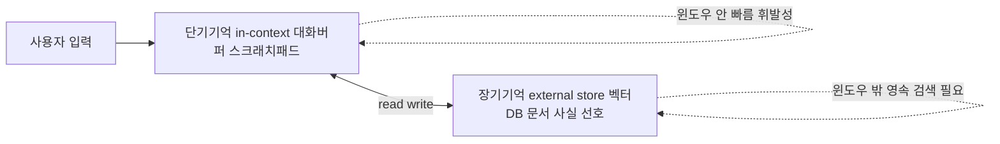
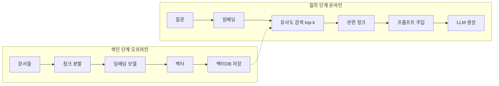

# 세션 04 — 메모리 & 컨텍스트 관리

> AI Agent 개발 코스 · 중급~고급 개발자 대상 · 이론/개념 중심 · 60~90분
>
> 참고: 본 세션도 공용 토이 예제인 **리서치 어시스턴트(Research Assistant)** 태스크를 사용합니다.
> (도구: `web_search(query)`, `calculator(expression)`, `fetch_url(url)`, `summarize(text)`, `cite(claim, source)`)
> 세션 03에서 추론 trace가 길어질수록 컨텍스트가 폭증한다는 점을 봤습니다. 이번 세션은 그 폭증을 다스립니다.

---

## 학습 목표

1. 컨텍스트 윈도우의 물리적 제약과 토큰 비용이 에이전트 설계를 어떻게 강제하는지 설명할 수 있다.
2. 단기기억(대화/스크래치패드)과 장기기억(외부 저장)의 역할 차이를 구분할 수 있다.
3. 컨텍스트 압축·요약·선택적 회상(retrieval) 전략의 trade-off를 비교할 수 있다.
4. RAG가 "메모리의 한 형태"임을 이해하고, 임베딩/벡터DB를 개념 수준에서 설명할 수 있다.
5. 상태(state) 관리가 왜 메모리의 토대인지 이해하고, 세션 07 LangGraph state와 연결지을 수 있다.

---

## 회차 타임라인 (총 80분 기준)

| 구간 | 시간 | 내용 |
|------|------|------|
| 복습 | 5분 | 세션 03(추론 패턴·trace 폭증) 회상, 질문 받기 |
| 개념 강의 ① | 12분 | 컨텍스트 윈도우 제약과 비용 |
| 개념 강의 ② | 13분 | 단기기억 vs 장기기억 |
| 개념 강의 ③ | 13분 | 압축·요약·선택적 회상 |
| 개념 강의 ④ | 12분 | RAG 개요(메모리로서의 검색증강) |
| 개념 강의 ⑤ | 5분 | 상태(state) 관리와 세션 07 복선 |
| 데모 | 15분 | 대화 메모리: 요약 vs 슬라이딩 윈도우 비교 |
| 토론 | 5분 | 토론 질문 3~5개 |

---

## 0. 복습 — 왜 메모리가 문제인가 (5분)

세션 03에서 ReAct/Reflection의 trace(`Thought/Action/Observation`)가 스텝마다 누적되는 것을 봤습니다.
누적되는 토큰은 곧 **돈**이고 **지연**이며, 결국 **윈도우 한계**에 부딪힙니다.

핵심 질문: **"에이전트는 무한히 길어지는 대화/추론을 유한한 윈도우 안에서 어떻게 기억하는가?"**
답은 ==전부 기억하지 않는다. 선택하고, 압축하고, 외부에 저장한다.==

---

## 1. 컨텍스트 윈도우 제약과 비용 (개념 강의 ①)

### 1.1 윈도우는 RAM, 외부 저장은 디스크

LLM의 컨텍스트 윈도우는 ==작업 메모리(RAM)== 에 비유할 수 있습니다. 빠르지만 유한합니다. [[chip:info: RAM vs 디스크]]
무엇이든 윈도우에 넣어야 모델이 "볼" 수 있지만, 넣을수록 비용과 지연이 커집니다.

```
┌─────────────────────── 컨텍스트 윈도우 (유한) ───────────────────────┐
│ system 프롬프트 │ 도구 정의 │ 대화 이력 │ 검색 결과 │ 현재 질문 │ 출력여유 │
└──────────────────────────────────────────────────────────────────────┘
  ▲ 고정비용        ▲ 고정비용   ▲ 계속 증가  ▲ 가변     ▲ 작음     ▲ 남겨둬야 함
```

### 1.2 비용/지연의 구조

| 요인 | 영향 | 설계 시사점 |
|------|------|-------------|
| 입력 토큰 수 | 비용·지연 선형 증가 | 이력/검색결과를 무한정 쌓지 말 것 |
| 윈도우 한계 초과 | 잘림(truncation)·오류 | 압축/요약 필수 |
| "중간 손실"([lost in the middle](https://arxiv.org/abs/2307.03172)) | 긴 컨텍스트 중앙 정보 활용도 저하 | 중요 정보는 앞/뒤 배치 |
| 출력 여유 부족 | 응답이 잘림 | 입력 예산 상한 설정 |

> [!TIP] 규칙
> ==컨텍스트 예산(token budget)을 미리 정하라.== "이력 N토큰, 검색 M토큰, 출력 K토큰" 식으로.

---

## 2. 단기기억 vs 장기기억 (개념 강의 ②)

### 2.1 두 종류의 기억



| 구분 | 단기기억 | 장기기억 |
|------|----------|----------|
| 위치 | 컨텍스트 윈도우 안 | 외부 저장소(DB/벡터DB/파일) |
| 수명 | 현재 세션/요청 | 세션을 넘어 영속 |
| 접근 | 즉시(모델이 직접 봄) | 검색(retrieval) 후 주입 |
| 용량 | 작음(윈도우 한계) | 사실상 무제한 |
| 예시 | 직전 대화, 추론 trace, 도구 결과 | 사용자 선호, 과거 리서치 결과, 지식베이스 |

### 2.2 스크래치패드(단기) 예

리서치 어시스턴트가 진행 중 메모를 윈도우 안에 유지:
```
[scratchpad]
- 목표: EV 배터리 가격 추세
- 확보 출처: BNEF(2024 $115/kWh), IEA(작업중)
- 다음: IEA 수치 확인 → calculator로 하락률
```

### 2.3 장기기억 예

"지난 주 사용자가 EV 리서치를 요청했고, 한국 시장 중심을 선호" → 외부 저장 후, 이번 요청에 회상.

---

## 3. 압축 · 요약 · 선택적 회상 (개념 강의 ③)

길어지는 단기기억을 다루는 3대 전략입니다.

### 3.1 슬라이딩 윈도우(절단)

가장 단순: 최근 N턴/토큰만 유지하고 나머지는 버린다.

```
[전체 대화] t1 t2 t3 t4 t5 t6 t7 t8
[윈도우 N=3]                t6 t7 t8   ← t1~t5 소실
```
- 장점: 구현 단순, 비용 예측 가능, 지연 일정.
- 단점: **오래된 정보 영구 손실**(초반 제약/목표를 잊음).

### 3.2 요약 메모리(running summary)

오래된 부분을 LLM으로 **요약**해 압축본으로 대체.

```
[원본] t1..t5 (장문)  ──summarize──▶ [요약 S]
[윈도우] S + t6 t7 t8        ← 과거 핵심은 S로 보존, 최근은 원문 유지
```
- 장점: 장기 맥락 보존, 토큰 절감.
- 단점: **요약 손실/왜곡**(세부·수치 누락), 요약 자체에 추가 LLM 비용.

> [!WARNING] 요약 실패 사례
> 원본: "BNEF 2024 기준 EV 배터리 팩 가격 **$115/kWh**(IEA 교차 인용)".
> 요약: "배터리 가격이 하락했다" → ==수치($115/kWh)와 출처(BNEF·IEA 인용)가 둘 다 누락==.
> 이후 "정확히 얼마였지?"에 답할 수 없고, 출처가 사라져 교차검증도 불가.
> **교훈: 요약은 무엇을 보존할지 명시해야 한다(수치·출처는 반드시 유지).**

### 3.3 선택적 회상(retrieval)

모든 걸 윈도우에 넣지 않고, **필요할 때 관련 조각만 검색해 주입**.

```
질문 ─▶ [임베딩] ─▶ 벡터DB 유사도 검색 ─▶ 상위 k 조각 ─▶ 윈도우에 주입 ─▶ LLM
```
- 장점: 윈도우 효율 최고, 장기기억과 결합 자연스러움.
- 단점: 검색 품질에 의존(잘못 회상하면 오답), 인프라 필요.

### 3.4 전략 비교표

| 전략 | 토큰 비용 | 정보 손실 | 구현 난도 | 적합 상황 |
|------|-----------|-----------|-----------|-----------|
| 슬라이딩 윈도우 | 낮음(예측가능) | 높음(영구) | 낮음 | 짧은 대화, 최근성 중요 |
| 요약 메모리 | 중 | 중(왜곡) | 중 | 긴 대화, 흐름 보존 필요 |
| 선택적 회상 | 낮음~중 | 낮음(검색 의존) | 높음 | 대규모 지식·장기 세션 |
| 하이브리드 | 중 | 낮음 | 높음 | 실전 프로덕션 권장 |

> [!TIP] 실전 정답
> ==하이브리드== — 최근 N턴 원문 + 그 이전은 요약 + 장기 사실은 retrieval.

---

## 4. RAG 개요 — 메모리로서의 검색증강 (개념 강의 ④)

### 4.1 관점 전환: RAG = 장기기억 + 선택적 회상

RAG(Retrieval-Augmented Generation)는 흔히 "지식 주입"으로 소개되지만,
에이전트 관점에서는 **외부 장기기억을 선택적으로 회상하는 메커니즘**입니다.
세션 03의 `web_search`도 사실상 "외부 세계를 회상하는" 한 형태입니다.



### 4.2 임베딩 · 벡터DB (개념 수준)

- **임베딩**: 텍스트를 의미를 담은 고차원 벡터로 변환. 의미가 비슷하면 벡터 거리가 가깝다.
- **벡터DB**: 벡터를 저장하고 **근사 최근접 이웃(ANN)** 검색을 빠르게 수행하는 저장소.
- 이 코스에서는 **개념만** 다룬다. 구체 구현(청킹 전략, 인덱스 종류, 하이브리드 검색)은 별도 심화.

아래 셋도 ==개념 수준에서만== 알아두면 충분하다. (실제 구현·튜닝은 별도 심화)

| 개념 | 한 줄 정의 |
|------|-----------|
| 청킹(chunking) | 문서를 검색 단위(청크)로 적절히 **분할**하는 일 |
| 재랭킹(re-ranking) | 1차 검색으로 가져온 후보를 관련도로 **재정렬**해 상위만 남김 |
| 하이브리드 검색 | 키워드 검색(BM25)과 벡터(의미) 검색을 **결합**해 정확도↑ |

| 메모리 전략 | RAG와의 관계 |
|-------------|--------------|
| 단기기억 | 윈도우 내 버퍼 — RAG 결과를 잠깐 담는 곳 |
| 장기기억 | 벡터DB가 전형적 구현체 |
| 선택적 회상 | RAG의 retrieval 단계 그 자체 |
| 요약 | 청킹·압축의 사촌(저장 전 요약 가능) |

> [!IMPORTANT] 핵심 메시지
> "RAG는 별개 기술이 아니라, ==메모리 설계의 한 선택지==다."

---

## 5. 상태(State) 관리 — 메모리의 토대 (개념 강의 ⑤)

메모리는 결국 **어딘가에 저장된 상태(state)** 를 읽고 쓰는 일입니다.
무엇을 state에 담고, 누가 갱신하며, 노드 사이를 어떻게 흐르게 할지가 설계의 본질입니다.

```
state = {
    "messages":   [...],     # 단기: 대화 버퍼
    "summary":    "...",     # 압축된 과거 맥락
    "scratchpad": "...",     # 진행 메모(추론 trace)
    "retrieved":  [...],     # 이번 턴 회상된 조각
    "facts":      {...},     # 장기 사실(외부 저장과 동기화)
}
```

### 5.1 세션 07 복선 (LangGraph)

| 본 세션 개념 | LangGraph 대응 |
|--------------|----------------|
| 대화 버퍼 | `state["messages"]` (reducer로 append) |
| 요약 메모리 | 요약 노드가 `state["summary"]` 갱신 |
| 선택적 회상 | retrieve 노드가 `state["retrieved"]` 채움 |
| 메모리 정책 분기 | 조건부 엣지(요약할까/회상할까) |
| 영속화 | checkpointer(세션 간 state 저장) |

> 지금은 "메모리 = state를 읽고 쓰는 규칙"으로 추상화해두면, 세션 07에서 코드로 자연히 연결된다.

---

## 6. 데모 워크스루 — 요약 메모리 vs 슬라이딩 윈도우 (15분)

**시나리오:** 사용자가 리서치 어시스턴트와 10턴 대화. 1턴에서 "한국 시장 + kWh당 가격" 제약을 명시.
8턴쯤 가서 "아까 말한 제약 반영해서 최종 요약해줘"라고 요청.

### 6.1 슬라이딩 윈도우 (의사코드)

```python
def chat_sliding(history, user_msg, window=4):
    recent = history[-window:]                 # 최근 4턴만
    prompt = build_prompt(system, recent, user_msg)
    reply = llm(prompt)
    history.append((user_msg, reply))
    return reply
# 8턴째: window 밖으로 밀려난 1턴의 "한국 시장" 제약을 모델이 못 봄 → 제약 누락
```

### 6.2 요약 메모리 (의사코드)

```python
def chat_summary(state, user_msg, keep=2):
    if len(state["messages"]) > keep:
        old = state["messages"][:-keep]
        state["summary"] = llm(SUMMARIZE.format(
            prev=state["summary"], turns=old))    # 과거를 요약본으로 갱신
        state["messages"] = state["messages"][-keep:]
    prompt = build_prompt(system, state["summary"], state["messages"], user_msg)
    reply = llm(prompt)
    state["messages"].append((user_msg, reply))
    return reply
# 8턴째: summary에 "사용자: 한국 시장, kWh당 가격 중심"이 보존됨 → 제약 반영 성공
```

### 6.3 비교 분석

| 관찰 포인트 | 슬라이딩 윈도우 | 요약 메모리 |
|-------------|-----------------|-------------|
| 1턴 제약 유지(8턴째) | 실패(소실) | 성공(요약 보존) |
| 토큰 비용 | 낮고 일정 | 중(요약 LLM 호출 추가) |
| 세부 수치 보존 | 윈도우 안이면 정확 | 요약 과정서 누락 위험 |
| 지연 | 일정 | 요약 시점에 스파이크 |
| 실패 모드 | 오래된 핵심 망각 | 요약 왜곡·환각 |

> [!NOTE] 강조점
> 정답은 하나가 아니다. =="무엇을 잊어도 되는가"== 를 정하는 것이 메모리 설계다.
> 제약/목표 같은 "오래돼도 중요한 것"은 요약/장기기억으로, 잡담은 슬라이딩으로 버린다.

---

## 7. 토론 질문

1. 우리 리서치 대화에서 "오래돼도 절대 잊으면 안 되는 정보"와 "잊어도 되는 정보"를 어떻게
   **자동으로 분류**할 수 있을까? (규칙 기반 vs LLM 판단)
2. 요약 메모리가 수치(예: $115/kWh)를 반올림하거나 누락했다. 요약 손실을 줄이는 실용적 방법은?
3. RAG 회상이 **틀린 조각**을 가져왔을 때, 에이전트가 그걸 사실로 믿는 것을 어떻게 방지할까?
4. 장기기억을 "언제 쓰고(write) 언제 회상(read)"할지 결정하는 정책을 어떻게 설계할 것인가?
   매 턴 저장은 노이즈, 너무 적게 저장은 망각이다.
5. 컨텍스트 예산이 8k 토큰뿐이라면, system/도구정의/이력/검색결과/출력에 각각 몇 %를
   배분하겠는가? 그 근거는?

---

## ✅ 학습 결과 체크리스트

- ✅ "모델은 stateless, 기억은 컨텍스트에 다시 넣는 엔지니어링"임을 설명할 수 있다
- ✅ 단기/장기 기억과 슬라이딩 윈도우·요약·선택적 회상을 구분할 수 있다
- ✅ 요약 메모리의 손실 위험(수치·인용 누락)을 설명할 수 있다
- ✅ RAG가 메모리의 한 형태임을 이해하고 청킹/재랭킹/하이브리드를 개념 수준에서 말할 수 있다
- ✅ 상태(state) 관리가 세션 07 LangGraph state로 이어짐을 안다

---

## 8. 다음 시간 예고

세션 05 **RAG 심화 · 검색 증강 생성** — 오늘 개념으로만 짚은 검색증강을 청킹·임베딩·벡터DB·검색·평가,
그리고 검색을 에이전트가 운용하는 **Agentic RAG**까지 실제 구현 수준으로 내려갑니다.
(이후 세션 06 LangChain · 세션 07 LangGraph에서 손으로 짠 루프를 프레임워크 추상으로 다시 그립니다)

---

## 9. 강사 노트 (흔한 오해/질문)

- **오해 1: "윈도우가 크면 메모리 문제는 사라진다."**
  → 아니다. 큰 윈도우도 (1) 비용·지연이 토큰에 비례하고, (2) "lost in the middle"로 중앙 정보
  활용도가 떨어진다. **무엇을 넣을지 고르는 일**은 윈도우 크기와 무관하게 항상 중요하다.

- **오해 2: "RAG는 메모리와 별개의 고급 기능이다."**
  → RAG는 장기기억을 선택적으로 회상하는 **메모리 패턴의 한 사례**다. 같은 추상(저장→검색→주입)
  안에서 web_search, DB 조회, 벡터검색이 모두 형제 관계다.

- **질문 대응: "요약과 슬라이딩 윈도우 중 뭘 쓰나요?"**
  → 둘 다 쓴다(하이브리드). 최근 N턴은 원문(슬라이딩), 그 이전은 요약, 변하지 않는 사실은
  장기기억/RAG. "단일 전략 선택"이 아니라 **계층적 메모리 조합**이 실전 정답이다.
