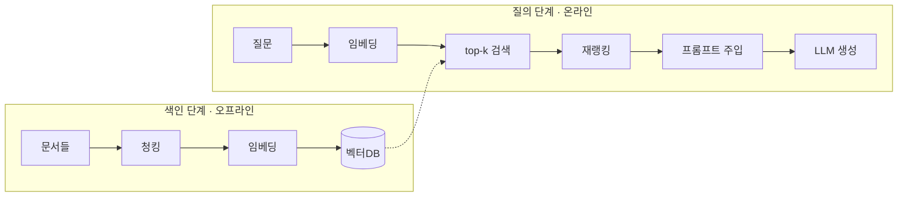
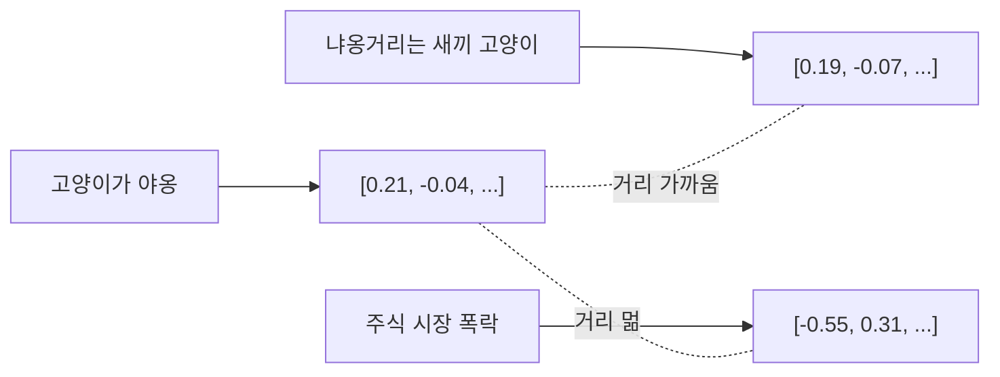
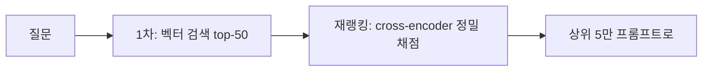
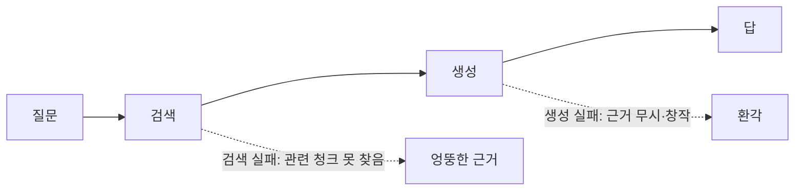
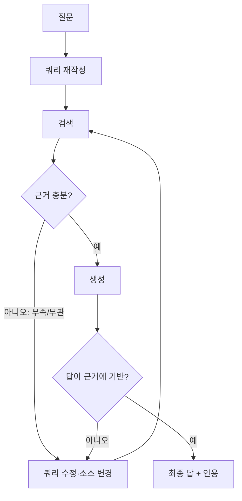

# 세션 05 — RAG 심화 · 검색 증강 생성

> "세션 04에서 RAG를 ==메모리의 한 형태==로 봤다면, 이번엔 그 메모리를 **실제로 어떻게 짓는가** — 청킹·임베딩·검색·평가, 그리고 검색을 에이전트가 스스로 운용하는 **Agentic RAG**까지 내려간다."

---

## 학습 목표

1. **색인 파이프라인**(청킹 → 임베딩 → 벡터DB)을 단계별로 설명하고, 각 단계의 설계 선택지와 trade-off를 말할 수 있다.
2. 검색 품질을 좌우하는 손잡이 — **top-k, 재랭킹, 하이브리드 검색, 메타데이터 필터링** — 을 구분하고 언제 무엇을 조절할지 판단할 수 있다.
3. RAG를 **평가**하는 법(검색 정확도 vs 생성 충실도)을 알고, "환각인데 그럴듯한 답"이 어디서 생기는지 짚을 수 있다.
4. **Agentic RAG** 패턴(쿼리 재작성·다단계 검색·self-RAG/corrective RAG)을 이해하고, "검색할지 말지를 에이전트가 결정"하는 흐름을 설계할 수 있다.
5. 공통 리서치 어시스턴트에서 `web_search`(외부)와 **벡터DB retriever**(내부 지식)를 언제 어떻게 나눠 쓸지 결정할 수 있다.

---

## 회차 타임라인 (총 85분)

| 구간 | 시간 | 내용 |
|------|------|------|
| 복습 | 5분 | 세션 04: RAG = 장기기억 + 선택적 회상 (개념) → 오늘은 구현 |
| 개념 강의 ① | 20분 | 색인 파이프라인: 청킹 → 임베딩 → 벡터DB(ANN) |
| 개념 강의 ② | 20분 | 검색 품질: top-k·재랭킹·하이브리드·메타데이터 필터링 + RAG 평가 |
| 개념 강의 ③ | 20분 | Agentic RAG: 쿼리 재작성·다단계·self-RAG·검색 여부 결정 |
| 데모/토론 | 20분 | 리서치 어시스턴트에 retriever 도구 추가 모델링 |

---

## 본문

### 1. 복습: 개념에서 구현으로

세션 04에서 우리는 RAG를 **"외부 장기기억을 선택적으로 회상하는 메커니즘"** 으로 정의했다. 그리고 청킹·재랭킹·하이브리드 검색은 ==개념 수준에서만== 짚고 "구체 구현은 별도 심화"로 미뤘다. **이번 세션이 바로 그 별도 심화다.**



오늘의 한 문장: ==RAG의 품질은 "생성"이 아니라 대부분 "검색"에서 결정된다.== LLM은 받은 청크를 충실히 요약할 뿐, 잘못된 청크를 받으면 그럴듯하게 틀린다.

---

### 2. 색인 파이프라인 ① — 청킹 (Chunking)

검색의 단위는 문서가 아니라 **청크**다. 청킹이 검색 품질의 첫 단추다.

| 전략 | 방식 | 장점 | 함정 |
|------|------|------|------|
| 고정 크기 | N토큰씩 자름 | 단순·예측가능 | 문장/표가 중간에 잘림 |
| 문장/문단 경계 | 의미 경계로 분할 | 맥락 보존 | 청크 크기 들쭉날쭉 |
| 재귀 분할 | 큰 단위→작은 단위 순차 | 구조 존중 | 구현 복잡 |
| 의미 기반 | 임베딩 유사도로 경계 탐지 | 주제 단위 | 비용↑ |

핵심 손잡이는 **청크 크기**와 **오버랩**이다.

> [!TIP] 청크 크기의 trade-off
> 너무 작으면 → 맥락이 잘려 검색은 정확해도 답에 필요한 정보가 흩어진다.
> 너무 크면 → 한 청크에 잡음이 섞여 임베딩이 ==뭉개지고== 관련 없는 청크가 끌려온다.
> 실무 출발점: 512~1024 토큰 + 10~20% 오버랩. 그다음 **평가로 튜닝**한다.

```python
# 재귀 분할 예시 (개념)
def chunk(text, size=800, overlap=120):
    step = size - overlap
    return [text[i:i+size] for i in range(0, len(text), step)]
```

> [!NOTE] 메타데이터를 함께 저장하라 — 청크 = 본문 + 구조화 필드
> 청크는 텍스트만이 아니다. 색인 시점에 **메타데이터**를 함께 붙여 둔다. 이건 "나중에 무엇으로 걸러
> 찾을 것인가"를 정하는 ==설계 결정==이라, 색인 후엔 바꾸기 번거롭다. 처음부터 넉넉히 붙여라.
> ```python
> {
>   "text": "환불은 구매 후 14일 이내 ...",   # 임베딩되는 본문
>   "source": "policy.pdf", "page": 3, "section": "환불",  # 인용(cite)용 출처
>   "date": "2024-05-01", "doc_type": "policy",            # 필터링용
>   "tags": ["refund", "billing"], "lang": "ko",
>   "tenant": "acme", "acl": ["member", "admin"],          # 접근제어용(멀티테넌시)
> }
> ```
> 출처(`source/page`)는 **인용(cite)** 에, 나머지 구조화 필드는 **필터링**(§5.4)에 쓰인다. 세션 04의
> demo-task-spec `cite(claim, source)` 도구가 여기서 살아난다.

---

### 3. 색인 파이프라인 ② — 임베딩 (Embedding)

임베딩은 텍스트를 **의미를 담은 고차원 벡터**로 바꾼다. 의미가 가까우면 벡터 거리가 가깝다.



설계 선택지:

- **모델 선택** — 다국어 지원? 도메인 특화(코드·의료·법률)? 차원 수(384~3072)? 비용·지연.
- **질의 vs 문서 비대칭** — 일부 모델은 질문용/문서용 인코더가 다르다(asymmetric). 짧은 질문과 긴 문서의 표현을 맞춘다.
- **정규화** — 코사인 유사도를 쓰려면 벡터를 정규화한다.

> [!WARNING] 흔한 실수
> 색인할 때와 질의할 때 ==다른 임베딩 모델==을 쓰면 벡터 공간이 어긋나 검색이 통째로 망가진다. **색인·질의는 반드시 같은 모델·같은 전처리.**

```kpi
1536 | 임베딩 차원(예) | text 모델 기준
top-k | 보통 4~8 | 한 번에 끌어올 청크 수
< 100ms | 벡터 검색 지연 | ANN 인덱스 기준
```

---

### 4. 색인 파이프라인 ③ — 벡터DB와 ANN

벡터DB는 수백만 벡터에서 질의 벡터와 가까운 것을 빠르게 찾는다. 정확 최근접(전수 비교)은 느리므로 **근사 최근접 이웃(ANN, Approximate Nearest Neighbor)** 을 쓴다.

| 인덱스 | 아이디어 | 특징 |
|--------|----------|------|
| Flat | 전수 비교 | 정확하지만 느림(소규모용) |
| IVF | 군집으로 나눠 일부만 탐색 | 빠름, 약간의 누락 |
| HNSW | 다층 그래프 탐색 | 고속·고정확, 메모리↑ |

> [!NOTE] ANN은 "정확도 ↔ 속도"의 손잡이다
> `nprobe`(IVF), `ef_search`(HNSW) 같은 파라미터로 **얼마나 넓게 탐색할지**를 조절한다. 넓게 = 정확·느림, 좁게 = 빠름·누락. 정답이 검색 후보에 아예 없으면(=recall 누락) 뒤에서 아무리 재랭킹해도 못 살린다.

---

### 5. 검색 품질의 세 손잡이

#### 5.1 top-k — 몇 개를 끌어올까

작을수록 잡음↓·맥락 부족 위험, 클수록 누락↓·잡음/비용↑. 보통 **재랭킹 전에는 넉넉히(20~50)**, 재랭킹 후 **프롬프트엔 소수(3~6)**.

#### 5.2 재랭킹 (Re-ranking)

1차 검색(빠른 벡터)으로 후보 다수를 가져온 뒤, **cross-encoder** 같은 정밀 모델로 질문-청크 쌍을 다시 채점해 상위만 남긴다.



> 1차 검색은 **recall**(놓치지 않기), 재랭킹은 **precision**(엉뚱한 것 걸러내기)을 맡는다. 역할 분담이 핵심.

#### 5.3 하이브리드 검색

키워드 검색(BM25)과 벡터(의미) 검색을 **결합**한다. 고유명사·코드·희귀어는 키워드가 강하고, 동의어·의역은 벡터가 강하다. 점수를 가중합하거나 **RRF(Reciprocal Rank Fusion)** 로 순위를 융합한다.

| 질의 유형 | 키워드(BM25) | 벡터 |
|-----------|:---:|:---:|
| "에러코드 E1042" | ⭕ 강함 | △ |
| "결제가 자꾸 실패해요" | △ | ⭕ 강함 |
| 둘 다 | **하이브리드가 최선** | |

#### 5.4 메타데이터 필터링

벡터 검색은 "의미가 가까운가"만 본다. 하지만 실무 질의에는 **구조화된 조건**이 따라붙는다 — "**2024년 이후** 문서에서", "**환불 정책** 문서만", "내가 **볼 권한 있는** 것만". 색인 때 붙여둔 메타데이터(§2)로 검색 공간을 좁히는 게 메타데이터 필터링이다.

```python
retriever(
    "환불 가능 기간",
    filter={"doc_type": "policy", "date": {"$gte": "2024-01-01"}, "lang": "ko"},
)
```

**필터를 언제 거는가 — pre vs post**

| 방식 | 순서 | 장점 | 함정 |
|------|------|------|------|
| Pre-filtering | 필터 → 그 안에서 벡터 검색 | 결과가 항상 조건 충족, 정확 | 후보가 적으면 ANN 인덱스 효율↓ |
| Post-filtering | 벡터 검색 top-k → 필터 | 빠름(인덱스 그대로) | 필터 통과분이 k보다 적어 **부족**할 수 있음 |

> [!NOTE] 실무 감각
> 필터가 후보를 많이 걷어내면(예: 한 사용자의 문서만) **pre-filtering**이 유리하다 — post로 하면 top-k를 거의 다 버리고 빈손이 되기 쉽다. 요즘 벡터DB 다수는 필터를 인덱스 탐색에 함께 거는 **filtered ANN**을 지원한다.

**대표 활용**
- **최신성**: `date >= ...` 로 낡은 정책·가격을 배제 — RAG 흔한 오답의 원인이 ==오래된 문서==다.
- **소스/종류 한정**: FAQ만, 계약서만, 특정 제품 문서만.
- **언어**: 다국어 코퍼스에서 질의 언어와 맞춤.

> [!IMPORTANT] 접근제어는 검색 단계에서 강제하라 (멀티테넌시 보안)
> SaaS처럼 여러 고객(tenant)의 문서가 한 벡터DB에 섞여 있으면 "사용자가 볼 권한 있는 청크만" 돌려줘야 한다. 이건 ==프롬프트로 "남의 문서는 쓰지 마"라고 부탁할 일이 아니라==, 검색 필터로 **강제**할 일이다.
> ```python
> retriever(query, filter={"tenant": user.org_id, "acl": {"$in": user.roles}})
> ```
> 프롬프트 가드(세션 09)는 인젝션으로 우회될 수 있지만, 검색 단계에서 걸러진 청크는 ==애초에 모델 눈에 들어오지 않는다==. **권한 없는 데이터는 컨텍스트에 넣지 않는다**가 원칙.

---

### 6. RAG 평가 — 그럴듯한 환각을 잡는 법

RAG는 두 군데서 실패한다. 분리해서 측정해야 한다.



| 무엇을 | 지표 | 묻는 것 |
|--------|------|---------|
| 검색 | Recall@k / MRR / nDCG | 정답 청크가 top-k 안에 있었나 |
| 생성·충실도 | Faithfulness / Groundedness | 답이 **검색된 근거에만** 기반하나 |
| 생성·관련성 | Answer Relevance | 질문에 실제로 답했나 |

> [!IMPORTANT] 핵심 메시지
> ==검색이 틀리면 생성은 절대 맞을 수 없다.== "답이 이상하다"의 80%는 검색 단계 문제다. 그래서 **검색 지표를 먼저** 본다. LLM-as-a-Judge(세션 09)로 faithfulness를 자동 채점할 수 있지만, 근거 청크를 함께 줘야 의미가 있다.

> [!NOTE] 세션 09 연결
> 여기서 만든 검색 정확도·faithfulness 지표는 세션 09(평가·관찰가능성)에서 **에이전트 전체 평가**의 한 축으로 다시 등장한다.

---

### 7. Agentic RAG — 검색을 에이전트가 운용한다

지금까지는 "질문 → 한 번 검색 → 생성"의 **고정 파이프라인**이었다. 하지만 세션 01~03에서 배운 에이전트의 본질은 ==동적 제어==다. 검색 자체를 에이전트의 결정에 맡기면 한 단계 강해진다.

#### 7.1 검색할지 말지를 결정 (Routing)

모든 질문에 검색이 필요한 건 아니다. "2+2는?"에 벡터DB를 뒤질 이유가 없다. 에이전트가 **retrieve 도구를 부를지 말지**를 스스로 고른다 — 세션 02의 function calling 그대로, 도구가 `retriever`일 뿐.

#### 7.2 쿼리 재작성 (Query Rewriting)

사용자 질문은 검색에 나쁜 형태일 때가 많다(대명사·맥락 의존·다중 의도). 에이전트가 먼저 **검색용 쿼리로 다시 쓴다**.

```
사용자: "그거 작년 것도 돼?"
   ↓ 쿼리 재작성
검색 쿼리: "2023년 환불 정책 적용 범위"
```

나아가 에이전트는 쿼리뿐 아니라 **메타데이터 필터도 동적으로 구성**한다(§5.4). "작년 것"은 `date` 범위 필터로, "정책 문서에서"는 `doc_type=policy`로 옮긴다. ==자연어 의도를 "의미 검색 + 구조화 필터"로 분해==하는 셈이다.

#### 7.3 다단계 검색 & Self-RAG / Corrective RAG

검색 결과를 **에이전트가 비평**하고, 부족하면 다시 검색한다.



- **Self-RAG**: 모델이 "검색이 필요한가/이 청크가 관련 있나/내 답이 근거에 충실한가"를 스스로 토큰으로 판단.
- **Corrective RAG(CRAG)**: 검색 품질이 낮으면 ==웹 검색으로 폴백==하거나 쿼리를 고쳐 재검색.

> 이건 세션 03의 **Reflection**(자기비평 루프)을 검색에 적용한 것이다. 같은 패턴, 다른 무대.

#### 7.4 멀티 소스 — `web_search` vs 내부 retriever

우리 리서치 어시스턴트는 이제 도구가 둘이다:

| 도구 | 소스 | 강점 |
|------|------|------|
| `web_search` | 외부 웹(최신·공개) | 시의성, 폭넓음 |
| `retriever` | 내부 벡터DB(사내 문서) | 정확성, 비공개 지식 |

에이전트가 질문에 따라 **어느 소스를 쓸지** 고른다. 이 "소스별 전문 에이전트" 아이디어는 세션 08(멀티 에이전트)에서 **RAG Research worker**로 확장된다.

---

## 데모 워크스루 — 리서치 어시스턴트에 retriever 달기

> 코드 데모 파일은 없지만(세션 02·06·07의 `demos/*.py` 가 raw→LangChain→LangGraph 축), 여기서는 **설계 모델링**을 함께 한다. 모든 도구는 목(mock)이라 API 키가 필요 없다.

```python
# 개념: retriever를 '또 하나의 도구'로 추가 (세션 02 function calling 그대로)
def retriever(query: str) -> list[dict]:
    """내부 벡터DB에서 query와 가까운 청크 top-k를 반환한다.
    반환: [{"text": "...", "source": "policy.pdf#p3", "score": 0.82}, ...]"""
    qv = embed(query)                 # 질의 임베딩 (색인과 같은 모델!)
    hits = vector_db.search(qv, k=20) # ANN top-k
    hits = rerank(query, hits)[:5]    # 재랭킹 후 소수만
    return hits

TOOLS = {"web_search": web_search, "calculator": calculator, "retriever": retriever}
```

칠판에 그릴 것: 사용자가 "우리 환불 정책상 이 주문 환불되나?"라고 물으면 →
에이전트가 `retriever("환불 정책 적용 조건")` 호출 → 청크 5개 회수 → 근거가 충분한지 판단 →
부족하면 쿼리 수정 후 재검색 → 충분하면 **인용과 함께** 답. demo-task-spec의 `cite` 가 여기서 출처를 단다.

---

## 토론 질문

1. 청크 크기를 키웠더니 "검색은 되는데 답이 장황하고 부정확"해졌다. 어느 단계(청킹/임베딩/검색/생성)가 원인일 수 있고, 어떻게 진단하겠는가?
2. 사내 위키 검색에 하이브리드(BM25+벡터)가 순수 벡터보다 나을 법한 질의를 셋 들어보라. 반대로 순수 벡터가 유리한 질의는?
3. "답이 그럴듯한데 출처를 확인하니 근거가 없다." 이 환각을 **검색 지표**와 **생성 지표** 중 무엇으로 잡겠는가? 평가 셋을 어떻게 설계할까?
4. 모든 질문에 무조건 검색을 거는 고정 RAG와, 검색 여부를 에이전트가 정하는 Agentic RAG의 비용·지연·정확도 trade-off는?
5. 당신 도메인의 문서로 RAG를 만든다면 `web_search`와 내부 `retriever`의 경계를 어디에 긋겠는가? 무엇을 어느 소스가 답해야 하는가?
6. 여러 고객의 문서가 한 벡터DB에 섞인 SaaS에서, A고객이 B고객 문서를 검색 결과로 받지 않게 하려면 어디서 막아야 하는가? "프롬프트로 막기"와 "검색 필터로 막기"의 차이는?

---

## ✅ 학습 결과 체크리스트

- ✅ 청킹 → 임베딩 → 벡터DB(ANN) 색인 파이프라인을 단계별로 설명할 수 있다
- ✅ top-k·재랭킹·하이브리드 검색의 역할(recall vs precision)을 구분할 수 있다
- ✅ 메타데이터 필터링(시점·소스·접근제어)을 pre/post로 구분해 검색에 적용할 수 있다
- ✅ RAG 실패를 검색 단계와 생성 단계로 나눠 진단·평가할 수 있다
- ✅ Agentic RAG(쿼리 재작성·다단계·self/corrective RAG)를 설계할 수 있다
- ✅ `web_search`와 내부 retriever를 질의에 맞게 선택하는 기준을 세울 수 있다

---

## 다음 시간 예고

세션 06에서는 지금까지 **손으로 짠** 에이전트 루프와 도구·메모리·검색을 **LangChain**이라는 프레임워크 추상으로 다시 그린다. "프레임워크가 무엇을 치워주고 무엇을 숨기는가"를 raw 루프와 나란히 놓고 본다.

---

## 강사 노트 (흔한 오해/질문)

- **오해 1: "RAG = 벡터 검색이다."**
  벡터 검색은 RAG의 한 부품일 뿐이다. 청킹·재랭킹·하이브리드·평가가 빠지면 데모는 되지만 프로덕션은 안 된다. "검색이 80%"를 강조.

> [!WARNING] 오해 2: "임베딩 모델은 아무거나 좋은 거 쓰면 된다."
> 색인과 질의의 모델·전처리가 다르면 벡터 공간이 어긋나 검색이 통째로 망가진다. 또한 도메인(코드·법률·다국어)에 따라 최적 모델이 다르다. **평가로 고른다**가 정답.

- **질문 대비: "Agentic RAG는 그냥 RAG에 루프 단 거 아닌가?"**
  맞다 — 그게 핵심이다. 세션 03의 ReAct/Reflection을 검색에 적용한 것. "새 마법이 아니라 익숙한 패턴의 재사용"이라는 이 코스의 일관된 메시지를 다시 짚을 것.

- **연결 짚기**: 세션 04(메모리로서의 RAG) → **세션 05(RAG 구현·운용)** → 세션 08(소스별 RAG worker) → 세션 09(RAG 평가). 검색이라는 한 가닥이 과정 전체를 관통한다.
