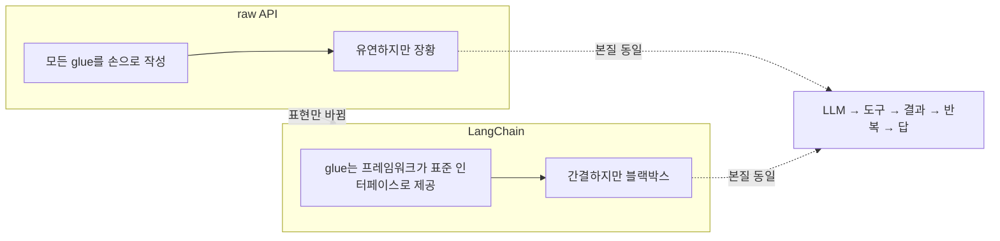
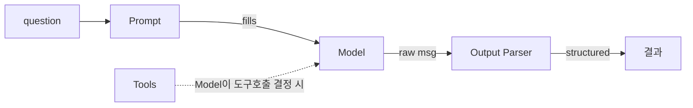
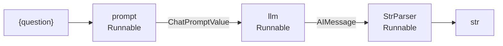

# 세션 06 — LangChain 아키텍처 이해

> "프레임워크는 우리가 세션 02에서 손으로 짠 루프를 '치워주는' 게 아니라, 같은 일을 **규약(interface)** 위에 다시 그려주는 것이다. 추상화 뒤에 무엇이 있는지 알고 써라."

---

## 학습 목표

1. LangChain이 **어떤 문제를 해결하려고** 등장했는지, 세션 02에서 직접 짠 raw 루프와 대비해 설명할 수 있다.
2. 핵심 추상 4종(Models / Prompts / Tools / Output Parsers)의 역할과 경계를 구분할 수 있다.
3. LCEL(LangChain Expression Language)과 Runnable 인터페이스의 조합 가능성(composability)을 이해하고 파이프(`|`)로 체인을 구성할 수 있다.
4. 추상화의 비용과 이점을 비교해 **언제 프레임워크를, 언제 raw API를** 쓸지 판단 기준을 세운다.
5. 세션 02의 리서치 어시스턴트(같은 토이 태스크)를 LangChain으로 재구성했을 때 무엇이 사라지고 무엇이 남는지 짚는다.

---

## 회차 타임라인 (총 80분)

| 구간 | 시간 | 내용 |
|------|------|------|
| 복습 | 5분 | 세션 02~04 요약: raw agent loop, tool use, memory |
| 개념 강의 ① | 20분 | 프레임워크가 해결하는 문제 + 핵심 추상 4종 |
| 개념 강의 ② | 20분 | LCEL과 Runnable 인터페이스, 조합 가능성 |
| 데모 | 20분 | `demos/02_langchain_agent.py` — 세션 02 루프의 재구성 |
| 토론 | 15분 | 추상화의 비용/이점, 프레임워크 vs raw 판단 |

---

## 본문

### 1. 복습: 우리가 세션 02에서 직접 짠 것

세션 02에서 우리는 **리서치 어시스턴트**(웹 검색 + 계산기로 multi-step 추론)를 raw API만으로 만들었다.
핵심은 손으로 돌린 `while` 루프였다.

```
# 세션 02의 raw 루프 (의사코드)
messages = [system_prompt, user_question]
while True:
    resp = client.chat(messages)            # ① LLM 호출
    if resp.has_tool_call:
        call = parse_tool_call(resp)         # ② 파싱 (직접 작성)
        result = TOOLS[call.name](**call.args)  # ③ 실행 (직접 디스패치)
        messages.append(tool_result(result)) # ④ 결과 주입
        continue                             # ⑤ 반복
    else:
        return resp.final_answer             # 종료
```

이 루프에서 우리가 **손으로** 책임진 것들:

- LLM SDK 호출 형식(OpenAI vs Claude 메시지 포맷 차이)
- 도구 호출 파싱 (JSON 추출, 에러 핸들링)
- 도구 디스패치 (`name -> 함수` 매핑)
- 메시지 누적과 컨텍스트 관리
- 출력 포맷팅(문자열 → 구조화 데이터)

이 다섯 가지가 정확히 **LangChain이 추상화하려는 지점**이다.

---

### 2. 프레임워크가 해결하는 문제

raw 루프를 한 번이라도 짜 본 사람은 다음 통증을 안다.

| 통증 (raw) | LangChain의 처방 |
|------------|------------------|
| OpenAI ↔ Claude 메시지 포맷이 다름 → 코드가 벤더에 묶임 | `Model` 추상: `ChatOpenAI`, `ChatAnthropic`을 동일 인터페이스로 |
| 프롬프트가 f-string 지옥, 재사용/버전관리 어려움 | `PromptTemplate` / `ChatPromptTemplate` |
| 도구 스키마를 손으로 JSON으로 적음 | `@tool` 데코레이터가 함수 시그니처/docstring에서 스키마 자동 생성 |
| LLM 출력(문자열)을 매번 파싱 | `OutputParser`가 구조화/검증 담당 |
| 조각들을 매번 손으로 이어붙임 | **LCEL** — `|` 연산자로 선언적 조합 |

핵심: LangChain은 "에이전트를 대신 만들어주는 마법"이 아니라, ==반복되는 접합부(glue)를 표준 인터페이스로 흡수==하는 것이다. 루프 자체의 본질(LLM→도구→결과→반복)은 사라지지 않는다. 단지 누가 그 루프를 들고 있느냐가 바뀐다.



---

### 3. 핵심 추상 4종

LangChain의 거의 모든 것은 다음 네 블록의 조합이다.

#### 3.1 Models — LLM 호출의 통일된 입구

```
from langchain_openai import ChatOpenAI
from langchain_anthropic import ChatAnthropic

llm = ChatAnthropic(model="claude-...")   # 또는 ChatOpenAI(...)
llm.invoke([HumanMessage("안녕")])         # 벤더 무관 동일 호출
```

세션 02에서 우리가 직접 분기 처리하던 SDK 차이를 `Model` 한 겹이 흡수한다.

#### 3.2 Prompts — 프롬프트의 템플릿화

```
from langchain_core.prompts import ChatPromptTemplate

prompt = ChatPromptTemplate.from_messages([
    ("system", "You are a research assistant. ..."),   # demo-task-spec의 공통 시스템 프롬프트
    ("human", "{question}"),
])
```

f-string을 흩뿌리는 대신 **재사용 가능한 객체**로 만든다. 변수 슬롯(`{question}`)이 명시적이라 버전관리·테스트가 쉽다.

#### 3.3 Tools — 함수에서 스키마 자동 생성

```
from langchain_core.tools import tool

@tool
def web_search(query: str) -> str:
    """웹 검색 결과 상위 N개 스니펫을 반환한다."""
    ...

@tool
def calculator(expression: str) -> float:
    """산술식을 평가한다."""
    ...
```

세션 03에서 우리가 손으로 적던 JSON 스키마(`{"name": ..., "parameters": {...}}`)를 데코레이터가 **시그니처+타입힌트+docstring**에서 자동 생성한다. docstring이 곧 도구 설명이 되므로 품질이 중요하다(강사 노트 참고).

#### 3.4 Output Parsers — 출력의 구조화

```
from langchain_core.output_parsers import StrOutputParser, PydanticOutputParser

chain = prompt | llm | StrOutputParser()   # 메시지 객체 → 순수 문자열
```

LLM의 raw 응답(메시지 객체)을 문자열/JSON/Pydantic 모델로 변환·검증한다. 세션 02의 "직접 파싱"이 이 블록으로 들어온다.



---

### 4. LCEL과 Runnable 인터페이스

#### 4.1 Runnable — 모든 블록의 공통 규약

LangChain의 핵심 통찰: ==모든 컴포넌트를 같은 인터페이스로 만들면 자유롭게 조립할 수 있다.== 그 인터페이스가 `Runnable`이다.

| 메서드 | 의미 |
|--------|------|
| `.invoke(x)` | 입력 하나 → 출력 하나 (동기) |
| `.batch([x1,x2])` | 여러 입력 병렬 처리 |
| `.stream(x)` | 토큰 스트리밍 |
| `.ainvoke(x)` | 비동기 버전 |

Model도, Prompt도, Parser도, 심지어 일반 파이썬 함수(`RunnableLambda`)도 전부 Runnable이다. 그래서 **입력/출력 타입만 맞으면** 어떤 것이든 이어붙일 수 있다.

#### 4.2 LCEL — `|` 로 선언적 조합

```
chain = prompt | llm | StrOutputParser()
answer = chain.invoke({"question": "2024 노벨 물리학상 수상자는?"})
```

`|`는 유닉스 파이프와 같은 발상이다. 왼쪽의 출력이 오른쪽의 입력으로 흐른다.



LCEL로 짜면 공짜로 따라오는 것들:

- **자동 배치/스트리밍/비동기** — 체인 전체가 Runnable이라 `.batch`, `.stream`, `.ainvoke`를 그대로 지원
- **부분 실행/추적** — LangSmith로 각 단계 입출력 추적 (세션 09 예고)
- **타입 검사** — 단계 간 입출력 불일치를 조기에 발견

> [!WARNING] LCEL은 한 방향 파이프
> LCEL 체인은 "한 방향 파이프"다. 세션 02의 ==루프(반복·조건분기)== 는 단순 `|`로 표현되지 않는다. 그래서 LangChain은 에이전트 실행을 위해 `AgentExecutor`(혹은 더 명시적인 LangGraph)를 별도로 둔다. → 세션 07으로 이어짐.

---

### 5. 추상화의 비용과 이점 — 언제 무엇을 쓸까

| 관점 | raw API | LangChain |
|------|---------|-----------|
| 초기 작성 속도 | 느림(glue 직접) | 빠름(블록 조립) |
| 투명성/디버깅 | 높음(전부 내 코드) | 낮음(내부 스택 추적 필요) |
| 벤더 교체 | 코드 수정 필요 | Model 한 줄 교체 |
| 학습 곡선 | LLM API만 | 프레임워크 개념 추가 |
| 버전 변동성 | 안정적 | 빠른 API 변화에 노출 |
| 세밀한 제어 | 완전 | 추상이 가로막을 수 있음 |

**판단 기준(rule of thumb):**

- **raw가 유리** — 학습/이해 목적, 매우 단순한 호출, 극단적 성능/제어가 필요, 의존성 최소화.
- **LangChain이 유리** — 여러 벤더·여러 도구·여러 단계를 빠르게 조합, 표준 추적/평가 도구를 얹고 싶을 때, 팀이 공통 어휘를 쓰고 싶을 때.

> [!IMPORTANT] 핵심 메시지
> 프레임워크는 ==생산성==을 주고 ==투명성==을 가져간다. 세션 02에서 루프를 직접 짜 봤기 때문에, 우리는 LangChain의 `AgentExecutor` 안에서 "지금 ④ 결과 주입 단계구나"를 읽어낼 수 있다. 그게 이 강의의 철학이다.

---

## 데모 워크스루 — `demos/02_langchain_agent.py`

> 세션 02와 **완전히 동일한 리서치 어시스턴트**(도구: `web_search`, `calculator`)를 LangChain으로 재구성한다. 같은 질문, 같은 도구, 다른 표현.

### 6.1 도구 정의 (세션 03의 손수 짠 스키마가 사라진다)

```python
from langchain_core.tools import tool

@tool
def web_search(query: str) -> str:
    """웹 검색 결과 상위 N개 스니펫을 반환한다."""
    return real_search(query)

@tool
def calculator(expression: str) -> float:
    """산술식을 평가한다."""
    return safe_eval(expression)

tools = [web_search, calculator]
```

### 6.2 모델 + 프롬프트 + 도구 바인딩

```python
from langchain_anthropic import ChatAnthropic
from langchain_core.prompts import ChatPromptTemplate

llm = ChatAnthropic(model="claude-...")
prompt = ChatPromptTemplate.from_messages([
    ("system", "You are a research assistant. ... Think step by step."),
    ("human", "{question}"),
    ("placeholder", "{agent_scratchpad}"),   # 도구 호출 이력이 누적되는 자리
])
```

### 6.3 에이전트 조립 — 세션 02의 while 루프가 `AgentExecutor`로

```python
from langchain.agents import create_tool_calling_agent, AgentExecutor

agent = create_tool_calling_agent(llm, tools, prompt)
executor = AgentExecutor(agent=agent, tools=tools, verbose=True)

result = executor.invoke({
    "question": "2024년 노벨 물리학상 수상자가 누구이고, 그 사람들이 받은 상금을 3으로 나누면 얼마야?"
})
print(result["output"])
```

### 6.3.1 `verbose=True` 로그 발췌 — ①~⑤가 그대로 찍힌다

`executor.invoke(...)`를 `verbose=True`로 돌리면 콘솔에 아래와 같은 로그가 흐른다. 세션 02 raw 루프의 ①LLM호출 ②파싱 ③실행 ④결과주입 ⑤반복이 한 줄 한 줄 대응된다.

```
> Entering new AgentExecutor chain...
Invoking: `web_search` with `{'query': '2024 Nobel Prize physics winners'}`   # ①LLM호출 ②파싱 ③실행
[{'snippet': '...수상자 John Hopfield, Geoffrey Hinton ... 상금 1,100만 SEK...'}]  # ④ 결과 주입(scratchpad)
Invoking: `calculator` with `{'expression': '11000000 / 3'}`                    # ⑤ 반복→① (다시 LLM 호출)
{'result': 3666666.67}                                                          # ④ 결과 주입
2024년 노벨 물리학상은 ... 상금을 3으로 나누면 약 3,666,667 SEK입니다.            # 도구 호출 없음 → 종료
> Finished chain.
```

> [!NOTE] 직접 확인시킬 것
> 이 로그에서 세션 02 raw 루프의 ①~⑤가 그대로 보인다. `Invoking:` 줄이 ①LLM호출+②파싱+③실행, 그 아래 결과 줄이 ④주입, 두 번째 `Invoking:`이 ⑤반복(다시 ①로)이다. ==`while True`는 사라진 게 아니라 이 로그 안에서 돌고 있다.==

### 6.4 세션 02 ↔ 세션 06 대응표 (꼭 칠판에 그릴 것)

| 세션 02 (raw 루프) | 세션 06 (LangChain) |
|--------------------|----------------------|
| `while True:` | `AgentExecutor`가 내부에서 반복 |
| `client.chat(messages)` | `llm`(Model) + 도구 바인딩 |
| `parse_tool_call(resp)` | 프레임워크가 자동 파싱 |
| `TOOLS[name](**args)` | `tools` 리스트 자동 디스패치 |
| `messages.append(...)` | `agent_scratchpad`에 자동 누적 |
| 종료 조건 직접 작성 | 도구 호출이 없으면 자동 종료 |

> [!NOTE] 메시지
> ==루프는 사라지지 않았다. AgentExecutor 안으로 들어갔을 뿐이다.== `verbose=True`로 실행하면 세션 02의 ①~⑤ 단계가 그대로 로그에 찍힌다 — 직접 확인시킬 것. [[chip:info: verbose=True]]

---

## 토론 질문

1. `verbose=True` 로그에서 세션 02 raw 루프의 ①LLM호출 ②파싱 ③실행 ④주입 ⑤반복을 각각 어디에서 찾을 수 있는가?
2. `@tool` 데코레이터가 docstring을 도구 설명으로 쓴다면, docstring 품질이 에이전트 성능에 어떤 영향을 주는가? 세션 03의 "도구 설계" 원칙과 어떻게 연결되는가?
3. LCEL의 `|`는 한 방향 파이프인데, 우리 리서치 어시스턴트는 본질적으로 루프(반복)다. `|`만으로 표현 못 하는 부분은 무엇이며, 그래서 `AgentExecutor`(다음 주 LangGraph)가 왜 필요한가?
4. 벤더를 OpenAI→Claude로 바꿀 때 raw 버전(세션 02)과 LangChain 버전에서 각각 무엇을 고쳐야 하는가?
5. 당신의 실무 프로젝트에서 LangChain을 쓰는 게 "투명성 손실"보다 이득인 경계는 어디라고 보는가?

---

## ✅ 학습 결과 체크리스트

- ✅ LangChain이 raw 루프의 어떤 접합부(glue)를 추상화하는지 설명할 수 있다
- ✅ 핵심 추상 4종(Models/Prompts/Tools/Output Parsers)을 구분할 수 있다
- ✅ LCEL의 `|`와 Runnable 인터페이스로 체인을 구성할 수 있다
- ✅ AgentExecutor 내부에 세션 02의 while 루프가 그대로 있음을 verbose 로그로 확인할 수 있다
- ✅ 언제 프레임워크를, 언제 raw API를 쓸지 판단 기준을 댈 수 있다

---

## 다음 시간 예고

세션 07에서는 LCEL의 한 방향 파이프로는 표현 못 했던 **루프·조건분기**를 정면으로 다룬다. 같은 리서치 어시스턴트를 **LangGraph 상태 그래프**로 다시 그린다.

---

## 강사 노트 (흔한 오해/질문)

- **오해 1: "LangChain을 쓰면 루프를 안 짜도 된다 = 루프가 없어진다."**
  아니다. 루프는 `AgentExecutor` 내부로 옮겨갔을 뿐 여전히 돈다. 세션 02 코드를 옆에 띄워 "이 줄이 저 안에 있다"고 매핑해 보여주면 이해가 확 빨라진다. 이 매핑이 이번 세션의 핵심 학습 효과다.

- **오해 2: "@tool이 알아서 스키마를 만들어주니 docstring은 대충 써도 된다."**
  정반대다. LLM은 docstring을 보고 도구를 고른다. docstring이 빈약하면 도구 선택이 틀린다. 세션 03의 "도구 설명은 LLM을 위한 프롬프트다" 원칙이 그대로 적용된다.

- **질문 대비: "그럼 raw는 배울 필요 없었던 거 아닌가?"**
  강조할 포인트. 디버깅·성능 튜닝·예외 흐름은 결국 추상화 아래로 내려가야 한다. raw를 모르면 `AgentExecutor`가 멈췄을 때 손을 못 댄다. "추상화 뒤를 알고 써라"가 이 강의의 척추다.
