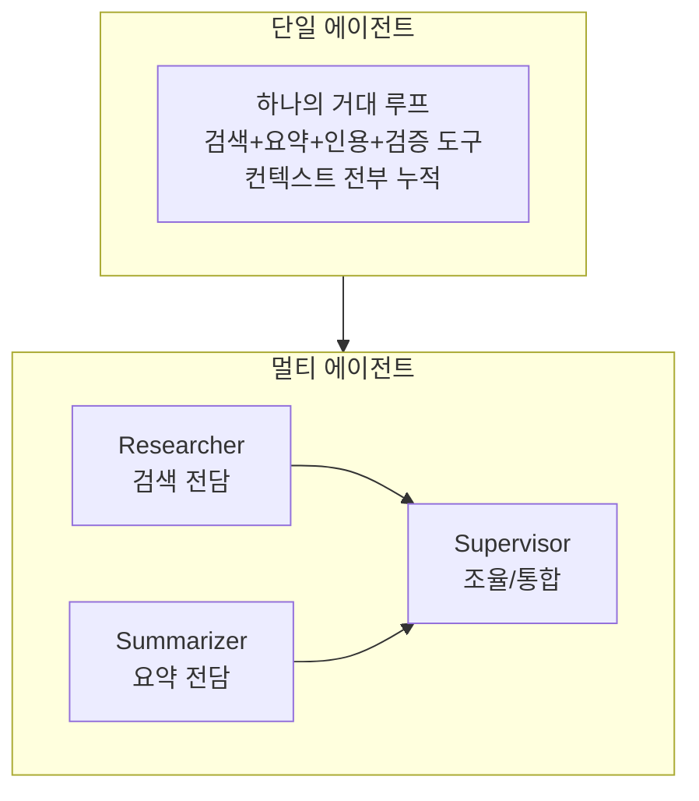
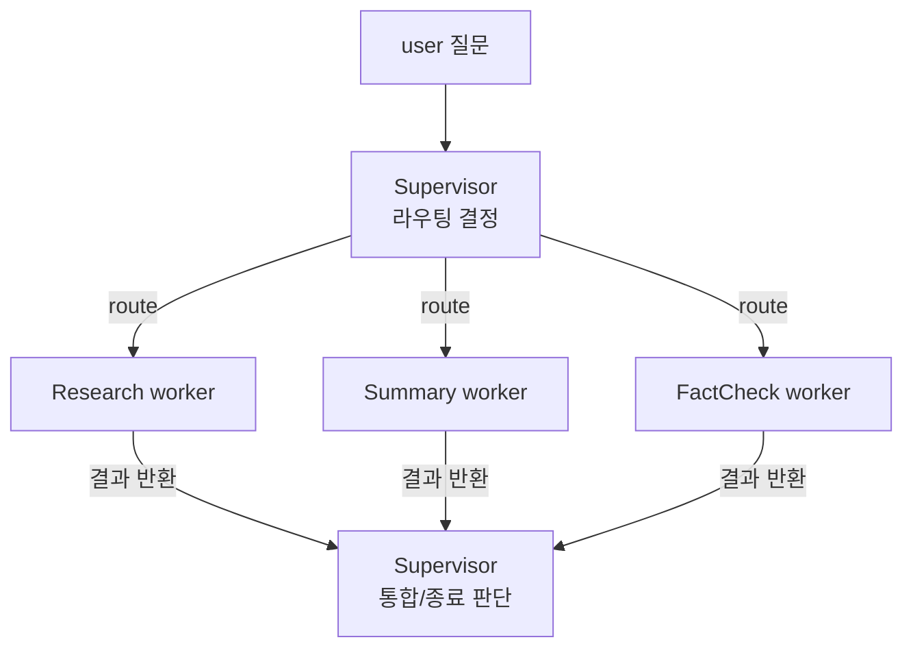
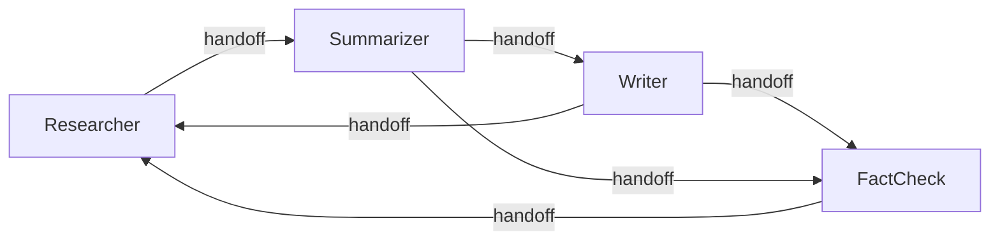
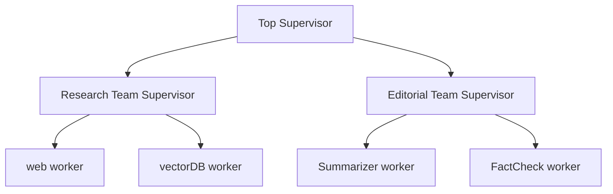
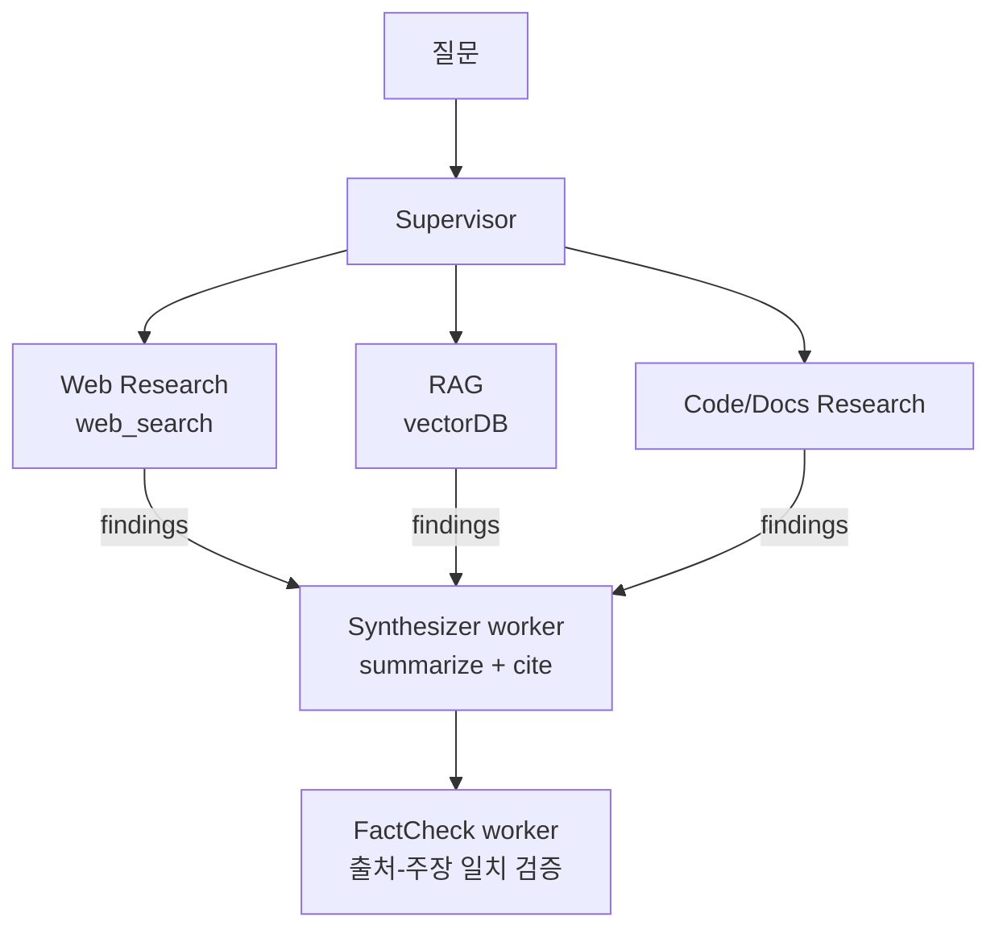

# Session 07 — 멀티 에이전트 시스템 & 오케스트레이션

> 7번째 세션. 지금까지 단일 에이전트로 키워온 **리서치 어시스턴트**를 여러 에이전트가 협업하는 구조로 확장한다.

## 학습 목표

- 단일 에이전트의 구조적 한계를 설명하고, 언제 멀티 에이전트로 분리해야 하는지 판단할 수 있다
- 대표 오케스트레이션 패턴(Supervisor, Network/Swarm, Hierarchical)의 차이와 적용 상황을 안다
- 에이전트 간 통신·핸드오프(handoff)·작업분배의 메커니즘을 설명할 수 있다
- 멀티 에이전트의 함정(비용 폭증, 일관성 붕괴, 디버깅 난이도, 동시 작업 충돌)을 인지하고 완화책을 안다
- 멀티 에이전트와 RAG를 결합한 리서치 파이프라인을 설계할 수 있다

## 회차 타임라인 (총 85분)

| 시간 | 구간 | 내용 |
|------|------|------|
| 0–5분 | 복습 | 지난 시간(LangGraph 상태 그래프) 요약 + 단일 에이전트 한계 도입 |
| 5–25분 | 개념① | 왜 멀티 에이전트인가 — 역할 분담의 동기 |
| 25–50분 | 개념② | 오케스트레이션 패턴 3종 + 통신/핸드오프 |
| 50–62분 | 개념③ | 멀티 에이전트의 함정 + 멀티에이전트 RAG |
| 62–78분 | 데모 | Supervisor가 검색/요약 하위 에이전트에 분배 |
| 78–85분 | 토론 | 단일 vs 멀티 선택 기준 |

---

## 1. 왜 멀티 에이전트인가 — 단일 에이전트의 한계

지금까지의 리서치 어시스턴트는 **하나의 LLM 루프**가 `web_search → fetch_url → summarize → cite`를 모두 처리했다. 작은 질문에는 충분하지만, 다음 한계에 부딪힌다.

| 한계 | 설명 | 증상 |
|------|------|------|
| 컨텍스트 과부하 | 검색 결과 + 원문 + 초안이 한 컨텍스트에 누적 | 토큰 폭증, "lost in the middle" |
| 프롬프트 비대화 | 모든 도구·규칙·페르소나를 한 시스템 프롬프트에 욱여넣음 | 지시 충돌, 도구 오남용 |
| 단일 추론 경로 | 한 번에 한 가지 관점만 추론 | 검증·비판 단계 부재 |
| 직렬 처리 | 여러 하위 주제를 순차로만 조사 | 지연(latency) 증가 |
| 책임 불명확 | 어디서 틀렸는지 추적 어려움 | 디버깅 난이도 |

### 역할 분담의 동기

사람 조직과 같은 직관이다. "검색 전문가", "요약 전문가", "팩트체커"로 **역할을 좁히면** 각 에이전트의 프롬프트가 단순해지고, 컨텍스트가 격리되며, 병렬 처리가 가능해진다.



> [!IMPORTANT] 핵심 원칙
> =="한 에이전트 = 한 책임(single responsibility)"==. 마이크로서비스의 직관을 LLM 에이전트에 그대로 적용한다.

---

## 2. 오케스트레이션 패턴

### 2-1. Supervisor (감독자) 패턴

중앙의 Supervisor 에이전트가 사용자 요청을 받아 **어떤 하위 에이전트(worker)에게 위임할지** 결정하고, 결과를 모아 다음 단계를 정한다. 하위 에이전트끼리는 직접 대화하지 않고, 항상 Supervisor를 거친다.



- 장점: 흐름이 명확하고 디버깅이 쉽다. 충돌·중복 제어가 한 곳에 집중된다.
- 단점: Supervisor가 병목·단일 실패점(SPOF). 모든 결과가 Supervisor 컨텍스트를 거쳐 토큰 비용 가중.
- LangGraph 구현: Supervisor 노드가 조건부 엣지로 worker 노드들로 분기, worker는 끝나면 다시 Supervisor로 회귀.

### 2-2. Network / Swarm 패턴

중앙 조율자 없이 에이전트들이 **서로에게 직접 핸드오프**한다. 각 에이전트가 "다음으로 누구에게 넘길지"를 스스로 판단한다.



- 장점: 유연하고 동적. 사전에 흐름을 고정하지 않아 예측 못 한 경로도 가능.
- 단점: 흐름 추적이 어렵고, **무한 핸드오프 루프** 위험. 종료 조건 설계가 까다롭다.
- 적합: 경로가 데이터에 따라 크게 달라지는 탐색적 작업.

### 2-3. Hierarchical (계층형) 패턴

Supervisor 위에 또 다른 Supervisor를 두는 **다층 트리**. 상위 Supervisor는 팀 단위(예: "조사팀", "검증팀")로 위임하고, 각 팀 내부에 자체 Supervisor가 worker를 관리한다.



- 장점: 대규모 시스템을 모듈로 분해. 팀 단위 재사용·확장이 쉽다.
- 단점: 깊이만큼 지연·비용이 누적. 과잉 설계(over-engineering)의 함정.

### 패턴 비교표

| 기준 | Supervisor | Network/Swarm | Hierarchical |
|------|-----------|---------------|--------------|
| 제어 | 중앙집중 | 분산 | 다층 중앙집중 |
| 흐름 예측성 | 높음 | 낮음 | 중간 |
| 디버깅 | 쉬움 | 어려움 | 중간 |
| 확장성 | 중간 | 높음 | 높음 |
| 루프 위험 | 낮음 | 높음 | 중간 |
| 추천 규모 | 2–5 worker | 동적/탐색적 | 대규모 시스템 |

---

## 3. 에이전트 간 통신 · 핸드오프 · 작업 분배

### 3-1. 핸드오프(handoff)의 본질

핸드오프는 결국 **"제어권 + 컨텍스트"를 다른 에이전트로 넘기는 것**이다. LangGraph에서는 보통 `Command(goto=..., update=...)` 형태로 표현된다.

```python
# 의사코드: Supervisor의 라우팅 결정
def supervisor(state: ResearchState) -> Command:
    decision = llm.decide(
        system="다음 작업에 가장 적합한 worker를 고르라: research|summary|factcheck|FINISH",
        state=state,
    )
    if decision == "FINISH":
        return Command(goto=END)
    return Command(
        goto=decision,                      # 제어권 이동
        update={"task": state["question"]}, # 컨텍스트 전달
    )
```

### 3-2. 무엇을 전달하고, 무엇을 격리할 것인가

| 전달(공유) | 격리(비공유) |
|-----------|-------------|
| 작업 지시(task) | worker 내부의 중간 추론 |
| 누적된 findings 요약 | 원문 전체(fetch_url 결과) |
| 전역 상태(question, done) | worker별 임시 변수 |

> [!NOTE] 격리가 가치다
> 모든 것을 공유하면 단일 에이전트와 다를 바 없어진다. ==격리가 멀티 에이전트의 가치==다. worker는 "압축된 결과"만 반환한다.

### 3-3. 작업 분배 · 충돌 · 중복 방지

병렬로 worker를 돌릴 때 **같은 자원에 동시 접근하면 충돌**한다. 이는 본 과정 운영에서 겪은 실무 교훈과 정확히 같다 — 여러 작업자가 같은 파일(`index.js`, `database.js`)을 동시에 수정하면 마지막 결과만 남는다.

```
[나쁜 분배 — 충돌/중복]            [좋은 분배 — 격리]
worker A: findings 검색→draft 작성   worker A: 주제1 검색만
worker B: findings 검색→draft 작성   worker B: 주제2 검색만
  → 둘 다 draft 덮어씀 (race)         Supervisor: 둘의 결과를 통합 작성
  → 같은 URL 중복 fetch               → 작업 경계가 겹치지 않음
```

| 문제 | 원인 | 완화책 |
|------|------|--------|
| 쓰기 충돌 | 여러 worker가 같은 상태 키에 write | reducer로 병합(append), worker마다 별도 키 |
| 작업 중복 | 분배 경계 불명확 | Supervisor가 명시적 서브태스크 분할 |
| 중복 검색 | 공유 캐시 없음 | 검색 결과 캐시/메모이제이션 |
| 순서 의존 | 검증이 작성에 의존 | 의존 작업은 직렬, 독립 작업만 병렬 |

> [!TIP] 운영 교훈
> "동일 파일은 한 작업자에게 몰아주거나, 병렬 후 메인에서 통합." 멀티 에이전트 상태 설계도 똑같다 — ==공유 쓰기는 reducer로, 충돌 가능 작업은 직렬로.==

---

## 4. 멀티 에이전트의 함정

| 함정 | 설명 | 신호 | 대책 |
|------|------|------|------|
| 비용 폭증 | 에이전트마다 LLM 호출, Supervisor 왕복마다 토큰 누적 | 단일 대비 3–10배 토큰 | worker 결과 압축, 호출 수 상한, 작은 모델 혼용 |
| 일관성 붕괴 | 에이전트별 스타일/판단 불일치 | 톤·인용 형식 제각각 | 공통 시스템 프롬프트 규약, 출력 스키마 강제 |
| 디버깅 난이도 | 어느 에이전트가 틀렸는지 불명확 | 결과만 보고 원인 추적 불가 | 전 단계 tracing(8회차), 에이전트별 로그 |
| 무한 루프 | Network에서 핸드오프가 순환 | 종료 안 됨, 비용 무한 | step 상한, 방문 카운터, 명시적 FINISH |
| 동시 쓰기 충돌 | 병렬 worker가 같은 상태 덮어씀 | 일부 결과 유실 | reducer 병합, 키 분리 |
| 과잉 설계 | 단순 작업에 5층 계층 도입 | 지연·비용만 늘고 품질 동일 | "단일로 안 되나?" 먼저 검증 |

```
비용 직관 (Supervisor + worker 2개, 1라운드)
사용자 1요청
  └ Supervisor 호출      (LLM 1)
      ├ Research worker   (LLM 2  + 도구 호출)
      ├ Summary worker    (LLM 3)
      └ Supervisor 재호출 (LLM 4, 통합/종료 판단)
→ 단일 에이전트면 LLM 1~2회로 끝날 일이 4회+ 로
```

#### 비용·지연 계산 예시 (Supervisor + worker 2개, 1라운드)

가정: ==호출당 평균 1.5k 토큰, 1회당 약 0.4s==. LLM 호출 수 = Supervisor(1) + Research(1) + Summary(1) + Supervisor 재호출(1) = **4회** (+도구 호출).

| 구성 | LLM 호출 | 토큰(≈) | 지연(≈) |
|------|---------|---------|---------|
| 단일 에이전트 | 1~2회 | 3k | 0.8s |
| 멀티(Sup+2 worker, 1R) | 4회 | 6k | 1.6s |

→ ==토큰·지연이 약 2배(라운드가 늘면 3–10배)==. 이 증가가 품질 향상으로 정당화되는지 **반드시 측정**하라.

> [!WARNING] 강의 포인트
> 멀티 에이전트는 =="품질·병렬성"을 "비용·복잡도"와 맞바꾸는 거래==다. 공짜 업그레이드가 아니다. [[chip:warn: 단일 대비 3–10배 토큰]]

---

## 5. 멀티 에이전트 + RAG 심화

4회차에서 다룬 RAG(메모리로서의 검색증강, 벡터DB 검색)를 멀티 에이전트와 결합하면, **검색 소스별로 전문 에이전트**를 둘 수 있다.



| 에이전트 | 도구 | 책임 |
|----------|------|------|
| Web Research | `web_search`, `fetch_url` | 최신 웹 정보 수집 |
| RAG Research | 벡터DB retriever | 내부 문서 검색 |
| Synthesizer | `summarize`, `cite` | findings 통합·인용 |
| FactCheck | (LLM 검증) | 주장-출처 일치 확인 |

- 핵심 이점: 검색 소스마다 **다른 청킹·검색 전략·프롬프트**를 독립 적용 가능.
- 주의: 소스 간 **중복 정보 통합**과 **출처 충돌 해소**가 Synthesizer의 핵심 난제.

---

## 6. 데모 워크스루 — Supervisor가 2개 worker에 분배

리서치 어시스턴트를 Supervisor + Research worker + Summary worker로 확장한다. (코드는 골격 수준)

### 6-1. 상태 스키마 (멀티 에이전트 확장)

```python
from typing import Annotated
import operator

class MultiAgentState(TypedDict):
    question: str
    next: str                                   # Supervisor가 정하는 라우팅
    findings: Annotated[list[dict], operator.add]  # reducer: append로 병합(충돌 방지)
    draft: str
    done: bool
```

> `Annotated[..., operator.add]`가 핵심. 여러 worker가 `findings`에 동시에 써도 **덮어쓰지 않고 합쳐진다.**

### 6-2. 노드 골격

```python
def supervisor(state):
    # findings가 충분하면 summary로, 아니면 research로, 끝났으면 FINISH
    nxt = llm.route(state)              # "research" | "summary" | "FINISH"
    return {"next": nxt}

def research_worker(state):
    hits = web_search(state["question"])
    docs = [fetch_url(h["url"]) for h in hits[:3]]
    new = [{"claim": ..., "source_url": h["url"], "snippet": ...}
           for h in hits]
    return {"findings": new}            # reducer가 append

def summary_worker(state):
    text = "\n".join(f["snippet"] for f in state["findings"])
    draft = summarize(text)  # 길이 제한(≈200단어)은 프롬프트로 지시 (공통 스펙 시그니처와 일치)
    cited = [cite(c, s) for c, s in extract_claims(draft)]
    return {"draft": draft, "done": True}
```

### 6-3. 그래프 배선

```python
g = StateGraph(MultiAgentState)
g.add_node("supervisor", supervisor)
g.add_node("research", research_worker)
g.add_node("summary", summary_worker)

g.set_entry_point("supervisor")
g.add_conditional_edges("supervisor", lambda s: s["next"],
    {"research": "research", "summary": "summary", "FINISH": END})
g.add_edge("research", "supervisor")   # worker는 끝나면 Supervisor로 회귀
g.add_edge("summary", "supervisor")
app = g.compile()
```

### 6-4. 실행 trace (개념)

```
[turn 1] supervisor → next=research        (findings 비어있음)
[turn 2] research   → web_search("...")    findings += 3건
[turn 3] supervisor → next=research        (더 필요 판단)
[turn 4] research   → findings += 2건       (총 5건)
[turn 5] supervisor → next=summary         (충분)
[turn 6] summary    → draft 작성 + cite     done=True
[turn 7] supervisor → next=FINISH → END
```

> trace에서 주목: Supervisor가 **매 라운드 호출**된다 = 비용 발생 지점. 또한 turn 2,4의 research 결과가 reducer로 안전하게 누적됨(충돌 없음).

### 6-5. 루브릭으로 본 개선

| 항목 | 단일 에이전트 | 멀티 에이전트 |
|------|--------------|--------------|
| 정확성 | 한 루프가 다 처리 | FactCheck 분리로 향상 가능 |
| 완전성 | 컨텍스트 과부하로 누락 | worker 격리로 깊은 조사 |
| 효율성 | 단순 작업엔 더 빠름 | Supervisor 왕복으로 저하 |
| 추적성 | 단일 로그 | 에이전트별 trace 필요 |

---

## 7. 토론 질문

1. 우리 리서치 어시스턴트를 멀티 에이전트로 바꿀 때, **가장 먼저 분리해야 할 책임**은 무엇이고 이유는? (검색? 요약? 검증?)
2. Supervisor 패턴과 Swarm 패턴 중, "출처 신뢰도에 따라 경로가 크게 달라지는" 작업에는 어느 쪽이 맞나? 종료 조건은 어떻게 보장할까?
3. 비용이 단일 대비 5배가 됐는데 품질 향상은 10%뿐이라면, 어떤 결정을 내리고 무엇을 측정해 정당화할까?
4. 두 worker가 같은 `draft` 키에 동시에 쓰려 한다. reducer 없이 이 충돌을 막는 방법 2가지는? (운영 교훈: 같은 파일 동시 수정 문제와 연결)
5. "단일 에이전트로 충분한가?"를 판단하는 **체크리스트**를 팀이 함께 3개 항목으로 정의해보자.

---

## ✅ 학습 결과 체크리스트

- ✅ 단일 에이전트의 한계와 멀티로 분리해야 할 시점을 판단할 수 있다
- ✅ Supervisor/Network·Swarm/Hierarchical 패턴의 차이를 설명할 수 있다
- ✅ 핸드오프 = "제어권+컨텍스트 이전"임을 설명하고 무엇을 격리할지 정할 수 있다
- ✅ 멀티 에이전트의 비용 증가(단일 대비 3–10배)를 계산·근거로 들 수 있다
- ✅ 공유 쓰기는 reducer로, 충돌 가능 작업은 직렬로 설계할 수 있다

---

## 8. 강사 노트 — 흔한 오해 & 질문

**오해 1: "멀티 에이전트면 항상 더 똑똑하다."**
→ 아니다. 단순/짧은 작업은 단일이 더 빠르고 싸고 정확하다. 멀티는 컨텍스트 격리·병렬성·전문화가 **실제로 필요할 때만** 이득. "단일로 안 되나?"를 먼저 물어라.

**오해 2: "worker끼리 모든 상태를 공유해야 협업이 된다."**
→ 반대다. 격리가 핵심 가치. worker는 **압축된 결과만** 반환해야 컨텍스트 폭증을 막는다. 전부 공유하면 거대 단일 에이전트와 동일해진다.

**자주 나오는 질문: "Supervisor도 결국 LLM인데, 라우팅을 틀리면?"**
→ 맞다. Supervisor의 라우팅 오류는 흔한 실패 모드다. (1) 라우팅을 function calling으로 강제해 출력 형식을 고정, (2) 허용 목적지를 enum으로 제한, (3) step 상한과 FINISH 강제 종료로 폭주 방지. 8회차 평가·tracing에서 이 라우팅 정확도를 측정하는 법을 다룬다.

> 다음 시간(S8): 이렇게 복잡해진 멀티 에이전트를 **어떻게 평가하고, 관찰하고, 프로덕션에 올릴 것인가**를 다룬다.
