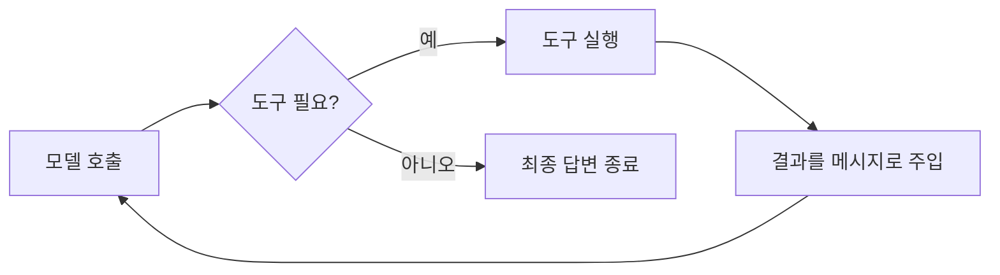

# 공유 데모 토이 태스크 명세 (모든 세션 자료의 기준)

> 이 문서는 강의 전체에서 **하나의 일관된 예제**를 쓰기 위한 기준이다.
> 세션 2(raw API) → 세션 5(LangChain) → 세션 6(LangGraph)에서 **같은 태스크가 진화**하는 모습을 보여준다.
> 모든 세션 자료와 데모 코드는 이 명세를 따른다.

## 토이 태스크: "리서치 어시스턴트 (Research Assistant)"

사용자의 질문을 받아, 필요하면 **웹 검색**과 **계산**을 도구로 사용해 답을 만들고, 마지막에 **요약**해서 돌려주는 단일 에이전트.

- 충분히 단순해서 1~1.5시간 세션에 설명 가능
- 그러나 "도구 선택 → 실행 → 결과 반영 → 종료 판단" 루프를 온전히 보여줄 만큼은 복잡
- 핵심 도구가 2개여서 "모델이 어떤 도구를 고르는가"를 시연 가능 (세션 3부터 확장 도구 추가)

## 도구(Tools) 정의

도구는 **핵심(Core) 2종**과 **확장(Extended) 3종**으로 나뉜다.
- **핵심 2종은 전 세션 공통**이다. 세션 1~2의 표준 데모는 이 2개만으로 "모델이 어떤 도구를 고르는가"를 시연한다.
- **확장 도구는 세션 3부터** 해당 세션의 학습 목표(다단계 추론·요약·인용·멀티에이전트)에 따라 추가로 등장한다. 이름·시그니처는 아래 정의를 **그대로** 쓴다.

### 핵심 도구 (Core — 전 세션 공통)

#### 1. `web_search`
- 설명: "주어진 검색어로 웹을 검색해 상위 결과 스니펫을 반환한다"
- 입력: `{ "query": string }`
- 출력(예): `[{ "title": string, "snippet": string, "url": string }, ...]`
- 데모에서는 **목(mock)** 구현 (고정 결과 반환) — API 키 없이 강의 가능

#### 2. `calculator`
- 설명: "수식 문자열을 계산해 결과를 반환한다"
- 입력: `{ "expression": string }`  (예: `"1234 * 5.5"`)
- 출력: `{ "result": number }`

### 확장 도구 (Extended — 세션 3부터 학습 목표에 따라 등장)

#### 3. `fetch_url`
- 설명: "주어진 URL의 본문을 가져온다. 검색 스니펫만으로 부족할 때 사용"
- 입력: `{ "url": string }`
- 출력: `{ "text": string }`
- 용도: ReAct 다단계 추론(세션 3), 멀티에이전트 리서치(세션 7) 시연
- 데모에서는 **목(mock)** 구현 (고정 본문 반환)

#### 4. `summarize`
- 설명: "긴 텍스트를 받아 핵심을 압축한 요약을 반환한다"
- 입력: `{ "text": string }`
- 출력: `{ "summary": string }`
- 용도: 메모리·컨텍스트 관리(세션 4), 멀티에이전트 합성(세션 7)

#### 5. `cite`
- 설명: "주장과 출처를 매핑해 인용 항목을 만든다"
- 입력: `{ "claim": string, "source": string }`
- 출력: `{ "citation": string }`
- 용도: 추적성(traceability) 루브릭 — 멀티에이전트(세션 7), 평가(세션 8)

## 표준 시나리오 (강의 중 trace로 따라갈 입력)
> "2024년 노벨 물리학상 수상자가 누구이고, 그 사람들 수가 받은 상금을 3으로 나누면 얼마야?"

기대 흐름:
1. 모델이 `web_search("2024 Nobel Prize physics winners")` 호출
2. 검색 결과(스니펫)를 보고 수상자 파악
3. 모델이 `calculator("11000000 / 3")` 호출 (상금은 mock 값)
4. 도구 결과를 종합해 최종 자연어 답변 생성 → 종료

## 정지 조건 (stop condition)
- 모델이 더 이상 도구를 호출하지 않고 최종 텍스트를 반환하면 종료
- 안전장치: 최대 루프 횟수(예: `MAX_TURNS = 6`) 초과 시 강제 종료

> [!IMPORTANT]
> 안전장치 `MAX_TURNS = 6` 초과 시 강제 종료로 무한 루프를 막는다.

## 진화 단계 매핑
| 세션 | 동일 태스크를 무엇으로 구현하는가 | 강조점 |
|------|------------------------------|--------|
| 2 | raw OpenAI/Claude API + while 루프 | 에이전트 루프의 본질 |
| 5 | LangChain (LCEL, Tool 추상) | 추상화가 무엇을 감추는가 |
| 6 | LangGraph (State/Node/Edge) | 루프 = 상태 그래프 |

## 코드 표기 규칙
- 언어: Python 3.11+
- 모델 호출은 의사코드/실제코드 혼용 가능하나, 도구 이름·시그니처는 위 정의를 **그대로** 사용
- API 키 노출 금지, 검색은 mock 함수로 대체

> [!WARNING]
> API 키 노출 금지. 검색은 mock 함수로 대체해 키 없이 강의 가능하게 한다.
