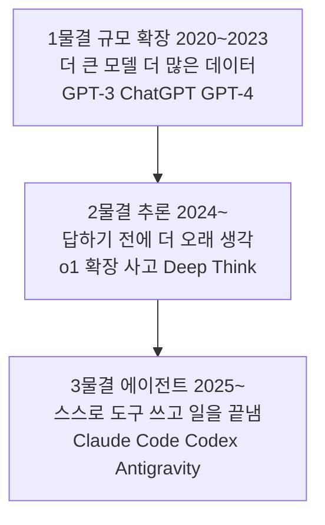
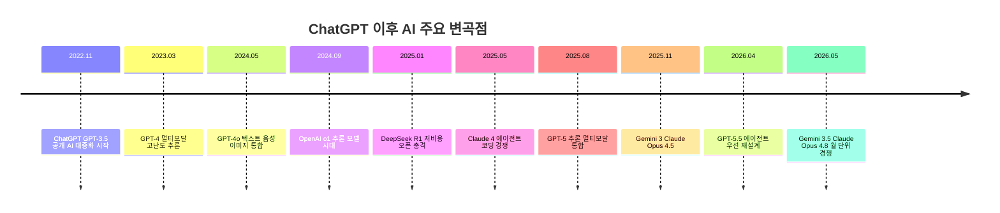
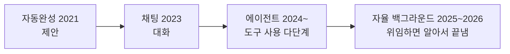

# 레슨 00 · AI 시대 이해하기

본격적으로 AI의 동작 원리를 배우기 전에, **지금 AI가 어디까지 왔고 무엇으로 경쟁하는지** 큰 지도를 먼저 그려봅니다.

> [!NOTE] 읽기 전에
> 이 레슨은 빠르게 변하는 업계 현황을 다룹니다. 아래 내용은 **2026년 5월 기준** [[chip:info: 2026]]으로 정리했으며, 모델·제품 정보는 몇 주 단위로 바뀔 수 있습니다. 주요 사실에는 출처 링크를 달아 두었으니 최신 여부는 원문에서 확인하세요.

## 학습 목표

- AI가 "규모 확장 → 추론 → 에이전트"로 발전해 온 큰 흐름을 한 문장으로 설명할 수 있다.
- LLM이 무엇이고 왜 지금 AI의 중심에 있는지 안다.
- 현재 경쟁 중인 주요 모델(ChatGPT·Claude·Gemini)과 AI 코딩 도구들의 지형을 구분할 수 있다.

---

## 1. AI는 어디로 발전하고 있나

지난 몇 년간 AI의 발전은 크게 ==세 단계의 물결==로 볼 수 있습니다.



- **1물결 — 규모(Scale)**: 모델을 키우고 데이터를 늘릴수록 똑똑해진다는 흐름. ChatGPT가 이 시기의 정점에서 AI를 대중에게 각인시켰습니다.
- **2물결 — 추론(Reasoning)**: 2024년 9월 OpenAI가 o1을 내놓으며 "답을 내기 전에 단계적으로 생각하는" 추론 모델 시대가 열렸습니다 ([OpenAI o1](https://openai.com/index/introducing-openai-o1-preview/)). 이후 경쟁사 모두 비슷한 기능을 도입했습니다.
- **3물결 — 에이전트(Agent)**: 2025년부터는 모델이 직접 도구를 쓰고 여러 단계를 자율 수행하는 **에이전트**가 핵심 경쟁 무대가 되었습니다. 이 과정의 주제이기도 하죠.

> [!TIP] 큰 방향
> **더 크게(scale) → 더 깊이 생각하게(reason) → 스스로 일하게(act).**
> 여기에 텍스트를 넘어 이미지·음성·영상을 함께 다루는 **멀티모달**과 **도구 사용**이 더해지고 있습니다.

---

## 2. LLM이란 무엇인가

오늘날 AI 붐의 중심에는 **LLM(Large Language Model, 대규모 언어 모델)** 이 있습니다.

LLM은 인터넷 규모의 방대한 텍스트로 학습해, ==다음에 올 단어(토큰)를 예측== 하도록 훈련된 모델입니다. 문장을 한 토큰씩 이어 붙이며 말을 만들어 내죠. (이 원리는 다음 레슨 01에서 자세히 다룹니다.)

- "Language Model(언어 모델)" = 다음 단어를 예측하는 모델
- "Large(대규모)" = 파라미터·학습 데이터가 매우 큼 → 번역·요약·코딩·추론 등 **하나의 모델이 다양한 일**을 해냄

핵심은, LLM은 정해진 규칙을 따르는 프로그램이 아니라 **패턴을 학습해 그럴듯한 다음 말을 생성**한다는 점입니다. 그래서 강력하지만 **틀리기도(환각) 합니다** — 이건 레슨 02의 주제입니다.

> [!IMPORTANT] 한 줄로
> **LLM = "다음에 올 말"을 엄청 잘 예측하도록 학습한, 거대하고 범용적인 언어 모델.**

---

## 3. ChatGPT 이후, 무슨 일이 있었나 (타임라인)

2022년 11월 ChatGPT 등장 이후 약 3년 반 동안 AI는 숨 가쁘게 발전했습니다. 주요 변곡점만 추려 봅니다.

```kpi
5일 | 100만 사용자 돌파 | ChatGPT 출시 직후
약 3년 반 | 숨 가쁜 발전 기간 | 2022.11 ~ 2026.05
3파전 | 프런티어 모델 경쟁 | OpenAI · Anthropic · Google
```



| 시기 | 사건 | 의의 | 출처 |
|------|------|------|------|
| 2022.11 | ChatGPT(GPT-3.5) 공개 | 생성형 AI 대중화의 출발점 | [Wikipedia](https://en.wikipedia.org/wiki/ChatGPT) |
| 2023.03 | GPT-4 출시 | 이미지 입력·고난도 추론 도약 | [Wikipedia](https://en.wikipedia.org/wiki/GPT-4) |
| 2024.05 | GPT-4o ("omni") | 음성·이미지 실시간 통합, 속도 향상 | [Wikipedia](https://en.wikipedia.org/wiki/GPT-4o) |
| 2024.09 | OpenAI o1 | "답 전에 생각하는" 추론 모델 시대 | [OpenAI](https://openai.com/index/introducing-openai-o1-preview/) |
| 2025.01 | DeepSeek R1 | o1급 성능을 저비용·오픈으로 공개 → 시장에 충격(엔비디아 등 AI 관련주 급락이 뒤따름) | [Britannica](https://www.britannica.com/money/DeepSeek) |
| 2025.05 | Claude Opus 4 / Sonnet 4 | "에이전트·코딩" 경쟁 본격화 | [Wikipedia](https://en.wikipedia.org/wiki/Claude_(language_model)) |
| 2025.08 | GPT-5 | 추론과 멀티모달을 단일 모델로 통합 | [OpenAI](https://openai.com/index/introducing-gpt-5/) |
| 2025.11 | Gemini 3 · Claude Opus 4.5 | 에이전트·코딩 차별화 심화 | [Anthropic](https://www.anthropic.com/news/claude-opus-4-5) |
| 2026.04 | GPT-5.5 | "에이전트 우선"으로 재훈련 | [OpenAI](https://openai.com/index/introducing-gpt-5-5/) |
| 2026.05 | Gemini 3.5 Flash·Omni / Claude Opus 4.8 | 월 단위 릴리스 경쟁, 멀티모달·에이전트 강화 | [Google](https://blog.google/innovation-and-ai/models-and-research/gemini-models/gemini-3-5/) |

> [!WARNING]
> 2026년의 세부 버전·날짜(예: Claude 4.6~4.8, Gemini 3.5)는 빠르게 갱신되며 일부는 공식 블로그가 아닌 정리 매체 기준입니다. 강의 시점에 최신 모델명을 한 번 더 확인하세요.

**기억할 3가지 변곡점**
1. **ChatGPT(2022.11)** — AI를 모두의 손에 쥐여 줌
2. **추론 모델 o1(2024.09)** — "생각하는" AI로의 전환
3. **DeepSeek 충격(2025.01)** — "AI는 무한한 돈·컴퓨팅이 필요하다"는 가정에 균열을 낸 사건으로 평가됨

---

## 4. 지금 경쟁 중인 3대 모델: ChatGPT · Claude · Gemini

2026년 현재 프런티어 모델 경쟁은 사실상 **OpenAI · Anthropic · Google**의 3파전입니다. (오픈 모델 진영에는 Meta Llama, DeepSeek 등도 있습니다.)

> 아래 표는 **2026년 5월 기준**이며, 모델명·세부 강점은 매달 바뀔 수 있습니다.

| 구분 | OpenAI (ChatGPT) | Anthropic (Claude) | Google (Gemini) |
|------|------------------|--------------------|-----------------|
| 대표 모델 | GPT-5.5 계열 | Claude Opus 4.x / Sonnet / Haiku | Gemini 3.x Pro / Flash |
| 강점·포지셔닝 | 폭넓은 활용·생태계, 에이전틱 코딩·도구 사용 | 코딩·장기 자율 작업, 신뢰성·안전성 | 속도·비용 균형, 네이티브 멀티모달, 구글 생태계 |
| 잘 맞는 용도(예) | 범용 비서, 다양한 도구·플러그인 연동 | 긴 코드베이스 수정, 오래 걸리는 자율 작업 | 영상·오디오 이해, 빠르고 저렴한 대량 처리 |
| 흔히 지적되는 약점 | 모델별 성격 차가 커 선택이 헷갈림 | 가벼운 잡담·창작에선 다소 딱딱하게 느껴질 수 있음 | 모델 라인업이 많아 어떤 걸 쓸지 혼란 |
| 멀티모달·컨텍스트 | 대형 컨텍스트, 텍스트·이미지 | 대형 컨텍스트, 텍스트·비전 | 텍스트·이미지·오디오·**영상**까지 네이티브 |
| 제품·생태계 | ChatGPT 앱, Codex, API | Claude 앱, Claude Code, API | Gemini 앱, 검색·Android·Workspace 통합 |

> [!NOTE]
> "약점"은 절대적 우열이 아니라 **상대적 인상**입니다. 모델은 매달 갱신되므로, 실제 선택은 직접 같은 작업을 시켜 비교해 보는 것이 가장 확실합니다.

출처: [OpenAI GPT-5.5](https://openai.com/index/introducing-gpt-5-5/) · [Anthropic 모델 개요](https://platform.claude.com/docs/en/about-claude/models/overview) · [Google Gemini](https://deepmind.google/models/gemini/)

**한 줄 요약(중립)**
- **OpenAI/ChatGPT** — 가장 널리 쓰이는 범용 강자, 도구·에이전트 기능이 풍부.
- **Anthropic/Claude** — 코딩과 장기 자율 작업, "정직하고 안전한" 포지셔닝.
- **Google/Gemini** — 멀티모달과 속도·비용 효율, 압도적 생태계 통합.

> 어떤 모델이 "최고"인지는 **용도에 따라 다릅니다.** 코딩, 글쓰기, 영상 이해, 비용 등 무엇을 중시하느냐로 선택이 갈립니다.

---

## 5. AI 코딩 에이전트 비교

모델 경쟁만큼 뜨거운 곳이 **AI 코딩 도구**입니다. 흥미롭게도 모델 제조사(OpenAI·Anthropic·Google)가 직접 완성형 코딩 에이전트를 내놓으며 경쟁이 격화됐습니다.

| 도구 | 제공사 | 형태 | 대표 강점 |
|------|--------|------|-----------|
| **Cursor** | Anysphere | IDE(VS Code 기반) + 백그라운드 에이전트 | "에이전트 우선" 에디터, 병렬 서브에이전트 |
| **Claude Code** | Anthropic | CLI(핵심) + IDE 확장 + 데스크톱/웹 | 터미널 네이티브 에이전트, 환경 간 세션 이동, MCP |
| **Codex** | OpenAI | CLI(오픈소스) + IDE + 웹/클라우드 | 수백~수천 단계 자율 실행, GPT-5.5 기반 |
| **Antigravity** | Google | 에이전트 우선 IDE + CLI/SDK | 에디터·터미널·브라우저를 아우르는 자율 오케스트레이션 |
| **GitHub Copilot** | GitHub/MS | IDE(에이전트 모드) + 클라우드 PR 에이전트 | 폭넓은 IDE 통합, 클라우드에서 PR 생성 |
| Windsurf / Devin | Cognition | 에이전트형 IDE / 자율 클라우드 에이전트 | 전체 코드베이스 이해, 엔드투엔드 자동화 |

출처: [Cursor 3](https://cursor.com/blog/cursor-3) · [Claude Code](https://claude.com/product/claude-code) · [OpenAI Codex](https://openai.com/codex/) · [Google Antigravity](https://developers.googleblog.com/build-with-google-antigravity-our-new-agentic-development-platform/) · [GitHub Copilot](https://docs.github.com/en/copilot/get-started/features)

> [!EXAMPLE] 참고
> **이 강의 자료를 만든 Claude Code**도 위 표의 도구 중 하나입니다 — Anthropic의 터미널 기반 코딩 에이전트죠.

> [!WARNING]
> "Gemini Antigravity"는 실재하는 제품이며 정식 명칭은 **Google Antigravity**(핵심 모델이 Gemini)입니다. 2025년 11월 프리뷰로 처음 공개됐습니다.

---

## 6. AI 코딩 에이전트는 어디로 가나 (동향)



- **제안에서 위임으로**: 코드를 한 줄 추천하던 도구가, 이제 목표를 주면 여러 파일을 고치고 테스트까지 돌립니다.
- **에이전트 우선 인터페이스**: Cursor·Antigravity처럼 IDE 자체가 "파일 편집기"에서 "에이전트 관리 작업대"로 재설계되고 있습니다 ([InfoQ](https://www.infoq.com/news/2026/04/cursor-3-agent-first-interface/)).
- **멀티에이전트·병렬 실행**: 여러 에이전트가 동시에 다른 작업을 처리하는 방식이 표준화되는 중 ([Anthropic 2026 Agentic Coding Trends](https://resources.anthropic.com/hubfs/2026%20Agentic%20Coding%20Trends%20Report.pdf)).
- **백그라운드·클라우드 에이전트**: 노트북을 닫아도 클라우드에서 작업이 이어지고, PR을 만들어 둡니다.
- **터미널(CLI) 에이전트의 부상**: Claude Code·Codex CLI·Antigravity CLI 등 CLI가 핵심 무대로 격상.
- **검증·가드레일 중시**: 자율성이 커질수록 "테스트 통과 요구, 사람 승인 게이트" 같은 안전장치가 함께 강조됩니다(레슨 06 에이전트 가드레일과 연결).

> [!TIP] 핵심 흐름
> 개발자의 역할이 =="직접 타이핑"에서 "에이전트에게 위임하고 검증"으로== 이동하고 있습니다.

---

## 💡 한 문장 요약
AI는 **규모 → 추론 → 에이전트**로 발전해 왔고, 지금은 ChatGPT·Claude·Gemini 3파전과 코딩 에이전트(Cursor·Claude Code·Codex·Antigravity) 경쟁이 동시에 달아오르는 **에이전트의 시대**다.

## ✅ 확인 문제

**Q1.** AI 발전의 세 물결을 순서대로 말하면?
**정답.** 규모 확장(Scale) → 추론(Reasoning) → 에이전트(Agent).
**해설.** 더 크게 → 더 깊이 생각 → 스스로 일하게, 의 흐름입니다. 이 과정의 최종 주제가 바로 3물결인 에이전트입니다.

**Q2.** 2026년 현재 프런티어 모델 경쟁을 이끄는 세 회사와 대표 모델 브랜드는?
**정답.** OpenAI(ChatGPT/GPT), Anthropic(Claude), Google(Gemini).
**해설.** 오픈 모델 진영(Meta Llama, DeepSeek 등)도 있지만, 프런티어 경쟁의 중심은 이 3사입니다.

**Q3.** "AI 코딩 에이전트"가 일반 자동완성과 다른 핵심은?
**정답.** 한 줄을 제안하는 데 그치지 않고, 도구를 써서 여러 단계를 스스로 수행해 작업을 끝낸다(제안 → 위임).
**해설.** 검색·파일 편집·테스트 실행 등을 반복하는 "에이전트 루프"가 핵심이며, 그래서 검증·가드레일이 함께 중요해집니다.

## 🔗 다음 / 심화 연결
- 다음 레슨: **01 · AI 모델은 어떻게 동작하나** — 방금 만난 LLM이 "다음 토큰 예측"으로 어떻게 말을 만드는지 들여다봅니다.
- 10세션 심화 과정에서는 이 코딩 에이전트들이 내부적으로 쓰는 **에이전트 루프**를 직접 구현합니다(세션 1·세션 2).

## 참고 자료 (출처)
- OpenAI — [o1](https://openai.com/index/introducing-openai-o1-preview/), [GPT-5](https://openai.com/index/introducing-gpt-5/), [GPT-5.5](https://openai.com/index/introducing-gpt-5-5/), [Codex](https://openai.com/codex/)
- Anthropic — [모델 개요](https://platform.claude.com/docs/en/about-claude/models/overview), [Claude Opus 4.5](https://www.anthropic.com/news/claude-opus-4-5), [Claude Code](https://claude.com/product/claude-code), [2026 Agentic Coding Trends](https://resources.anthropic.com/hubfs/2026%20Agentic%20Coding%20Trends%20Report.pdf)
- Google — [Gemini 모델](https://deepmind.google/models/gemini/), [Gemini 3.5](https://blog.google/innovation-and-ai/models-and-research/gemini-models/gemini-3-5/), [Antigravity](https://developers.googleblog.com/build-with-google-antigravity-our-new-agentic-development-platform/)
- 참고 — [ChatGPT(위키)](https://en.wikipedia.org/wiki/ChatGPT), [GPT-4](https://en.wikipedia.org/wiki/GPT-4), [GPT-4o](https://en.wikipedia.org/wiki/GPT-4o), [Claude(위키)](https://en.wikipedia.org/wiki/Claude_(language_model)), [Gemini(위키)](https://en.wikipedia.org/wiki/Google_Gemini), [DeepSeek](https://www.britannica.com/money/DeepSeek), [Cursor 3](https://cursor.com/blog/cursor-3), [Google Antigravity(위키)](https://en.wikipedia.org/wiki/Google_Antigravity)

> 본 자료의 모델·제품 정보는 **2026년 5월 기준**이며 빠르게 변경됩니다. 인용 시 원문 날짜를 확인하세요.
