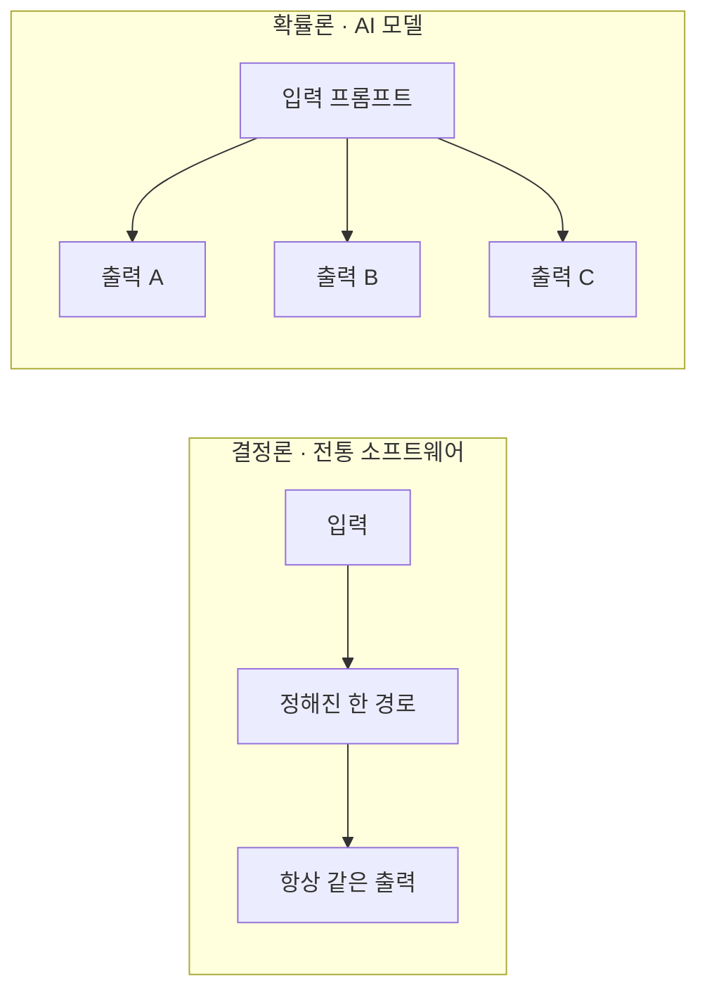
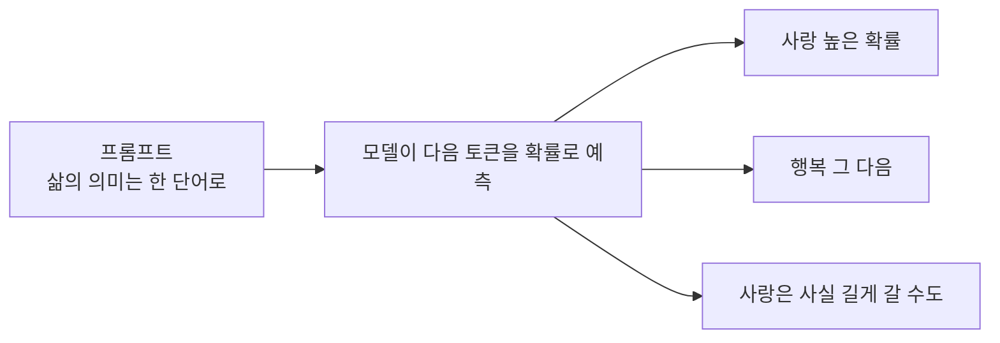

# 레슨 01 · AI 모델은 어떻게 동작하나

AI 모델이 "정답을 찾는" 게 아니라 "다음에 올 말을 예측한다"는 사실을 이해하면, 앞으로의 모든 내용이 훨씬 쉬워집니다.

## 학습 목표

- 전통적인 소프트웨어(결정론)와 AI 모델(확률론)의 차이를 한 문장으로 설명할 수 있다.
- AI가 "다음 토큰(다음에 올 단어 조각)"을 예측하는 방식이라는 점을 이해한다.
- 모델마다 지능·속도·비용이 다르고, 텍스트 외에 이미지·음성 같은 여러 모달리티가 있다는 것을 안다.

## AI 모델은 똑똑한 범용 API다

AI 모델은 아주 똑똑한 범용 API 엔드포인트라고 생각하면 편합니다. 결제를 붙이려고 Stripe를 호출하고, 문자를 보내려고 Twilio를 호출하듯, 다양한 작업을 처리하려고 AI 모델을 호출하는 거죠.

다만 가장 큰 차이가 하나 있습니다. ==같은 요청을 보내도 매번 같은 결과가 보장되지 않습니다.== 이게 일반적인 API와 결정적으로 다른 점입니다.

## 결정론 vs. 확률론

전통적인 소프트웨어는 **결정론적**입니다. 같은 입력을 넣으면 몇 번을 다시 실행해도 똑같은 출력이 나옵니다. 개발자가 "이 입력이 오면 이렇게 처리하라"고 경로를 명시적으로 적어 두었기 때문입니다.

AI 모델은 다릅니다. **확률론적**이라서, 같은 입력에도 모델이 갈 수 있는 길이 여러 갈래입니다.



그래서 AI를 다룰 때 가장 먼저 기억할 원칙은 이것입니다.

> [!IMPORTANT]
> =="매번 같은 답이 나올 거라고 절대 가정하지 말 것."==

## 다음 토큰 예측 — 모델은 어떻게 답을 고를까

그럼 모델은 여러 갈래 중 무엇을 출력할지 어떻게 정할까요? 내부적으로 모델은 **다음에 올 텍스트 조각(토큰)을 예측**합니다. 이 예측은 크게 두 가지에 기반합니다.

1. 모델이 **"훈련"된 정보** — 학습 과정에서 본 방대한 데이터
2. 우리가 입력으로 주는 것, 즉 **"프롬프트"**

더 구체적인 예를 들어 봅시다. 프롬프트로 "하늘은"이라고 주면, 모델은 다음에 올 단어 후보마다 **확률**을 매깁니다.

```
프롬프트: "하늘은 ___"
  파랗다 ··· 60%
  맑다  ··· 20%
  높다  ··· 15%
  …    ··· 나머지 5%
        └ 이 확률 분포에서 하나를 "샘플링"해 다음 토큰을 고른다
```

그래서 보통은 "파랗다"가 나오지만, 어떤 때는 "맑다"가 뽑히기도 합니다. **확률이 가장 높은 단어가 항상 선택되는 건 아니기 때문**입니다.

이번엔 AI에게 "삶의 의미가 뭐야? 한 단어로 답해 줘"라고 물어본다고 합시다. 모델은 내 입력을 바탕으로 다음에 올 단어를 한 조각씩 예측해 나갑니다. 이때 두 가지를 꼭 기억하세요.

- 같은 모델, 같은 프롬프트여도 **서로 다른 답**이 나올 수 있습니다.
- 모델이 **지시를 항상 정확히 따르는 것은 아닙니다.** 분명 "한 단어로 답하라"고 했는데도 문장으로 답할 수 있습니다.



### 왜 "확률론"이 중요할까

같은 프롬프트라도 매번 답이 달라질 수 있다는 건, 단순한 호기심거리가 아니라 **실무에서 큰 의미**를 갖습니다.

- 한 번 잘 나왔다고 **항상 그렇게 나오는 게 아니므로**, 결과는 늘 검증해야 합니다(레슨 02).
- 답의 품질이 **프롬프트에 크게 좌우되므로**, 좋은 프롬프트를 쓰는 일이 곧 좋은 결과로 이어집니다.

> [!NOTE]
> 답이 매번 흔들리는 게 곤란하다면 **temperature(온도)** 라는 설정을 낮추면 됩니다. 온도가 낮을수록 "가장 확률 높은 단어"를 더 고집해서, 답이 더 일관되고 재현 가능해집니다(대신 다양성은 줄어듭니다).

## 모델 선택하기 — 어떤 모델을 써야 할까

AI 모델은 지능, 응답 속도, 비용, 전문성이 제각각입니다. 어떤 모델은 빠르고 저렴하지만 깊은 사고가 필요한 어려운 문제는 풀지 못할 수 있고, 어떤 모델은 더 느리고 비싸지만 복잡한 작업일수록 오래 "생각"하며 잘 다룹니다.

| 가벼운 모델 | 강력한 모델 |
|---|---|
| 빠름 | 상대적으로 느림 |
| 저렴함 | 비쌈 |
| 간단한 작업에 적합 | 복잡하고 어려운 작업에 적합 |

궁극적인 목표는 ==아주 똑똑하면서도, 아주 빠르고, 아주 저렴한== 모델입니다. 그런 모델이 지금 있는지는 결국 "무엇에 쓰느냐(사용 사례)"에 달려 있습니다. 다행히 코딩 작업이라면 요즘 모델들은 이미 충분히 잘합니다. 새 모델이 거의 매달 나오고 성능 한계선도 계속 갱신되니, 앞으로 더 똑똑한 모델을 기대할 수 있습니다.

## 모달리티 — 모델과 대화하는 여러 방식

모델과 상호작용하는 방식을 **모달리티**라고 부릅니다. 텍스트를 입력하는 것 말고도 이미지를 생성하거나, 음성으로 대화하거나, 프롬프트로 동영상을 만들 수도 있습니다. 모델 품질은 빠르게 좋아지는 중이라 최신 릴리스를 주시하는 게 중요합니다. (동영상 생성만 해도 몇 년 전엔 어설펐지만 지금은 꽤 현실적이죠.)

소프트웨어를 만들 때 모달리티를 이렇게 활용할 수 있습니다.

- **텍스트**: 만들고 싶은 제품/기능을 글로 설명하고 AI와 함께 계획을 세우기
- **이미지**: UI 목업이나 디자인을 이미지로 공유하고, 간격·색상이 안 맞을 때 피드백 주기
- **음성**: 말한 내용을 받아적어 입력으로 쓰면, 길고 자세한 지시를 일일이 타이핑하지 않아도 됨

## 💡 한 문장 요약

> [!TIP] 한 문장 요약
> AI 모델은 학습한 정보와 프롬프트를 바탕으로 "다음에 올 토큰"을 확률적으로 예측하기 때문에, 같은 입력에도 답이 달라질 수 있다.

## ✅ 확인 문제

**Q.** AI 모델의 응답을 가장 잘 설명하는 문장은?

**정답.** 확률론적이며 동일한 프롬프트로 실행해도 결과가 달라질 수 있다.

**해설.** AI는 정해진 경로를 따라 항상 같은 답을 내는 결정론적 소프트웨어가 아니라, 다음 토큰을 확률로 예측하므로 같은 프롬프트에도 결과가 달라질 수 있습니다.

**Q2.** 답이 매번 흔들리지 않고 더 일관되게 나오도록 하려면 어떻게 하나요?

**정답.** **temperature(온도)** 를 낮춘다.

**해설.** 온도가 낮을수록 모델은 확률 분포에서 무작위로 고르기보다 ==가장 확률이 높은 토큰==을 더 고집합니다. 그래서 답이 더 일관되고 재현 가능해지지만, 대신 표현의 다양성은 줄어듭니다. 반대로 창의적인 초안이 필요하면 온도를 높이기도 합니다.

## 🔗 다음 / 심화 연결

- **다음 레슨: 02 환각과 한계** — 확률론적으로 동작하는 모델이 왜, 어떤 한계를 갖는지 살펴봅니다.
- 이 내용은 **10세션 심화 과정 세션 1(에이전트 개요)**로 이어집니다.
