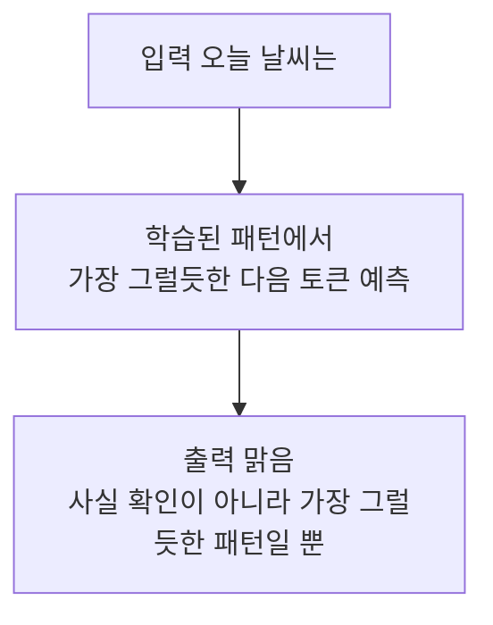
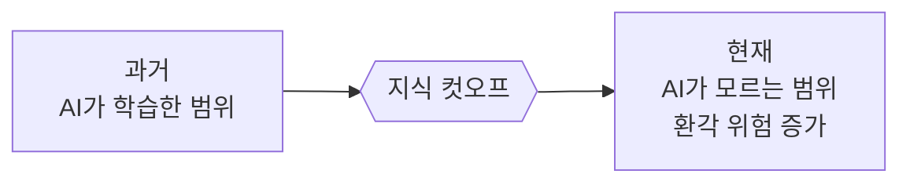

# 레슨 02 · 환각과 한계

AI가 왜 자신 있게 틀린 답을 내놓는지, 그리고 그 답을 어떻게 다뤄야 하는지 배워봅니다.

## 학습 목표

- 환각(Hallucination)이 왜 생기는지 "자동완성" 비유로 이해한다.
- 지식 컷오프(knowledge cutoff)의 개념과 그것이 코드 제안에 미치는 영향을 안다.
- AI의 답을 항상 검증하는 "검증 중심 사고방식"을 익힌다.

## 환각이란?

환각은 AI 모델이 ==겉보기에는 그럴듯하지만 실제로는 틀린 정보를 자신 있게 만들어 내는 현상==을 말합니다. 잘 모르는 주제인데도 아는 척 대화를 이어가는 사람을 떠올리면 비슷합니다. 문제는 AI가 "잘 모르겠어요"라고 솔직하게 말하기보다, 그럴듯한 답을 척척 지어낸다는 점입니다.

## 왜 환각이 생길까? — 강력한 자동완성

레슨 01에서 AI 모델은 **학습한 패턴을 바탕으로 다음 토큰(단어 조각)을 예측**한다고 배웠습니다. 환각도 바로 이 원리에서 나옵니다.

휴대폰 자동완성을 떠올려 보세요. "오늘 날씨는..."이라고 치면 휴대폰이 흔한 패턴을 따라 "맑음"이나 "흐림"을 제안합니다. AI 모델도 똑같이 작동하지만, 단어 한두 개가 아니라 **개념 전체와 코드 블록 수준**에서 이 일을 합니다.



여기서 핵심은, AI는 모르는 내용을 만나도 멈추지 않는다는 것입니다. 대신 지금까지 본 패턴 중 **가장 그럴듯한 답**을 만들어 냅니다. 코딩에서는 이런 모습으로 나타납니다.

- 실제로는 존재하지 않는 그럴듯한 API 메서드를 만들어냄
- 서로 다른 라이브러리/프레임워크의 문법을 뒤섞음
- 그럴듯해 보이지만 실제로는 없는 설정 옵션을 지어냄

## 지식 컷오프 — AI의 "최신 정보 마감일"

모델 제공자는 인터넷의 방대한 텍스트로 **특정 시점까지** 모델을 학습시킵니다. 이 마감 날짜를 ==지식 컷오프(knowledge cutoff)== 라고 부릅니다. 즉, AI가 알고 있는 최신 정보는 이 날짜까지입니다.

쉽게 말해 **지식 컷오프 = 학습이 마감된 시점**입니다. 그 이후 세상에서 벌어진 일은 모델이 알지 못합니다.

그래서 **컷오프 이후에 나온 라이브러리나 새 문법**을 물어보면, AI는 자기가 모른다는 사실조차 모른 채 옛 패턴에 맞춰 틀린 해법을 제안할 수 있습니다.

> [!NOTE]
> 내가 쓰는 모델의 컷오프가 정확히 언제인지는 **모델 제공사의 공식 문서**에서 확인할 수 있습니다. 최신 라이브러리를 다룰 땐, 컷오프 이후 정보는 모델이 모를 수 있다는 점을 염두에 두세요.



## 실제 사례로 보는 환각

개발자가 흔히 겪는 환각 예시 세 가지를 봅시다. 모두 "거의 맞아 보인다"는 공통점이 있습니다.

**1) 존재하지 않는 import** — 그럴듯하지만 그 패키지에는 없는 것을 가져오려 합니다.

```js
// AI 제안:
import { debounce } from "react";
// 실제: debounce는 React에서 내보내지 않습니다!
// lodash를 쓰거나 직접 작성해야 합니다.
```

> 왜 생기나: 학습 데이터에 `import { something } from "react"` 패턴이 워낙 흔해서, 모델이 그 빈 칸에 그럴듯한 단어(debounce)를 채워 넣은 것입니다.

**2) 가짜 메서드** — 그럴듯한 이름이지만 실제 클래스에는 없는 메서드입니다.

```python
# AI 제안:
df.remove_outliers(threshold=3)
# 실제: pandas DataFrame에는 이런 메서드가 없습니다.
# 이상치 제거는 직접 구현해야 합니다.
```

> 왜 생기나: `df.drop_...`, `df.replace(...)`처럼 동사+목적어 형태의 메서드가 흔하다 보니, "이상치 제거"라는 의도에 맞춰 실재하지 않는 이름을 자연스럽게 지어낸 것입니다.

**3) 거의 맞는 설정 파일** — 한 줄만 틀렸는데 유효하지 않은 설정입니다.

```json
// AI가 package.json에 대해 제안:
{
  "type": "module",
  "exports": "./index.js",
  "browser": true   // <- 이 옵션은 유효하지 않습니다!
}
```

> 왜 생기나: 다른 설정 파일에서 `"browser": true`가 자주 등장하다 보니, 모델이 그 익숙한 패턴을 엉뚱한 파일(package.json)에 끌어다 붙인 것입니다.

세 사례의 공통 원인은 하나입니다. **모델은 "학습 데이터에서 자주 본 패턴"을 일반화해 빈 칸을 채우는데, 그 과정에서 실재하지 않는 것까지 그럴듯하게 만들어 냅니다.** 사실을 조회하는 게 아니라 패턴을 흉내 내기 때문입니다.

이런 패턴을 자주 보다 보면, 자연스럽게 환각을 알아채는 눈이 생깁니다.

## 검증 중심 사고방식

AI와 잘 협업하는 비결은 한 문장으로 정리됩니다.

> [!IMPORTANT]
> =="모든 제안은 출발점일 뿐, 최종 답이 아니다."==

| 상황 | 이렇게 하지 마세요 | 이렇게 하세요 |
| --- | --- | --- |
| 새 API 메서드를 제안받음 | 일단 믿고 그대로 사용 | 공식 문서/코드베이스에서 확인 |
| 코드에서 오류가 남 | 무시하거나 직접 끙끙댐 | 오류 메시지를 AI에 다시 전달 |
| "정말 맞습니다!"라는 답 | 그 말을 그대로 신뢰 | 실제로 동작하는지 직접 검증 |

검증을 쉽게 하려면, **에디터가 바로 피드백을 주도록 환경을 설정**해 두는 것이 좋습니다. 잘못된 import가 있으면 곧바로 "존재하지 않는다"는 오류가 표시되도록 해 두는 식이죠.

특히 효과적인 건 **검증 루프**입니다. 코드를 실행하거나 빌드해서 나온 **오류 메시지를 그대로 복사해 모델에게 되돌려 주고 "이 오류를 고쳐 줘"라고 시키는 것**입니다. 모델은 자신이 무엇을 틀렸는지 그 오류를 보고 스스로 교정합니다. 이 "실행 → 오류 → 되먹임 → 수정" 고리를 몇 번 돌리면 환각이 빠르게 걸러집니다.

> [!NOTE]
> 도구 예시(Cursor): 잘못된 import에 빨간 밑줄로 오류를 표시해 주고, 그 오류를 한 번의 클릭으로 AI에 전달해 고치게 하는 흐름을 제공합니다. 다른 AI 코딩 도구들도 비슷한 "오류 되먹임" 기능을 갖추고 있습니다.

### 그 밖의 한계도 알아두기

- AI는 **틀렸는데도 "정말 맞습니다!"** 라고 확신에 차서 답하기도 합니다.
- 진짜 무작위 수 생성이나 단어 속 특정 글자 세기처럼, **정확한 계산이 필요한 작업**은 의외로 약합니다. (이런 일은 일반 프로그램이 더 잘합니다.)

> [!WARNING]
> AI의 "정말 맞습니다!"라는 확신은 ==정확성의 보증이 아닙니다.== 확신의 강도와 사실 여부는 별개입니다.

이런 한계가 있어도 AI는 여전히 강력한 도구입니다. 다만 검증하는 습관이 더해지면, 코드를 그대로 베끼지 않고 **동작을 이해하게 되어** 오히려 더 나은 개발자로 성장하게 됩니다.

## 💡 한 문장 요약

> [!TIP] 한 문장 요약
> AI는 "사실 확인"이 아니라 "가장 그럴듯한 패턴"을 내놓기 때문에 자신 있게 틀릴 수 있으니, 모든 제안은 검증한 뒤에 받아들이자.

## ✅ 확인 문제

**Q. 환각일 가능성이 높은 API 메서드를 제안받았을 때, 즉시 취할 수 있는 최선의 대응은?**

1. 일단 믿고 구현한 뒤 나중에 고친다.
2. 문서나 코드베이스에서 확인하고, 발생한 오류를 모델에 다시 전달한다.
3. 대안을 세 가지 더 요청하고 그중 하나를 고른다.

**정답: 2번** — 문서나 코드베이스에서 확인하고, 발생한 오류를 모델에 다시 전달한다.

**해설:** 환각은 그럴듯하게 보이므로 1번처럼 믿고 진행하면 버그가 뒤늦게 터집니다. 3번은 또 다른 환각을 늘릴 뿐입니다. 가장 확실한 방법은 **신뢰할 수 있는 출처(공식 문서·실제 코드)로 사실을 확인**하고, 발생한 오류 메시지를 AI에 되먹여 스스로 교정하게 하는 것입니다.

## 🔗 다음 / 심화 연결

- **다음 레슨: 03 토큰 & 요금제** — AI가 어떻게 "생각"하고 어떻게 과금되는지 살펴봅니다.
- 이 주제는 **10세션 심화 과정 세션 9(가드레일·안전성)** 로 이어집니다. 환각을 막는 검증 장치와 안전한 운영 방법을 깊이 다룹니다.
