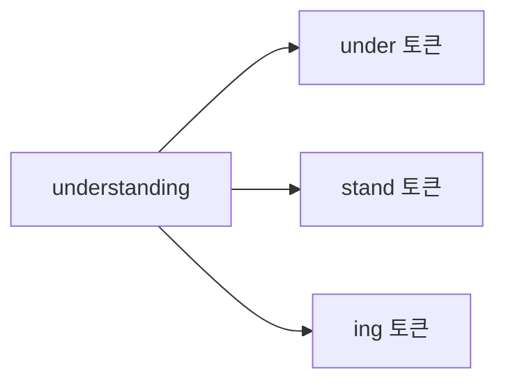
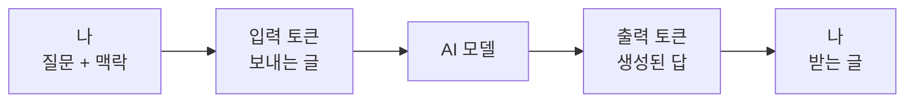

# 레슨 03 · 토큰 & 요금제

AI 모델이 글자를 어떻게 잘게 쪼개서 이해하는지, 그리고 그 조각이 왜 요금과 속도를 결정하는지 알아봅니다.

## 학습 목표

- 토큰이 무엇인지, 우리가 쓰는 단어와 어떻게 다른지 설명할 수 있다.
- 입력 토큰과 출력 토큰의 차이, 그리고 출력이 더 비싼 이유를 이해한다.
- 토큰이 속도(TPS)와 스트리밍 응답에 어떻게 연결되는지 안다.

---

## 토큰이란 무엇인가

지난 레슨에서 AI 모델이 큰 틀에서 어떻게 동작하는지 살펴봤습니다. 이번에는 모델이 "실제로 무엇을 읽고 있는가"를 들여다볼 차례입니다. 그 핵심에 **토큰(token)** 이 있습니다.

토큰은 AI 모델이 이해하는 "단어"라고 생각하면 됩니다. 다만 우리가 일상에서 쓰는 단어와 완전히 같지는 않습니다.

컴퓨터가 문자 "A"를 그대로 이해하지 않고 1과 0의 이진수로 바꿔서 처리하는 것을 떠올려 보세요. AI 모델도 비슷합니다. "hello"나 "world" 같은 단어를 통째로 다루지 않고, 모든 것을 더 작은 조각인 토큰으로 잘게 나눕니다.

예를 들어 짧은 단어 "hello"는 토큰 하나일 수 있지만, 긴 단어 "understanding"은 여러 조각으로 나뉩니다.



이처럼 단어의 일부, 구두점, 심지어 공백 하나하나가 각각 토큰이 되기도 합니다. 한국어든 영어든, 모델은 우리가 입력한 모든 글자를 이런 토큰의 흐름으로 바꿔서 읽고 답을 만들어 냅니다.

그렇다면 왜 토큰을 알아야 할까요? 이유는 두 가지입니다.

- ==토큰은 요금의 기준입니다.== 단어 수나 글자 수가 아니라, 토큰 단위로 비용을 냅니다.
- ==토큰은 속도의 척도입니다.== 더 빠른 모델일수록 초당 더 많은 토큰을 만들어 결과를 빨리 돌려줍니다.

먼저 비용에 직접 영향을 주는 요금 이야기부터 해보겠습니다.

---

## 입력 토큰 vs 출력 토큰, 그리고 과금

AI 모델을 하나의 API라고 비유하면, 토큰은 오가는 트래픽을 재고 요금을 매기는 단위입니다. 모델은 두 종류의 토큰으로 과금합니다.

| 종류 | 무엇인가 | 예시 |
| --- | --- | --- |
| **입력 토큰** | 모델에 보내는 모든 것 | 내 질문(프롬프트), 이전 대화 내용 |
| **출력 토큰** | 모델이 만들어 돌려주는 모든 것 | 모델의 답변 텍스트 |

흐름으로 보면 이렇게 정리됩니다.



여기서 꼭 기억할 점이 하나 있습니다. ==출력 토큰은 보통 입력 토큰보다 2~4배 더 비쌉니다.==

```chart
{
  "type": "bar",
  "data": {
    "labels": ["입력 토큰", "출력 토큰"],
    "datasets": [{ "label": "상대 단가 (입력=1 기준)", "data": [1, 3] }]
  },
  "caption": "출력 토큰은 보통 입력의 2~4배 (그림은 약 3배 가정) · 대략치/2026년 5월 기준"
}
```

왜 그럴까요? 입력은 이미 적혀 있는 글을 "읽어서 처리"하면 되지만, 출력은 모델이 다음에 올 내용을 한 조각씩 새로 "만들어 내야" 하기 때문입니다. 없던 것을 새로 생성하는 일이 훨씬 많은 연산을 요구하므로, 그만큼 단가가 높습니다.

> [!NOTE]
> 토큰당 가격은 **모델마다 다릅니다.** 가벼운 모델은 싸고, 강력한 모델은 비쌉니다. 다만 공통점은 **거의 항상 출력 토큰이 입력 토큰보다 비싸다**는 점입니다. 정확한 단가는 각 제공사의 가격표에서 확인하세요.

그래서 비용 관리의 핵심은 토큰을 의식하는 습관입니다. 서버 요금 구조를 미리 파악해 두는 것과 같습니다. 처음 보내는 맥락에 정보를 얼마나 담을지, 그리고 답변을 간결하게 받을지 자세하게 받을지를 의도적으로 조절하면 비용을 크게 아낄 수 있습니다. (맥락 관리는 다음 레슨에서 더 깊이 다룹니다.)

---

## 토큰 = 속도 (TPS)

토큰은 돈뿐 아니라 시간과도 직결됩니다. 모델의 속도는 흔히 **TPS(tokens per second, 초당 토큰 수)** 로 표현합니다.

TPS가 높을수록 모델이 같은 시간에 더 많은 토큰을 쏟아낸다는 뜻이고, 그만큼 답이 빨리 완성됩니다. 즉 =="얼마나 빠른 모델인가"는 곧 "초당 토큰을 몇 개 만들어 내는가"==의 문제입니다.

---

## 스트리밍 응답의 원리

ChatGPT 같은 챗봇이 마치 실시간으로 글자를 "타이핑"하듯 답을 보여주는 모습을 본 적 있을 겁니다. 이건 멋있게 보이려는 단순한 화면 효과가 아닙니다. 실제로 모델이 그렇게 동작하기 때문입니다.

AI 모델은 토큰을 한 개씩, 순서대로 만들어 냅니다. 먼저 다음 토큰을 예측하고, 그 예측을 바탕으로 또 그다음 토큰을 예측하는 식으로 이어 갑니다. 그래서 답이 토큰 단위로 차례차례 나타나는 것입니다.

이렇게 만들어진 토큰을 다 모일 때까지 기다리지 않고, 생성되는 즉시 조금씩 흘려보내 주는 것을 ==스트리밍(streaming)== 이라고 합니다. 스트리밍에는 좋은 점이 있습니다.

- 전체 답변이 끝날 때까지(때로는 몇 분씩) 기다리지 않고 부분 결과를 바로 볼 수 있습니다.
- 모델이 엉뚱한 방향으로 가기 시작하면 중간에 멈출 수 있습니다.

> [!NOTE]
> 스트리밍은 출력 토큰의 **개수를 바꾸지 않으므로 비용을 줄이지는 않습니다.** 대신 부분 결과를 빨리 보여주고 중간에 멈출 수 있게 해 줍니다.

참고로 AI 도구들은 토큰을 아끼기 위한 여러 기법도 씁니다. 자주 쓰는 프롬프트 일부를 캐시해 두거나, 매 요청에 어떤 맥락을 포함할지 알아서 관리해 주는 식입니다.

---

## 프롬프트 캐싱 — 같은 맥락을 반복해 보낼 때

긴 시스템 프롬프트나 참고 문서를 **매 요청마다 똑같이** 보내는 경우가 많습니다. 이때 같은 내용을 매번 새로 처리하면 입력 토큰 비용이 계속 발생합니다. **프롬프트 캐싱(prompt caching)** 은 이렇게 반복되는 앞부분을 모델 쪽에 한 번 저장해 두고, 다음 요청부터는 그 부분을 훨씬 싼값(또는 거의 공짜)으로 재사용하게 해 주는 기능입니다.

- **언제 효과적인가**: 자주 쓰는 긴 시스템 프롬프트, 같은 매뉴얼·코드베이스 문서를 여러 번 참고하는 경우.
- **간단 수치 예**: 매 요청에 1만 토큰짜리 문서를 붙여 20번 호출하면 입력만 20만 토큰입니다. 이 문서를 캐시하면 첫 1회만 정가로 내고 이후 19번은 대폭 할인된 단가로 처리돼 **반복 호출 비용을 크게 절감**할 수 있습니다.

> [!TIP]
> 바뀌지 않는 긴 맥락(시스템 프롬프트·문서)은 **앞쪽에 고정**해 두면 캐싱 효과를 보기 좋습니다.

---

## 토큰과 컨텍스트 윈도우의 관계

모델이 한 번에 담아 둘 수 있는 토큰의 총량을 **컨텍스트 윈도우**라고 합니다. 중요한 건, **이 윈도우 안에 들어가는 모든 글자가 토큰으로 계산된다**는 점입니다. 내 질문, 이전 대화, 붙여 넣은 문서, 모델의 답변까지 전부요. 그래서 토큰을 이해하면 비용뿐 아니라 "대화가 길어질 때 무슨 일이 일어나는가"도 이해할 수 있습니다. 이 이야기는 바로 다음 레슨 04에서 이어집니다.

---

## 💡 한 문장 요약

```kpi
2~4배 | 출력 토큰이 입력보다 비쌈 | 새로 생성하는 연산 비용
1개씩 | 토큰 생성 단위 | 스트리밍의 원리
TPS | 속도의 척도 | 초당 토큰 수
```

> [!TIP] 한 문장 요약
> AI 모델은 글을 토큰이라는 작은 조각으로 나눠 읽고 한 개씩 생성하며, 이 토큰이 곧 요금(특히 더 비싼 출력)과 속도(TPS)·스트리밍을 모두 결정한다.

---

## ✅ 확인 문제

**Q. 스트리밍에 대한 올바른 설명은 무엇인가요?**

**정답:** 모델은 토큰을 하나씩 생성하며 부분 출력물을 스트리밍할 수 있다.

**해설:** 스트리밍은 단순한 UI 트릭이 아닙니다. 모델이 실제로 토큰을 한 개씩 순서대로 만들어 내기 때문에, 다 만들어지기 전에 부분 결과를 그때그때 흘려보낼 수 있는 것입니다. 따라서 "전체 텍스트를 즉시 생성한다"는 설명은 틀립니다. 또한 스트리밍은 출력 토큰의 개수를 바꾸지 않으므로 비용을 줄여 주지 않으며, 오히려 생성 도중 중단을 가능하게 해 줍니다.

---

## 🔗 다음 / 심화 연결

- **다음 레슨:** 04 컨텍스트 — 모델에 어떤 정보를 얼마나 넣을지가 토큰과 비용에 어떻게 영향을 주는지 이어집니다.
- **10세션 심화 과정 연결:** 세션 4(메모리·컨텍스트 관리)와 세션 9(평가·운영 — 비용·토큰 관측)로 이어집니다.
