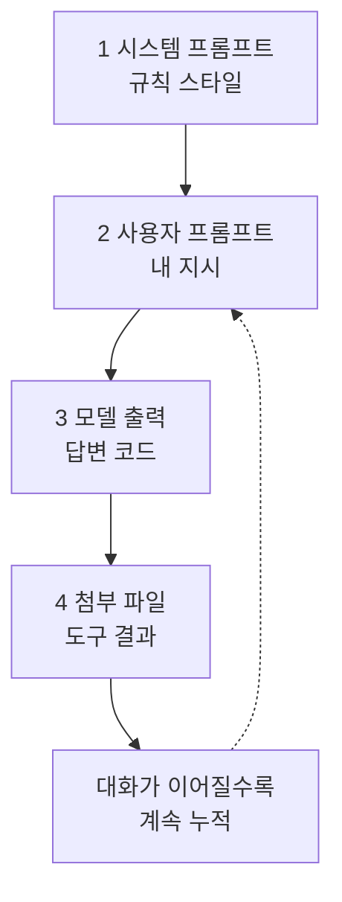

# 레슨 04 · 컨텍스트

AI 모델에게 "무엇을 보여 주고 기억하게 하느냐"가 곧 결과 품질을 좌우합니다. 이번 레슨에서는 그 핵심인 컨텍스트를 쉽게 풀어 봅니다.

## 학습 목표

- 컨텍스트가 무엇이며 왜 "작업 메모리"라고 부르는지 이해한다.
- 시스템 프롬프트와 사용자 프롬프트의 차이를 구분한다.
- 대화가 길어질수록 컨텍스트가 쌓이고, 한도와 압축/요약이 왜 필요한지 안다.

## 컨텍스트란 무엇인가 — 요리 비유

좋은 결과를 얻으려면 "더 좋은 프롬프트를 쓰면 되겠지"라고 생각하기 쉽습니다. 물론 도움이 되지만, 더 큰 핵심은 모델에게 제공하는 ==컨텍스트를 잘 관리하는 것==입니다. [[chip:info: 작업 메모리]]

수프를 만든다고 떠올려 보세요. 요리에는 여러 입력(재료)이 들어가고, 레시피라는 절차를 따라가며 진행 상황을 챙기고, 마지막에 완성된 수프가 나옵니다. 같은 레시피라도 셰프가 재료를 조금 더하거나 바꾸면 맛이 달라집니다.

AI와 작업하는 것도 똑같습니다. 코딩으로 비유하면:

- **재료(입력)**: 현재 코드베이스, 열려 있는 파일, 그리고 목표를 알려 주는 프롬프트
- **레시피(절차)**: 사람이 짠 계획이나 모델이 제안한 계획, 그에 따른 할 일 목록
- **완성된 수프(출력)**: 프로젝트에 적용할 수 있는 결과 코드

이 모든 재료와 진행 과정을 한데 담아 두는 그릇이 바로 ==컨텍스트==입니다.

> [!TIP] 핵심 한 줄
> 프롬프트를 다듬는 것보다, 모델이 보는 컨텍스트 전체를 잘 관리하는 것이 결과 품질을 더 크게 좌우합니다.

## 시스템 프롬프트 vs 사용자 프롬프트

컨텍스트는 AI 모델이 대화를 위해 유지하는 **작업 메모리가 담긴 긴 목록**이라고 생각하면 됩니다. 그 목록의 맨 앞과 그 뒤에 들어가는 두 가지 프롬프트를 구분해 봅시다.

| 구분 | 누가 넣나 | 역할 | 예시 |
| --- | --- | --- | --- |
| 시스템 프롬프트 | 도구 제작자 | 모델이 따라야 할 규칙·스타일을 미리 주입 | "항상 한국어로, 친절하게 답하라" |
| 사용자 프롬프트 | 사용자(나) | 그때그때 시키고 싶은 지시 | "사용자 계정 관리용 새 라우트를 추가해 줘" |

사용자 프롬프트는 철자나 문법이 완벽하지 않아도 됩니다. 모델은 의도를 잘 파악합니다. 다만 명확하게 쓸수록 결과가 더 좋아집니다.

프롬프트가 꼭 텍스트일 필요도 없습니다. 요즘 많은 AI 제품은 이미지 첨부를 지원하고, 모델은 그 이미지 내용을 읽어 텍스트 표현으로 바꿔 컨텍스트에 함께 담습니다.

## 컨텍스트 = 차곡차곡 쌓이는 작업 메모리

내가 입력을 보내면 모델이 출력을 만들어 돌려줍니다. 단순한 질문이면 텍스트만, 코딩 상황이면 적용 가능한 코드 스니펫이 나올 수 있습니다. **모델이 돌려주는 결과도 컨텍스트의 일부**로 쌓입니다.

또한 많은 AI 코딩 도구는 코드베이스 상태에 따라 관련 정보를 자동으로 컨텍스트에 더해 주기도 합니다. 예를 들어 열려 있는 파일, 터미널 출력, 린터 오류 같은 것들입니다.

> [!NOTE]
> 도구 예시(Cursor): 현재 열린 파일이나 린터 오류 등을 자동으로 컨텍스트에 포함해 줍니다. 다른 도구들도 비슷하게 "지금 작업 중인 주변 정보"를 알아서 챙겨 넣습니다.

정리하면, 컨텍스트에는 다음이 차곡차곡 담깁니다.



## 멀티턴 — 대화가 길어질수록 누적된다

대화는 사용자와 모델 사이에서 여러 '턴(turn)' 동안 이어집니다. 입력이든 출력이든, **모든 메시지가 작업 메모리에 그대로 저장**됩니다. 그래서 이 목록은 시간이 지날수록 점점 길어집니다.

```
턴 1   [시스템][사용자1][출력1]                       ← 윈도우 작음
턴 2   [시스템][사용자1][출력1][사용자2][출력2]          ← 점점 커짐
턴 3   [시스템][사용자1][출력1][사용자2][출력2][사용자3][출력3]  ← 더 커짐
        └────────── 누적될수록 컨텍스트 윈도우 증가 ──────────┘
```

```chart
{
  "type": "line",
  "data": {
    "labels": ["턴 1", "턴 2", "턴 3", "턴 4", "턴 5"],
    "datasets": [{ "label": "누적 컨텍스트(상대값)", "data": [1, 2, 3.2, 4.5, 6] }]
  },
  "caption": "대화 턴이 늘수록 컨텍스트는 계속 누적된다 (개념 설명용 대략치)"
}
```

**숫자로 느껴 보기**: 한 번 주고받는 턴이 대략 500토큰이라고 하면, 20턴쯤 이어지면 `500 × 20 ≈ 1만 토큰`이 쌓입니다. 코드나 문서를 붙여 넣으면 한 턴이 수천 토큰으로 불어나기도 하죠. 이렇게 누적된 양이 곧 레슨 03에서 본 토큰이고, 그만큼 비용도 함께 늘어납니다.

이게 왜 중요할까요? 사람도 대화가 길어지면 3시간 전에 누가 했던 말을 기억하기 어렵습니다. 모델도 한 번에 머릿속에 담아 둘 수 있는 양에 한계가 있습니다.

## 컨텍스트 한도와 압축 · 요약

각 AI 모델은 더 이상 메시지를 받아들이지 못하는 ==고유한 컨텍스트 한도==를 가지고 있습니다. 그래서 많은 AI 도구는

- 지금 한도에 얼마나 가까운지 알려 주거나,
- 현재 대화를 **압축(compact)하거나 요약**해 한도 안에 머물게 해 줍니다.

대화가 길어졌을 때 핵심만 남기고 정리하면, 모델이 중요한 내용을 놓치지 않으면서 계속 작업할 수 있습니다. 그래서 컨텍스트를 이해하고 관리하는 능력은 꼭 익혀 둘 중요한 기술입니다.

> [!WARNING] 한도를 넘으면
> 컨텍스트가 한도에 가까워지면 압축이나 요약 없이는 오래된 내용이 잘려 나가 모델이 맥락을 놓칠 수 있습니다.

### 한도를 넘으면 정확히 무슨 일이 일어나나

한도를 초과했을 때의 동작은 **모델·제공사마다 다릅니다.** 크게 두 가지입니다.

- **잘림(절단)**: 가장 오래된 메시지부터 조용히 버려집니다. 대화는 계속되지만, 모델이 앞부분을 "잊은" 듯 행동할 수 있습니다.
- **오류**: 아예 요청을 거부하며 "컨텍스트가 너무 길다"는 오류를 돌려주기도 합니다.

그래서 한도에 의존해 무한정 대화를 늘리기보다, 아래 같은 **메모리 전략**으로 미리 관리하는 편이 안전합니다.

| 전략 | 한 줄 설명 |
| --- | --- |
| 슬라이딩 윈도우 | 최근 N개 메시지만 남기고 오래된 것은 잘라 낸다(가장 단순). |
| 요약 메모리 | 오래된 대화를 짧은 요약으로 압축해 핵심만 남긴다. |
| 선택적 회상(retrieval) | 필요할 때만 관련 내용을 검색해 다시 컨텍스트에 불러온다. |

이 세 전략은 **10세션 심화 과정 세션 4(메모리·컨텍스트 관리)** 에서 직접 구현하며 자세히 다룹니다.

## 💡 한 문장 요약

> [!IMPORTANT] 한 문장 요약
> 컨텍스트는 ==시스템 프롬프트·사용자 프롬프트·모델 출력·도구 결과==가 차곡차곡 쌓이는 모델의 작업 메모리이며, 대화가 길어질수록 누적되므로 한도 안에서 압축·요약으로 관리해야 합니다.

## ✅ 확인 문제

**Q. 채팅 중 모델의 컨텍스트에 포함되는 항목은 무엇인가요? (복수 정답)**

- (가) 시스템 프롬프트
- (나) 기존 대화 내역
- (다) 첨부 파일 및 도구 출력
- (라) 사용자의 API 키 문자열

**정답: (가), (나), (다)**

**해설:** 시스템 프롬프트(규칙·스타일), 지금까지의 대화 내역, 첨부 파일과 도구 출력은 모두 모델의 작업 메모리, 즉 컨텍스트에 담깁니다. 반면 API 키 문자열은 도구가 요청을 보낼 때 쓰는 인증 수단일 뿐, 모델이 읽는 대화 컨텍스트에 포함되는 항목이 아닙니다.

## 🔗 다음 / 심화 연결

- **다음 레슨:** 05 도구 호출 — 모델이 스스로 컨텍스트를 동적으로 가져오게 하는 방법을 다룹니다.
- **10세션 심화 과정 세션 4(메모리·컨텍스트 관리)**로 이어집니다.
