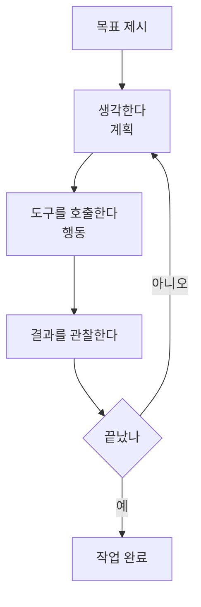

# 레슨 06 · 에이전트

AI에게 단계마다 지시하는 대신, 목표만 던져주면 스스로 단계를 찾아 수행하는 "에이전트"를 알아봅니다.

## 학습 목표

- 에이전트가 "반복 루프 안의 도구 활용"이라는 점을 이해한다.
- 에이전트가 잘하는 일과 어려워하는 일을 구분하고, 안전하게 위임하는 법을 익힌다.
- 가드레일과 검증이 왜 사용자의 책임인지 안다.

## 에이전트란? — 반복 루프 안의 도구 활용

지난 레슨까지 우리는 AI 모델이 도구를 호출해 기능을 넓힐 수 있다는 걸 배웠습니다. 그렇다면 한 발 더 나아가 봅시다. AI가 여러 도구를 직접 골라 쓰고, 결과를 보고, 다음에 무엇을 할지 스스로 정하게 한다면 어떨까요? 바로 그 지점에서 **에이전트(Agent)** 가 등장합니다.

본질을 한마디로 줄이면 이렇습니다. 에이전트는 =="반복 루프 안의 도구 활용"==입니다. [[chip:info: GPS 방식]]

쉽게 그림을 그려볼게요. 길을 알려주는 두 가지 방식을 떠올려 보세요.

- **턴마다 안내하기**: "여기서 좌회전, 다음 신호에서 우회전, 이제 직진…" — 매 순간 사람이 지시해야 합니다.
- **목적지만 주기(GPS)**: "○○역으로 가줘"라고 목적지만 말하면, GPS가 경로를 스스로 계산하고, 막히면 다시 길을 찾습니다.

에이전트는 두 번째, 즉 **GPS 방식**입니다. 우리는 목표만 제시하고, 거기에 도달하는 단계는 에이전트가 알아서 찾습니다.

이 루프가 핵심입니다. 한 번의 응답으로 끝나는 게 아니라, **생각 → 도구 호출 → 결과 관찰**을 목표가 달성될 때까지 스스로 반복합니다.

### 루프는 언제 멈출까 — 종료 조건과 안전장치

"스스로 반복한다"고 하면 한 가지 걱정이 생깁니다. 멈추지 않으면 어떡하죠? 그래서 에이전트에는 ==루프를 끝내는 종료 조건==이 반드시 들어갑니다.

- **도구 호출이 없으면 종료** — 모델이 더 이상 도구를 부르지 않고 "끝났습니다"라고 답하면, 그게 곧 작업 완료 신호입니다(위 다이어그램의 "예" 분기).
- **최대 횟수 상한(max_steps)** — "최대 30번까지만 반복"처럼 한도를 둡니다. GPS가 무한히 길을 다시 찾지 않도록 거는 안전벨트예요.
- **같은 행동 반복 감지** — 똑같은 도구를 똑같은 인자로 계속 부르면(제자리걸음) 루프를 강제로 끊습니다.

> [!WARNING] 무한 루프는 비용이 샌다
> 종료 조건이 없으면 에이전트가 같은 일을 끝없이 반복하며 토큰(비용)을 태웁니다. 상한선은 안전장치이자 ==비용 보호 장치==이기도 합니다.

## 에이전트는 실제로 어떻게 동작할까

예를 들어 에이전트에게 "설정 페이지에 다크 모드 토글을 추가해줘"라고 요청했다고 해봅시다. 그러면 대략 이런 흐름으로 일이 진행됩니다.

1. **검색** — 코드베이스를 뒤져 설정 페이지가 어디 있는지 찾습니다.
2. **읽기** — 관련 파일을 열어 현재 구조와 스타일링 방식을 파악합니다.
3. **계획** — 스스로 계획을 세웁니다. "상태 변수를 추가하고, CSS 클래스를 만들고, 토글 컴포넌트를 구현하고, UI를 연결하자."
4. **실행** — 계획한 단계를 하나씩 코드로 옮깁니다.
5. **점검** — 중간중간 테스트를 돌리고, 오류가 나면 고칩니다.

흥미로운 점은, 이 모든 과정이 **연속된 도구 호출**로 이뤄지고 에이전트가 매 결과를 보고 다음 행동을 정한다는 것입니다. 마치 누군가 생각을 소리 내어 말하며 일하는 모습을 지켜보는 느낌이지만, 그저 말만 하는 게 아니라 실제로 결과물을 만들어 냅니다.

### 에이전트의 3가지 사고 방식

에이전트가 "어떻게 생각하며 일하느냐"에는 대표적으로 세 가지 패턴이 있습니다. 입문 단계에서는 ==이름과 한 줄 차이==만 알아 두면 충분합니다.

| 사고 방식 | 한 줄 설명 | 장점 | 단점 |
|-----------|-----------|------|------|
| **ReAct** | 한 스텝마다 관찰하고 바로 다음 행동 결정 | 상황 변화에 유연 | 큰 그림 없이 헤맬 수 있음 |
| **Plan-and-Execute** | 먼저 전체 계획을 세운 뒤 그대로 실행 | 일관·효율적 | 도중 상황이 바뀌면 계획이 빗나감 |
| **Reflection** | 결과를 낸 뒤 스스로 비평하고 다시 고침 | 품질이 올라감 | 단계가 늘어 비용·시간 증가 |

위 다크 모드 예시처럼 **검색→읽기→행동→점검**을 한 스텝씩 밟는 흐름이 가장 흔한 ReAct 방식입니다. 셋은 배타적이지 않고, 실제 에이전트는 이들을 섞어 쓰기도 합니다.

## 작업 수행자에서 작업 관리자로

에이전트의 진짜 힘은 **당신의 역할 자체를 바꾼다**는 데 있습니다.

예전 방식이라면 "components 폴더에 뭐가 있지?" → "Button 컴포넌트를 읽어줘" → "이제 다크 모드 버전을 추가해줘"처럼 단계마다 일일이 요청해야 했습니다. 에이전트와 함께라면 **최종 목표만** 밝히면 됩니다. 과정은 에이전트가 알아서 처리하니까요.

이건 꽤 큰 변화입니다. 당신을 ==작업 수행자(doer)에서 작업 관리자(manager)로== 옮겨놓기 때문입니다. 심지어 여러 에이전트를 동시에 돌릴 수도 있습니다. 한 에이전트가 인증 플로우에 테스트를 추가하는 동안, 다른 에이전트는 문서를 업데이트하고, 또 다른 에이전트는 미뤄둔 지저분한 유틸리티 파일을 백그라운드에서 리팩터링하는 식으로요.

## 잘하는 일 vs 어려운 일

에이전트가 만능은 아닙니다. **목표가 뚜렷하고 패턴이 정해진 일**에 강합니다.

- 잘하는 일: 기존 코드에 테스트 추가, 문서 업데이트, 일관된 패턴으로 리팩터링, 명확한 오류 메시지가 있는 버그 수정.
- 어려운 일: 시스템 동작에 대한 깊은 이해가 필요한 복잡한 디버깅, 픽셀 단위까지 맞추는 시각 디자인, 학습 데이터에 없던 완전히 새로운 라이브러리 다루기.

이 차이를 기억하는 가장 좋은 비유가 있습니다.

> [!TIP] 기억하면 좋은 비유
> 에이전트를 =="빠르지만 손이 많이 가는 주니어 개발자"==로 생각하세요. 빠르게 처리하지만 명확한 지시와 감독이 필요합니다.

주니어 개발자는 일을 빠르게 처리하지만 명확한 지시가 필요하고, 중요한 맥락을 잊기 쉬워 감독이 필요합니다. 에이전트도 마찬가지입니다. 때로는 같은 실패한 방법을 "다른 전략이 필요하다"는 걸 깨닫지 못한 채 계속 반복하며 루프에 갇히기도 합니다.

## 토큰 비용과 한계

에이전트는 도구를 여러 번 호출하고 루프를 반복하기 때문에, 단순히 한 번 질문하는 것보다 **훨씬 더 많은 토큰**을 씁니다. 비용과 시간이 그만큼 더 든다는 뜻이죠.

또한 적절한 제약이 없으면 시키지 않은 변경까지 "열정적으로" 해버릴 수 있습니다.

> [!WARNING] 검증은 당신의 몫
> 코드가 제대로 동작하고 기준을 충족하는지 검증하는 책임은 여전히 당신에게 있습니다. 에이전트가 "다 했어요"라고 말해도 그대로 믿어서는 안 됩니다.

## 위임의 기술과 가드레일

에이전트와 잘 협업하는 핵심은 **무엇을, 언제 맡길지** 판단하는 감각입니다.

- 처음에는 **작고 범위가 명확한 작업**부터 맡겨 자신감을 쌓으세요.
- 익숙해지면 더 큰 작업도 위임하되, **항상 중간 점검과 검증 단계**를 넣으세요.
- 가장 효과적인 가드레일 중 하나는 =="변경을 머지하기 전에 테스트 통과를 요구"==하는 것입니다. 테스트가 통과해야만 합쳐지므로, 엉뚱한 변경이 그대로 들어가는 걸 막아줍니다.

**가드레일이란**, 에이전트가 ==넘을 수 없는 선을 코드로 고정==해 둔 것입니다. 말로 "조심해"라고 부탁하는 게 아니라, 시스템이 강제로 막는다는 점이 핵심이에요.

| 상황 | 가드레일 판단 |
|------|--------------|
| 테스트가 빨간불인 변경 | ❌ 머지 차단 — 테스트 통과를 요구 |
| 결제 실행 / DB 데이터 삭제 | ❌ 에이전트 범위 밖 — 사람 승인 필수 |
| 테스트 추가, 문서 수정 | ✅ 허용 — 되돌리기 쉬움 |

기준은 간단합니다. ==비가역(되돌릴 수 없는) 작업==과 ==돈이 오가는 작업==은 자동화 범위 밖에 두고, 나머지 안전한 작업만 에이전트에게 맡기는 거예요.

목표는 사람의 개입을 없애는 게 아닙니다. **당신이 해낼 수 있는 범위를 넓히는 것**입니다. 당신은 설계자이자 검토자가 되고, 에이전트는 구현의 세부를 맡습니다.

## 💡 한 문장 요약

> [!IMPORTANT] 한 문장 요약
> 에이전트는 목표만 주면 ==생각 → 도구 호출 → 결과 관찰==을 스스로 반복하는 GPS 같은 존재이며, 강력한 만큼 가드레일과 검증은 여전히 당신의 몫입니다.

## ✅ 확인 문제

**Q1. 일반적으로 에이전트에게 맡겨도 안전한 작업은 무엇일까요? (해당하는 것 모두)**

정답: **여러 파일에 걸친 패턴 기반 리팩터링**, **명확히 범위가 정의된 실패 지점에 대한 테스트 추가**

해설: 두 작업 모두 목표가 뚜렷하고 따라야 할 패턴이 정해져 있어 에이전트가 안정적으로 잘하는 영역입니다. 반대로 "픽셀 퍼펙트 리디자인"이나 "문서 없는 새 라이브러리 통합"은 깊은 판단이나 학습에 없던 지식이 필요해 에이전트가 어려워하는 작업입니다.

**Q2. 무분별한 에이전트 변경을 방지하는 가드레일로 알맞은 것은?**

정답: **변경을 머지하기 전에 테스트 통과를 요구한다.**

해설: 테스트라는 자동 검증 관문을 두면, 기준을 통과한 변경만 코드베이스에 합쳐집니다. "모든 도구를 비활성화"하면 에이전트가 아무 일도 못 하고, "조심하라고 요청"하는 것은 강제력이 없어 실질적인 안전장치가 되지 못합니다.

## 🔗 다음 / 심화 연결

- **다음 레슨: 07 에이전트 활용하기** — 1부에서 쌓은 기초 멘탈 모델을 바탕으로, 코딩 에이전트를 실제로 잘 부려 쓰는 전략으로 넘어갑니다.
- 여기서 만든 멘탈 모델은 **10세션 심화 과정 세션 1·세션 2(에이전트 개요와 루프 직접 구현)** 로 자연스럽게 이어집니다. 본격적으로 에이전트의 루프를 직접 만들어 보게 될 거예요.
