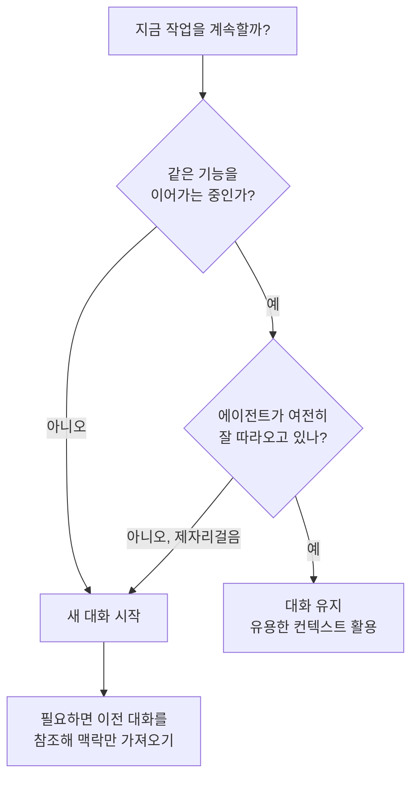

# 레슨 07 · 에이전트 활용하기

이제 개발자들은 모든 코드를 직접 타이핑하는 대신, 코딩 에이전트와 대화하며 코드를 짓습니다. 레슨 06에서 에이전트가 "반복 루프 안의 도구 활용"이라는 멘탈 모델을 익혔다면, 이번에는 그 에이전트를 **실제로 잘 부려 쓰는 전략**을 배웁니다.

핵심은 세 가지입니다. 에이전트가 살아 움직이는 환경(==하니스==)이 무엇인지, 어떻게 프롬프트를 써야 좋은 결과가 나오는지, 그리고 레슨 04에서 배운 ==컨텍스트(작업 메모리)==를 어떻게 관리하느냐입니다. 에이전트를 "빠른 주니어 개발자"로 본다면, 이번 레슨은 그 주니어에게 ==일을 잘 맡기는 법==이라고 할 수 있어요.

## 학습 목표

- 에이전트 하니스가 **지시(Instructions) · 도구(Tools) · 모델(Model)** 세 요소로 이뤄진다는 점을 이해한다.
- 모호한 프롬프트와 구체적·제약 있는 프롬프트의 차이를 구분하고, 더 나은 프롬프트를 쓴다.
- 컨텍스트가 쌓이는 흐름을 알고, 언제 대화를 이어가고 언제 새로 시작할지 판단한다.
- 스코프 크리프(scope creep)라는 흔한 함정을 알아채고 작업을 작게 쪼갠다.

## 에이전트 하니스란? — 지시 · 도구 · 모델

코딩 에이전트는 허공에서 동작하지 않습니다. **하니스(harness)** 라고 부르는 환경 안에서 실행되죠. 하니스는 세 가지 부품으로 이뤄집니다. [[chip:info: 하니스 3요소]]

```
┌──────────────────────────────────────────────┐
│                에이전트 하니스                  │
│                                                │
│  [ Instructions ]  동작을 안내하는              │
│                    시스템 프롬프트 · 규칙        │
│                                                │
│  [ Tools ]         파일 편집 · 코드 검색 ·       │
│                    터미널 실행 같은 도구         │
│                                                │
│  [ Model ]         작업을 수행할 에이전트 모델   │
└──────────────────────────────────────────────┘
```

| 요소 | 역할 | 비유 |
|------|------|------|
| Instructions(지시) | 어떻게 행동할지 알려주는 규칙 | 신입에게 건네는 ==업무 매뉴얼== |
| Tools(도구) | 실제로 무언가를 할 수 있는 손발 | 작업에 쓰는 ==연장통== |
| Model(모델) | 생각하고 판단하는 두뇌 | 일을 처리하는 ==담당자== |

같은 도구를 줘도 하니스마다 동작이 조금씩 다릅니다. 어떤 모델은 셸 명령을 더 자주 호출하도록 학습돼 있고, 어떤 모델은 더 명시적인 지시를 필요로 하죠. ==하니스가 어떻게 튜닝됐고 어떤 모델을 쓰느냐==에 따라 결과의 결이 달라진다는 점만 기억하면 됩니다.

> [!EXAMPLE] 도구 예시 (Cursor)
> Cursor는 코딩 에이전트가 내장된 AI 에디터로, 위 세 요소를 묶어 하니스를 제공합니다. 가능한 모든 프런티어 모델을 지원하면서, 그 모델이 접근하는 도구까지 포함해 하니스를 최대한 최적화하는 것을 목표로 합니다. 하지만 "지시 · 도구 · 모델"이라는 구조 자체는 어떤 코딩 에이전트에서도 동일합니다.

### Instructions(시스템 프롬프트)는 어떻게 쓸까

Instructions는 매 작업마다 다시 쓰는 프롬프트가 아니라, 에이전트가 ==항상 지키는 기본 규칙==입니다. 신입에게 건네는 업무 매뉴얼처럼, **역할·규칙·금지사항**을 구체적으로 적을수록 좋아요.

```text
[역할]   너는 이 프로젝트의 프런트엔드 코딩 보조다.
[규칙]   - 새 컴포넌트는 src/components 패턴을 따른다.
         - 스타일은 인라인이 아니라 CSS 모듈을 쓴다.
         - 변경 후 항상 npm test를 돌려 통과를 확인한다.
[금지]   - package.json 의존성을 임의로 추가/삭제하지 않는다.
         - 요청 범위 밖 파일은 건드리지 않는다.
```

"잘해줘" 같은 막연한 말 대신 ==무엇을 따르고 무엇을 하지 말지==를 못 박는 게 핵심입니다. 좋은 Instructions 하나가 매번 긴 프롬프트를 쓰는 수고를 덜어 줍니다.

## 효과적인 프롬프트 작성 — 모호함 vs 구체성

에이전트와 일을 시작하는 첫 진입점은 **프롬프트**입니다. 같은 일을 시키더라도 어떻게 말하느냐에 따라 결과가 크게 달라져요. 두 방식을 비교해 봅시다.

```
모호한 프롬프트                    구체적·제약 있는 프롬프트
─────────────────                ──────────────────────────
"설정 페이지를 추가해줘"           "설정 페이지를 추가해줘.
                                   레이아웃은 profile/page.tsx를 참고,
        │                          폼은 Form.tsx와 동일하게,
        ▼                          저장은 useUserPreferences 훅 사용"
에이전트가 레이아웃·컴포넌트·                │
스타일을 전부 추측 →                         ▼
==새 패턴을 멋대로 만들어냄==        기존 패턴을 그대로 따름 →
                                   ==코드베이스와 일관된 결과==
```

모호하게 맡기면 에이전트는 모든 것을 추측해야 하고, 때로는 운 좋게 맞지만 대개는 엉뚱한 패턴을 만들어 냅니다. 반대로 **기존 파일·컴포넌트를 참조하고 범위를 명확히** 못 박으면, 에이전트는 새 패턴을 발명하는 대신 ==여러분의 패턴==을 따릅니다.

> [!TIP] 좋은 프롬프트의 3요소
> ==기존 패턴 참조==(어떤 파일을 본떠라) · ==명확한 범위==(무엇을 포함/제외할지) · ==구체적 제약==(어떤 훅·라우트를 쓸지). 이 셋만 챙겨도 결과가 확 좋아집니다.

주의할 점도 있어요. 구체적이라는 게 ==프로젝트의 모든 파일을 다 욱여넣으라==는 뜻은 아닙니다. 그건 컨텍스트 낭비일 뿐이죠(레슨 04). 또한 의사코드를 직접 다 쓸 필요도 없습니다. 핵심은 **기존 코드베이스에 기반한 구체적인 지시**입니다.

## 컨텍스트 관리하기 — 언제 새 대화를 시작할까

에이전트와 대화를 이어 가면 메시지, 도구 호출, 파일 내용이 차곡차곡 쌓입니다. 이게 바로 레슨 04에서 배운 ==컨텍스트(작업 메모리)==이고, 여기엔 한계가 있습니다. [[chip:warn: 컨텍스트는 유한]]

> [!NOTE] 잠깐 복습 (레슨 04)
> 메모리는 ==단기==와 ==장기==로 나뉩니다. 지금 다루는 컨텍스트 윈도우는 그중 **단기 메모리 = 작업 메모리(책상 위 공간)**예요. 공간이 유한하므로, 책상이 어수선해지면 새 책상으로 옮기는 게 낫습니다.

언제 대화를 이어가고 언제 새로 시작할지, 간단한 판단 흐름으로 정리해 볼게요.



정리하면 이렇습니다.

- **이어가기**: 같은 기능을 작업 중이고, 이전 메시지에 쓸모 있는 맥락이 남아 있다면 대화를 유지하세요.
- **새로 시작**: 새 작업으로 ==전환==할 때, 또는 에이전트가 ==실수를 반복하며 제자리걸음==을 시작하면 기능 도중이라도 새 대화를 여세요.
- **참조하기**: 새로 시작하더라도 이전 대화를 참조하면 에이전트가 그 채팅 기록을 읽어 필요한 맥락만 가져올 수 있습니다.

그런데 "제자리걸음"은 어떻게 알아챌까요? 다음 ==신호 중 하나라도 보이면 새 대화를 시작==할 때입니다.

- 🔁 **같은 수정을 반복** — 고쳤다가 되돌리고 또 같은 곳을 고친다.
- 🐛 **같은 오류가 재발** — 분명 고쳤는데 똑같은 에러가 다시 난다.
- 🔄 **했던 걸 또 함** — 방금 읽은 파일을 다시 읽고, 같은 설명을 되풀이한다.

이런 신호는 컨텍스트가 어수선해져 에이전트가 길을 잃었다는 뜻입니다. 책상을 정리하듯, 새 대화로 옮겨 핵심 맥락만 다시 챙겨 주세요.

> [!NOTE] 최신 모델은 스스로 찾는다
> 요즘 모델은 컨텍스트를 알아서 찾는 데 능숙합니다. 시맨틱 검색 같은 도구가 있으면 필요한 파일을 직접 가져오죠. 정확한 파일을 안다면 콕 집어 지정하고, 모른다면 일반적인 설명만 줘도 에이전트가 올바른 파일을 찾아냅니다.

## 흔한 함정: 스코프 크리프

가장 흔한 실수는 **충분한 계획 없이 너무 큰 변경을 한 번에** 요청하는 것입니다. 이걸 ==스코프 크리프(scope creep)==라고 불러요. 범위가 슬금슬금 불어나는 현상이죠.

```
[ 거대한 한 번의 요청 ]            [ 작게 쪼갠 요청 ]
"앱 전체를 리팩터링하고               1) 인증 로직만 정리
 인증도 고치고 UI도 바꿔줘"     →     2) UI 컴포넌트 교체
        │                            3) 테스트 추가
        ▼                                  │
관련 없는 파일 수정 ·                       ▼
원치 않는 변경 · 초점 상실           각 단계가 명확 · 검토 쉬움
```

이런 조짐(엉뚱한 파일을 건드리거나 초점을 잃는 것)이 보이면 잠시 멈추세요. 그리고 **작업을 더 작은 단위로 나눌 수 있는지** 생각해 보세요. 야심찬 기능일수록, 먼저 탄탄한 계획을 세운 뒤 ==작은 후속 대화로 나누어== 반복하는 편이 오히려 더 빠른 경우가 많습니다.

쪼개야 할지 헷갈린다면 두 가지만 자문해 보세요.

- ❓ **한 번의 실수가 복구 불가한가?** — 그렇다면 작게 쪼개 각 단계를 검토하며 진행하세요.
- ❓ **단계가 너무 많은가?** (서로 다른 영역을 한꺼번에 건드리는가) — 그렇다면 영역별로 분리하세요.

둘 중 하나라도 "예"라면, 큰 요청 하나보다 ==작은 요청 여러 개==가 안전하고 빠릅니다.

## 💡 한 문장 요약

> [!IMPORTANT] 한 문장 요약
> 코딩 에이전트는 ==지시 · 도구 · 모델==로 이뤄진 하니스 안에서 동작하며, ==기존 패턴을 참조한 구체적 프롬프트==와 ==적절한 컨텍스트 관리==, 그리고 ==작게 쪼개기==가 좋은 결과의 열쇠입니다.

## ✅ 확인 문제

**Q1. 에이전트가 가장 좋은 결과를 내도록 돕는 프롬프트 방식은?**

정답: **구체적인 파일·기존 패턴을 참고하고, 명확한 범위와 경계를 정의한다.**

해설: 모호하게 맡기면 에이전트가 모든 것을 추측해 새 패턴을 만들어 냅니다. 그렇다고 프로젝트 전체 파일을 다 넣는 것은 컨텍스트 낭비이고(레슨 04), 의사코드까지 직접 쓸 필요도 없습니다. **기존 코드베이스에 기반한 구체적인 지시**가 핵심입니다.

**Q2. 에이전트가 같은 실수를 반복하며 제자리걸음을 시작했습니다. 가장 적절한 대응은?**

정답: **새 대화를 시작한다(필요하면 이전 대화를 참조해 맥락만 가져온다).**

해설: 컨텍스트는 에이전트의 작업 메모리이고 한계가 있습니다(레슨 04). 에이전트가 계속 헛돈다면 기능 작업 도중이라도 새 대화로 환경을 정리하는 편이 낫습니다. 같은 기능을 매끄럽게 이어갈 때만 대화를 유지하세요.

## 🔗 다음 / 심화 연결

- **다음 레슨: 08 코드베이스 이해하기** — 에이전트가 여러분의 코드베이스를 어떻게 검색하고, 작업 중인 코드와 아키텍처를 더 잘 이해하도록 돕는 방법을 다룹니다.
- 이번 레슨은 1부의 ==컨텍스트(레슨 04)== 와 ==에이전트(레슨 06)== 개념 위에 세워졌습니다. 하니스·프롬프트·컨텍스트 관리라는 실전 감각은 심화 과정 **세션 4(메모리 & 컨텍스트 관리)** 로 자연스럽게 이어집니다.
