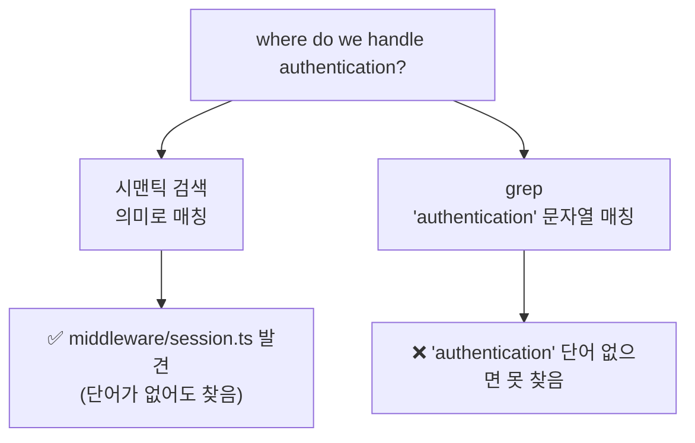

# 레슨 08 · 코드베이스 이해하기

소프트웨어 엔지니어가 가장 자주 하는 일은 코드를 쓰는 게 아니라, 이미 있는 코드를 **찾고 이해하는** 일입니다. 프로젝트가 커질수록 "그 코드가 어디 있더라?"가 점점 어려워집니다. 이번 레슨에서는 에이전트에게 코드베이스를 대신 탐색하게 하는 법을 배웁니다.

## 학습 목표

- 큰 코드베이스에서 코드를 찾는 일이 핵심 역량임을 이해한다.
- grep(정확한 텍스트 매치)과 시맨틱 검색(의미 기반)의 차이와 상호 보완성을 설명할 수 있다.
- 구체↔광범위 스펙트럼에 맞춰 좋은 질문을 던지는 감각을 익힌다.
- 변경 전에 먼저 탐색시키는 습관의 중요성을 안다.

## 예전 방식 vs 지금 방식 — 지도를 만드는 법

코드베이스를 이해한다는 건 머릿속에 ==정신적 지도(mental map)==를 그리는 일입니다. [[chip:info: 자연어로 검색]]

예전에는 이 지도를 그리려면 정규식을 외우거나 전용 검색 도구를 익혀야 했습니다. 지금은 다릅니다. 찾고 싶은 내용을 **자연어로 설명**하면, 에이전트가 알아서 도구를 골라 대신 찾아줍니다.

```
예전:  정규식 암기 → 전용 도구 학습 → 손으로 검색
지금:  "결제 실패는 어디서 처리하지?" → 에이전트가 도구로 탐색
```

다만 에이전트가 어떤 도구로 어떻게 찾는지 그 원리를 알면, ==더 좋은 질문==을 던져 더 정확한 결과를 얻을 수 있습니다.

## 두 가지 검색 — grep과 시맨틱 검색

에이전트가 쓰는 검색은 크게 두 갈래입니다. 둘은 **잘하는 일이 다릅니다.**

| 구분 | grep / 정규식 | 시맨틱 검색 |
|------|---------------|-------------|
| 찾는 기준 | **정확한 문자열** (함수명·변수명) | **의미·개념** |
| 잘하는 예 | `PaymentService` 참조 전부 | "인증은 어디서 처리하지?" |
| 원리 | 텍스트 패턴 매치 | 코드를 벡터(임베딩)로 변환해 비교 |
| 약점 | 단어를 정확히 알아야 함 | 정확한 심볼 추적엔 둔함 |

핵심 차이를 그림으로 보면 이렇습니다.



`session.ts` 파일 안에 "authentication"이라는 단어가 한 글자도 없어도, 시맨틱 검색은 그 파일이 ==의미상 인증을 다룬다==는 걸 알아냅니다. 반대로 정확한 함수명을 추적할 때는 grep이 더 빠르고 정확합니다.

그래서 결론은 **둘 중 하나가 아니라 둘 다**입니다. 정확 매치와 의미 기반 검색은 서로 메우는 관계라, 함께 쓰면 더 넓은 범위를 커버합니다.

> [!EXAMPLE] 도구 예시 (Cursor)
> Cursor는 grep을 개선한 **Instant Grep**으로 대형 코드베이스에서 ripgrep보다 빠르게 검색하고, 커스텀 임베딩 모델로 코드베이스를 **자동 인덱싱**해 시맨틱 검색을 제공합니다. 별도 설정은 필요 없습니다. Cursor의 연구에 따르면 시맨틱 검색과 grep을 함께 썼을 때 코드베이스 질문 정확도가 grep만 쓸 때보다 약 **12.5%** 높았고, 그 효과는 파일 1,000개 이상의 큰 코드베이스에서 가장 컸습니다.

## 좋은 질문 — 구체에서 광범위까지

질문을 어떻게 던지느냐에 따라 에이전트가 어떤 도구를 쓰고 결과가 얼마나 좋은지가 달라집니다. 질문은 하나의 **스펙트럼** 위에 있습니다.

```
구체적 ◀───────────────────────────────▶ 광범위
함수명 정확 매치              "결제 제출 시 무슨 일이 일어나지?"
(grep으로 시작)               (시맨틱 검색으로 시작)
```

- **무엇을 찾는지 알 때** → 구체적으로 시작하세요. (예: "`PaymentService`를 import하는 파일 전부 찾아줘")
- **낯선 영역을 탐색할 때** → 범위를 넓게 가져가세요. (예: "결제 실패를 어떻게 처리하는지, 폼부터 에러 메시지까지 흐름을 짚어줘")

질문의 위치에 따라 적합한 검색 방식이 달라집니다. 아래 표로 감을 잡아 보세요.

| 질문 예 | 스펙트럼 | 적합한 검색 |
|---------|----------|-------------|
| "`useAuth` 훅을 쓰는 곳 전부 찾아줘" | 매우 구체적 | grep (정확 매치) |
| "로그인 검증 로직이 어느 파일에 있지?" | 약간 구체적 | grep 먼저 → 시맨틱 보완 |
| "비밀번호 재설정은 어떻게 흘러가지?" | 약간 광범위 | 시맨틱 먼저 → grep로 세부 |
| "이 앱의 결제 시스템 전체 구조를 설명해줘" | 매우 광범위 | 시맨틱 검색(+다이어그램) |

구체적 질문이면 에이전트는 grep부터, 넓은 질문이면 시맨틱 검색부터 시작한 뒤 grep으로 세부를 채우는 식으로 도구를 조합합니다.

## 서브에이전트 — 컨텍스트를 아끼는 병렬 탐색

코드베이스에서 파일을 많이 뒤지면 그만큼 **컨텍스트를 많이 소모**합니다. 레슨 04에서 컨텍스트는 모델의 작업 메모리이며 한정된 자원이라고 했죠. 검색 결과로 메인 대화가 부풀면 정작 중요한 내용이 밀려날 수 있습니다.

이때 **서브에이전트**가 해법입니다. 부모 에이전트와 **별도의 컨텍스트 윈도우**에서 더 빠른 모델로 병렬 검색을 돌린 뒤, ==발견한 결과만== 메인 대화로 돌려줍니다.

왜 "별도 윈도우"가 중요할까요? 레슨 04에서 컨텍스트 윈도우를 ==작업 메모리(RAM, 책상 위 공간)==에 비유했죠. 파일 수십 개를 메인 대화의 책상에 쏟아부으면 책상이 어수선해져 정작 중요한 작업이 밀려납니다. 서브에이전트는 ==자기 책상(별도 RAM)==에서 어지러운 탐색을 다 끝낸 뒤, 깔끔하게 정리한 결론 한 장만 가져옵니다. 메인 대화의 책상은 오염되지 않는 거예요.

```
[메인 대화]  ──위임──▶  [서브에이전트: 별도 컨텍스트, 빠른 모델]
                              │  파일 수십 개 병렬 탐색
                              ▼
[메인 대화]  ◀─결과만──  "관련 파일은 A, B, C입니다"
```

덕분에 메인 대화의 초점은 유지하면서도 넓게 탐색할 수 있습니다. 컨텍스트 관리가 크게 개선되는 셈이죠.

> [!EXAMPLE] 도구 예시 (Cursor)
> Cursor에는 기본 제공 **Explore 서브에이전트**가 있습니다. 직접 호출할 필요 없이 에이전트가 필요하다고 판단하면 자동으로 사용하며, 원한다면 "서브에이전트로 찾아줘"라고 직접 요청할 수도 있습니다.

## 아키텍처 다이어그램 — 코드베이스를 그림으로

크거나 낯선 코드베이스라면, 에이전트에게 **Mermaid 다이어그램**을 그려 달라고 요청해 구조를 한눈에 볼 수 있습니다.

> [!TIP] 이럴 때 유용해요
> 다이어그램은 **온보딩**(새 팀원이 구조 파악), **문서화**, **디자인 리뷰**에 좋습니다. 또 다른 서비스에 과하게 의존하거나, 의도치 않은 경로로 흐르는 데이터처럼 ==아키텍처 문제를 드러내==기도 합니다.

예: "체크아웃 폼, API 라우트, 결제 서비스, 외부 통합을 포함해 결제 시스템의 데이터 흐름을 Mermaid로 그려줘."

다이어그램이 문제를 드러내는 원리는 단순합니다. 글로 흩어져 있던 코드가 ==화살표(데이터 경로)==로 한눈에 보이면, 그제야 "어? 결제 폼이 왜 외부 API로 직접 화살표가 가지?"처럼 ==의도치 않은 연결==이 눈에 띕니다. 머릿속에서는 안 보이던 잘못된 흐름이, 그림으로 그리면 비정상적인 선 하나로 또렷이 드러나는 거예요.

## 흔한 함정 — 이해하기 전에 먼저 바꾸기

가장 자주 나오는 실수는, 기존 코드를 **충분히 이해하지 않은 채** 바로 변경을 시키는 것입니다.

에이전트는 요청을 문자 그대로 받아들이고, 명시하지 않은 부분은 스스로 판단합니다. 그 결과 ==이미 있는 유틸리티 함수를 새로 또 만들==거나, 코드베이스의 나머지와 다른 패턴을 써버릴 수 있습니다. 레슨 02에서 본 "출력은 정답이 아니라 출발점"이라는 검증 중심 사고가 여기서도 그대로 적용됩니다.

> [!WARNING] 변경 전에 먼저 탐색시키세요
> "아무것도 바꾸지 말고, 지금 폼 검증이 어떻게 동작하는지·어떤 패턴을 쓰는지·공용 검증기가 어디 있는지 먼저 보여줘"처럼 **탐색을 먼저** 시키세요. 기존 패턴을 파악한 뒤 변경을 요청할수록 결과가 좋아집니다.

## 💡 한 문장 요약

> [!IMPORTANT] 한 문장 요약
> ==grep(정확한 텍스트)==과 ==시맨틱 검색(의미)==은 강점이 달라 함께 쓸 때 코드베이스를 가장 넓게 커버하며, 변경 전에 먼저 탐색시켜 기존 패턴을 이해하는 것이 좋은 결과의 핵심입니다.

## ✅ 확인 문제

**Q1. 왜 에이전트에게 grep과 시맨틱 검색을 모두 제공할까요?**

정답: **각 도구의 강점이 다르다 — grep은 정확한 텍스트를, 시맨틱 검색은 개념을 찾는다. 함께 쓰면 더 넓은 범위를 다룬다.**

해설: "시맨틱 검색만으로 전부 처리된다"는 틀렸습니다. 정확한 함수명·변수명 추적은 grep이 더 잘합니다. 또 사용자가 매번 수동으로 도구를 고르게 하려는 것도 아닙니다 — 에이전트가 질문에 맞춰 알아서 고릅니다. 정확 매치와 의미 기반 검색은 ==상호 보완==적이라, 둘을 함께 쓸 때 가장 넓은 범위를 커버합니다.

## 🔗 다음 / 심화 연결

- **이전 레슨: 04 컨텍스트** — 서브에이전트가 왜 컨텍스트 관리에 유리한지는 컨텍스트가 한정된 작업 메모리라는 개념에서 출발합니다.
- **이전 레슨: 02 환각/검증** — "먼저 이해하고 바꾸기"는 모든 출력을 검증해야 한다는 사고의 연장선입니다.
- 코드를 찾고 이해하는 법을 익혔으니, 다음은 이해한 내용을 **기능 계획 · 테스트 작성 · 실제 배포**까지 이어가는 단계로 나아갑니다.
- 검색·서브에이전트로 컨텍스트를 아끼는 감각은 심화 과정 **세션 2**(Tool Use)·**세션 4**(메모리·컨텍스트 관리)에서 직접 구현으로 이어집니다.
