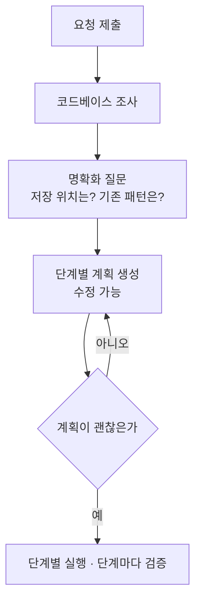
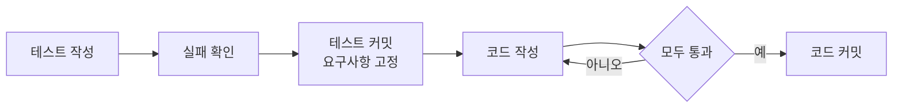

# 레슨 09 · 기능 구현하기

코드베이스를 이해했으니, 이제 새로운 것을 만들어 볼 차례입니다. 에이전트와 함께 기능을 구현하는 핵심은 **에이전트가 스스로 검증할 수 있는 단계로 작업을 나누는 것**입니다.

## 학습 목표

- 큰 요청을 ==작고 독립적으로 검증 가능한 단계==로 쪼개는 "계획부터 시작" 습관을 익힌다.
- 에이전트와 함께하는 **테스트 주도 개발(TDD)** 5단계와, 그것이 왜 잘 작동하는지 이해한다.
- 검증 없이 구현하는 함정을 알고, 테스트·타입검사·린터·브라우저라는 검증 수단을 구분한다.

## 계획부터 시작하기 — 코드를 쓰기 전에 고민한다

레슨 06에서 에이전트는 =="반복 루프 안의 도구 활용"==이라고 배웠습니다. 그 루프가 엉뚱한 방향으로 달려가지 않도록 잡아주는 첫 번째 가드레일이 바로 **계획**입니다. [[chip:info: 계획 먼저]]

코드를 작성하기 전에는 결정해야 할 것이 많습니다. "일단 간단한 버전을 만들고 나중에 개선할까?" "이 데이터는 어디에 저장하지?" 같은 질문들이죠. 에이전트에게 곧장 "만들어줘"라고 하기보다, 먼저 **함께 계획을 검토**하면 방향을 크게 줄일 수 있습니다.

좋은 계획 도구는 대략 이런 흐름으로 동작합니다.



핵심은 **큰 요청을 작고 독립적으로 검증 가능한 단계로 분해**한다는 점입니다. 각 단계마다 에이전트는 진행 상황을 측정하고, 그 단계가 제대로 끝났는지 확인한 뒤 다음으로 넘어갑니다.

> [!EXAMPLE] 도구 예시 (Cursor)
> Cursor의 **Plan Mode**는 프롬프트를 제출하면 먼저 명확화 질문을 던집니다(예: "알림 설정을 DB에 저장할까요, localStorage에 저장할까요?"). 답하면 마일스톤이 담긴 `notification-preferences.md` 같은 **수정 가능한 계획 문서**를 만들어 주고, 이상한 부분은 직접 고친 뒤 실행할 수 있습니다.

## 처음부터 다시 시작해야 할 때

에이전트가 기대와 다른 결과물을 내놓을 때가 있습니다. 이때 후속 프롬프트로 **땜질하려는 유혹**을 조심하세요.

> [!TIP] 땜질보다 되돌리기
> 변경을 되돌리고 **계획 단계로 돌아가** 더 구체적으로 다듬은 뒤 다시 실행하세요. 특히 중요한 아키텍처나 설계 맥락을 놓쳤다면, 잘못된 방향을 계속 보수하는 것보다 처음부터 다시 가는 편이 ==더 빠른 경우가 많습니다==.

직관에 어긋나 보이지만, 방향이 틀린 접근법은 프롬프트를 아무리 더해도 결국 틀린 채로 커집니다.

## 에이전트와 함께하는 TDD — 5단계

에이전트는 **자기 코드가 올바른지 스스로 판단할 수 있을 때** 가장 좋은 결과를 냅니다. 테스트가 실패하면 무엇이 잘못됐는지 보고 다시 시도할 수 있으니까요. 이것이 레슨 06에서 본 =="변경을 머지하기 전에 테스트 통과를 요구"==하는 가드레일을, 구현 단계로 끌어온 모습입니다. [[chip:info: TDD 5단계]]

| 단계 | 무엇을 하나 | 핵심 포인트 |
|------|-------------|-------------|
| ① 테스트 먼저 작성 | 예상 입력·출력에 기반해 테스트 작성 | TDD임을 명시해 ==mock을 만들지 않도록== 지시 |
| ② 실패 확인 | 테스트를 돌려 실패하는지 확인 | 아직 기능 코드를 쓰지 않는다 |
| ③ 테스트 커밋 | 만족스러우면 테스트를 커밋 | **요구사항을 고정**한다 |
| ④ 코드 작성 | 테스트를 통과시키는 코드를 작성 | ==테스트는 수정 금지==, 전부 통과까지 반복 |
| ⑤ 코드 커밋 | 결과를 검토하고 커밋 | 기대대로 동작하는지 확인 |



**실제 프롬프트는 어떻게 생겼을까요?** 두 단계로 나눠 보면 흐름이 분명해집니다.

```text
[① 테스트 먼저]  "discountCode() 함수의 테스트를 먼저 작성해줘 —
                 유효한 코드면 할인가 반환, 만료된 코드면 에러,
                 가격이 0 밑으로는 절대 안 내려가게. 함수는 아직 쓰지 마."
        ↓ (만족하면 테스트를 커밋해 요구사항 고정)
[② 코드 작성]   "이 테스트를 전부 통과시켜줘. 단, 테스트는 수정하지 말고
                 기존 PricingService 패턴을 따라줘."
```

==테스트는 절대 건드리지 말라고 못 박는 것==이 핵심입니다. 그래야 에이전트가 "통과"를 위해 테스트를 느슨하게 고치는 대신, 진짜로 요구사항을 만족하는 코드를 만듭니다.

**왜 잘 작동할까요?** 각 테스트 실행이 에이전트에게 ==구체적인 피드백==을 주기 때문입니다. 테스트가 없으면 에이전트는 자기 변경이 제대로 동작하는지 알 길이 없습니다. 특히 화면만으로 정확성을 확인하기 어려운 **백엔드 코드**에서 강력합니다.

> [!TIP] 에이전트 시대엔 "테스트 먼저"가 쉬워진다
> TDD는 오래된 기법이지만 늘 인기 있진 않았습니다. 테스트를 먼저 쓰는 게 번거로웠으니까요. 그런데 에이전트가 테스트 작성을 거들면서 ==그 진입 장벽이 크게 낮아졌습니다==. 코드베이스가 커질수록 먼저 쌓아둔 테스트가 회귀를 막아주는 값어치는 더 커집니다.

> [!IMPORTANT] ③번이 핵심인 이유
> 코드 작성보다 **먼저 테스트를 커밋**하는 이유는, 에이전트가 통과를 위해 테스트 자체를 고쳐버리는 일을 막기 위해서입니다. 테스트가 잠겨 있어야 검증이 의미를 가집니다.

## 디자인을 코드로

에이전트는 텍스트뿐 아니라 **이미지도 이해**합니다. 그래서 디자인 작업에도 끌어올 수 있습니다.

- **목업**: 와이어프레임이나 디자인 내보내기 파일을 붙여넣고 "이 컴포넌트를 구현해줘"라고 요청합니다.
- **시각적 디버깅**: 예상치 못한 UI 상태를 스크린샷으로 찍어 "왜 이렇게 보이는지 조사해줘"라고 맡깁니다.
- **반복 개선**: 현재 결과의 스크린샷을 찍고 무엇을 어떻게 바꿀지 설명합니다.

> [!EXAMPLE] 도구 예시 (Cursor)
> **Figma MCP** 서버를 연결하면 에이전트가 디자인 토큰·변수·컴포넌트 스펙을 Figma에서 직접 가져옵니다. **통합 브라우저(integrated browser)** 를 쓰면 에이전트가 변경을 미리 보고, 스크린샷을 찍어 ==자기 시각적 출력을 스스로 검증==합니다 — 스크린샷을 사람이 다시 붙여넣는 수고가 줄어듭니다.

## 흔한 함정 — 검증 없이 구현하기

기능을 빠르게 만들 때 가장 큰 위험은 **검증을 건너뛰는 것**입니다.

> [!WARNING] 정확성 없는 속도
> 에이전트는 많은 코드를 빠르게 쏟아낼 수 있습니다. 하지만 정확성 없는 속도는 일을 줄이기는커녕 ==나중에 더 많은 수정 작업==을 만듭니다.

그래서 에이전트가 **스스로 검증할 수단**을 손에 쥐여줘야 합니다. 검증의 종류는 이렇게 나뉩니다.

| 검증 수단 | 무엇을 잡아주나 |
|-----------|-----------------|
| 테스트 | 로직과 동작 |
| 타입 검사 | 구조적 정확성 |
| 린터 | 코드 스타일과 패턴 |
| 브라우저 / MCP 서버 | UI 변경에 대한 피드백 |

에이전트가 자기 출력을 검증할 수 없다면, 결국 사람이 그 빈자리를 메우게 됩니다.

## 💡 한 문장 요약

> [!IMPORTANT] 한 문장 요약
> 기능 구현의 핵심은 ==계획으로 작업을 작게 쪼개고, 테스트·타입검사·린터·브라우저로 에이전트가 스스로 검증하게== 만드는 것입니다 — 특히 코드보다 **테스트를 먼저 커밋**해 요구사항을 고정하세요.

## ✅ 확인 문제

**Q1. 에이전트와의 TDD에서 코드 작성을 요청하기 전에 테스트를 먼저 커밋하는 이유는?**

정답: **에이전트가 테스트를 쉽게 통과시키려고 테스트 자체를 수정하지 못하게 하기 위해서.**

해설: 테스트를 먼저 커밋해 고정해두면 요구사항이 잠깁니다. git 히스토리를 깔끔하게 하거나 CI를 위해 커밋을 분리하는 것은 본질적인 이유가 아닙니다. 에이전트가 "통과"를 위해 테스트를 고쳐버리면 검증이라는 행위 자체가 의미를 잃습니다.

## 🔗 다음 / 심화 연결

- **이전 레슨: 08 코드베이스 이해하기** — 코드베이스를 파악하는 법을 배웠다면, 이번 레슨은 그 위에 ==새 기능을 얹는== 단계였습니다.
- 여기서 본 TDD 가드레일은 레슨 06의 =="테스트 통과를 요구"==하는 가드레일이 구현 현장으로 내려온 모습입니다.
- **다음 레슨** — 배포한 기능에는 늘 버그가 따라옵니다. 다음 장에서는 에이전트를 활용해 버그를 체계적으로 찾고 고치는 법을 다룹니다.
- 계획 우선·검증 가능한 단계로 나누는 사고는 심화 과정 **세션 2**(Tool Use)·**세션 3**(추론 & 계획 패턴)으로 이어집니다.
