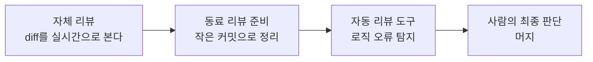

# 레슨 11 · 코드 리뷰 및 테스트

에이전트는 코드를 빠르게 쏟아낼 수 있습니다. 그만큼 품질을 지켜내는 안전망 — 리뷰와 테스트 — 이 어느 때보다 중요해집니다.

## 학습 목표

- 사람이 쓴 코드든 에이전트가 쓴 코드든 **머지 기준은 동일**하다는 원칙을 이해한다.
- 자체 리뷰 · 동료 리뷰 준비 · 자동 리뷰 도구로 이어지는 리뷰 흐름을 안다.
- 테스트·타입 검사·린팅을 겹쳐 쌓는 **검증 가능한 목표**가 위임의 자신감을 키운다는 걸 안다.
- 테스트를 통과해도 정확하지 않을 수 있다는 흔한 함정을 경계한다.

## 빠를수록 기준은 더 높게

에이전트가 코드를 많이 만들수록, **기술 부채**도 그만큼 빠르게 쌓일 수 있습니다. 빠르게 진행하는 건 좋지만 품질 기준은 높게 유지해야 합니다. 핵심 원칙은 단순합니다. [[chip:info: 동일한 머지 기준]]

> 코드를 ==사람이 직접 작성했든 에이전트가 작성했든==, 무엇을 머지할지에 대한 기준은 똑같아야 한다.

AI가 생성한 코드는 겉보기엔 멀쩡합니다. 기존 패턴을 따르고, 컴파일도 되고, 당신이 짠 테스트도 통과할 수 있습니다. 그런데도 **미묘하게 틀릴 수 있습니다**.

| 그럴듯해 보이지만 | 실제로는 |
|------------------|----------|
| 패턴을 따름 | 엣지 케이스를 놓침 |
| 컴파일됨 | 보안 구멍이 있음 |
| 테스트 통과 | 이미 있는 로직을 중복 구현 |

레슨 06에서 "검증은 당신의 몫"이라고 한 이유가 여기 있습니다. 에이전트가 "다 했어요"라고 말해도, 문제를 프로덕션 전에 잡아내는 프로세스를 갖추는 건 엔지니어의 책임입니다.

## 리뷰의 3단계 흐름

리뷰는 한 번에 끝나는 게 아니라 겹겹이 쌓는 안전망입니다.



### 1) 자체 리뷰 — 어깨너머로 지켜보기

남에게 리뷰를 부탁하기 전에, 먼저 스스로 검토하세요.

- **실시간으로 지켜보기**: 에이전트가 만드는 diff가 화면에 흘러갑니다. 잘못된 방향으로 가는 게 보이면 끝까지 기다리지 말고 **중단하고 다시 지시**하세요. 방향을 크게 틀어야 한다면, 변경을 되돌리고 계획부터 다듬은 뒤 재실행합니다.
- **브랜치 전체를 한 번에**: "지금 이 브랜치에서 내가 뭘 바꿨지? 리뷰해 줘"처럼 변경 전체의 맥락을 주면, 에이전트가 **여러 파일에 걸친 이슈**까지 잡아냅니다.

> [!EXAMPLE] 도구 예시 (Cursor)
> Cursor에서는 `Ctrl+Shift+Backspace`로 진행 중인 에이전트를 즉시 멈출 수 있고, 프롬프트에 `@Branch`를 태그하면 현재 브랜치의 전체 diff를 에이전트에게 통째로 넘겨 자체 리뷰를 맡길 수 있습니다.

### 2) 동료 리뷰 준비 — 작은 커밋으로 쪼개기

에이전트는 한 번에 수백 줄을 바꿀 수 있습니다. 그 결과가 **거대한 커밋 하나**라면 아무도 리뷰할 수 없습니다.

권장 방식은 **작고 의미 있는 커밋 + 명확한 설명**입니다. 각 커밋이 하나의 논리적 변경을 담으면, 리뷰어는 히스토리를 한 단계씩 따라가며 읽을 수 있습니다.

커밋 정리는 직접 하기엔 번거롭지만 ==에이전트가 잘하는 일==입니다.

1. **자유롭게 구현** — 반복 수정하는 동안엔 커밋 정리를 신경 쓰지 않습니다.
2. **재구성 요청** — 다 동작하면, 에이전트에게 커밋을 리뷰 가능한 단위로 다시 묶게 합니다(보통 DB/스키마 → 백엔드 → 프론트엔드 순서).
3. **검증** — 재구성한 **최종 diff가 원본과 일치**하는지 비교해, 빠진 변경이 없는지 확인합니다.

이 흐름은 한 번 만들어 두면 팀 누구나 쓸 수 있는 재사용 워크플로(스킬/명령)로 만들 수 있습니다. 레슨 09에서 본 "검증 가능한 단계"의 연장선이죠 — 정리 결과를 기계적으로 확인할 수 있으니까요.

### 3) 자동 리뷰 도구 — 린터를 넘어서

포맷만 보는 린터와 달리, **에이전트 기반 리뷰**는 변경의 전체 맥락을 읽고 로직 오류를 찾습니다.

| 린터 | 에이전트 기반 리뷰 |
|------|--------------------|
| 들여쓰기·포맷 | 널 포인터 예외 |
| 스타일 규칙 | 레이스 컨디션 |
| 명명 규칙 | 누락된 에러 처리 · 보안 문제 |

문제를 발견하면 **수정안까지 제안**할 수 있고, PR이 올라올 때 자동으로 도는 리뷰 봇도 점점 흔해지고 있습니다.

> [!EXAMPLE] 도구 예시 (Cursor)
> Cursor의 `Agent Review`(Review → Find Issues)는 변경을 한 줄씩 분석해 문제를 표시합니다. PR 단계에서는 `Bugbot`이 푸시 시 자동으로 리뷰하고, autofix를 켜면 PR 댓글에서 바로 수정 커밋을 적용할 수 있습니다.

## 검증 가능한 목표 — 자동 안전망 쌓기

에이전트가 **스스로 자기 작업을 검증**할 수 있게, 명확한 신호를 마련해 주세요.

```
┌──────────┬──────────────────────────────┐
│ 테스트    │ 동작 회귀를 잡는다            │
│ 타입 검사 │ 구조적 오류를 잡는다          │
│ 린팅      │ 스타일·패턴 위반을 잡는다     │
└──────────┴──────────────────────────────┘
        ↓ 안전망이 많을수록
   더 자신 있게 위임할 수 있다
```

검사가 많을수록 더 자신 있게 맡길 수 있습니다. 그래서 테스트 커버리지와 린팅 규칙을 갖춘 **정적 타입 언어**가 에이전트와 특히 잘 맞습니다.

### 테스트도 에이전트에게

예전엔 테스트 커버리지를 갖추는 데 큰 노력이 들었지만, 이제 상당 부분을 위임할 수 있습니다.

- **통합/e2e 테스트 작성** — "기존 테스트 패턴을 살펴보고 그에 맞춰 작성해 줘"처럼 요청합니다.
- **인프라 셋업** — 예를 들어 테스트 프레임워크가 아직 없다면 프로젝트 셋업·설정·첫 테스트까지 만들게 할 수 있습니다.
- **엣지 케이스 탐색** — "지금 이 기능에서 커버되지 않은 엣지 케이스는 뭐야?"라고 물어 빈틈을 찾습니다.

고품질 테스트가 갖춰질수록, 에이전트가 **회귀 없이 자율적으로** 일할 확신이 커집니다.

> [!EXAMPLE] 도구 예시 (Cursor)
> Cloud agents는 원격 샌드박스에서 돌아 노트북을 닫아도 됩니다. 저장소를 클론 → 브랜치 생성 → 작업 → PR을 여는 흐름이라, "발견한 버그 수정, 테스트 커버리지, 문서, 리팩터링" 같은 TODO성 작업에 잘 맞습니다. 여러 에이전트로 다양한 입력 조합을 **병렬 대규모 테스트**할 수도 있습니다.

## 피드백 루프 가속하기

에이전트를 많이 쓰기 시작하면, 병목은 시스템에서 **가장 느린 부분**으로 옮겨 갑니다. 보통 테스트 스위트, 타입/린트 검사, CI 파이프라인이죠.

이 비용은 모든 대화에서 반복됩니다. 테스트가 10분 걸리는데 에이전트 10개를 병렬로 돌리면 거의 두 시간을 기다립니다(레슨 03에서 본 토큰·시간 비용이 여기서 **병렬로 곱해집니다**). 테스트를 50% 빠르게 만들면 그때마다 한 시간 가까이 아낍니다.

이런 최적화 — 느린 테스트 프로파일링, 의존성 트리 줄이기, 빌드 시간 단축 — 자체도 **에이전트에게 맡길 수 있습니다**. 범위가 명확하고 결과가 검증 가능한, 에이전트가 가장 잘하는 종류의 일이니까요.

> [!WARNING] 흔한 함정: 테스트 통과 ≠ 정확
> 테스트가 통과해도 코드가 옳다는 보장은 없습니다. 테스트 자체가 **잘못된 동작을 검사**하거나, 에이전트가 **해피패스만** 처리하고 경계 상황을 놓쳤을 수 있습니다. 변경을 직접 이해하세요. 한 번에 보기 부담스러울 만큼 크다면, 작은 단위로 쪼개세요.

> [!EXAMPLE] 경계값 하나면 드러난다
> "1% 할인"을 테스트했더니 `$100 → $99`로 깔끔하게 통과합니다. 그런데 `$0.01` 짜리 상품에 같은 할인을 걸면 ==$0.0099==가 됩니다 — 반올림을 어디서·어떻게 하느냐에 따라 `$0.01`로 남거나 `$0.00`이 되거나 결과가 갈립니다. 해피패스 테스트는 이런 **경계값(0, 최솟값, 반올림 단위)**을 비껴가기 일쑤입니다. 그래서 "이 기능에서 커버 안 된 엣지 케이스가 뭐야?"라고 따로 물어 빈틈을 메워야 합니다.

## 💡 한 문장 요약

> [!IMPORTANT] 한 문장 요약
> AI 코드는 그럴듯해도 미묘하게 틀릴 수 있으므로, ==자체 리뷰 · 작은 커밋 · 자동 리뷰 도구 · 테스트/타입/린트==를 겹겹이 쌓아 머지 기준을 사람 코드와 똑같이 높게 유지하세요.

## ✅ 확인 문제

**Q1. AI가 생성한 코드에 가장 강력한 안전망을 주는 조합은 무엇일까요?**

정답: **테스트, 타입 검사, 린팅, 자동 PR 리뷰(예: Bugbot)를 사람의 리뷰와 함께 사용한다.**

해설: 수동 리뷰만, 또는 자동 린팅만으로는 부족합니다. 자동 검증(테스트·타입·린트·리뷰 봇)과 사람의 판단을 ==겹겹이 쌓을수록== 미묘한 오류를 더 많이 잡아냅니다. 어느 하나도 단독으로는 완전한 안전망이 되지 못합니다.

## 🔗 다음 / 심화 연결

- 이 레슨의 리뷰·테스트 습관은 레슨 06의 ==검증 책임==과 레슨 09의 ==검증 가능한 단계== 위에 세워집니다 — 자동 검증이 촘촘할수록 더 큰 작업을 자신 있게 위임할 수 있습니다.
- 다음은 **에이전트 커스터마이징** — 리뷰 봇에 규칙을 더하는 것처럼, 에이전트의 동작을 코드베이스에 맞게 맞춤 설정해 워크플로를 더 빠르게 만드는 단계로 이어집니다.
- 자동 검증·리뷰 안전망은 심화 과정 **세션 9**(평가·관찰가능성·가드레일)로 직접 이어집니다.
