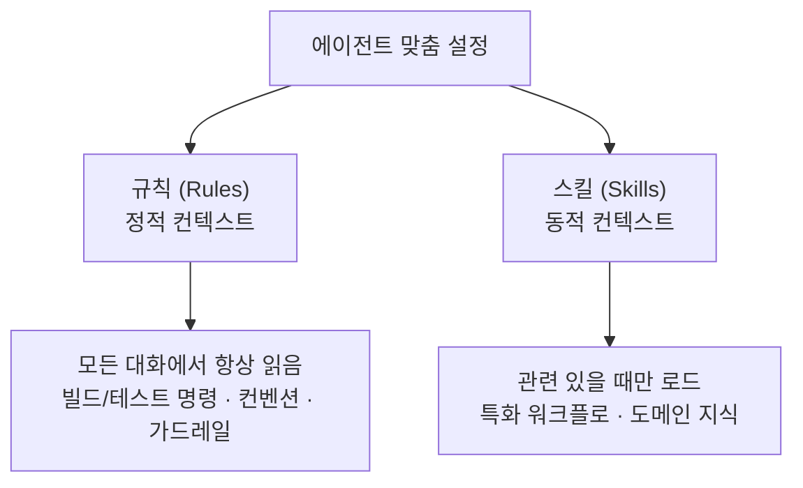

# 레슨 12 · 에이전트 맞춤 설정

에이전트는 기본적으로 똑똑하지만, **당신의 팀이 어떻게 일하는지는 모릅니다**. 그 빈틈을 메워 더 나은 결과를 끌어내는 맞춤 설정을 알아봅니다.

## 학습 목표

- 에이전트가 무엇을 모르는지 이해하고, 왜 맞춤 설정이 필요한지 안다.
- **규칙(정적 컨텍스트)**과 **스킬(동적 컨텍스트)**의 차이를 구분하고 언제 무엇을 쓸지 판단한다.
- **MCP·CLI 도구·슬래시 명령**으로 에이전트의 능력을 넓히는 방법을 안다.
- 규칙을 과설계하는 흔한 함정을 피한다.

## 왜 맞춤 설정인가 — 새 팀원 온보딩

코딩 에이전트는 검증된 소프트웨어 엔지니어링 지식을 풍부하게 갖추고 있어, 별다른 설정 없이도 대체로 올바른 결정을 내립니다. 하지만 한 가지를 모릅니다. 바로 **당신의 팀**입니다. 우리 팀이 어떤 컨벤션으로 코드를 쓰는지, 선호하는 도구가 무엇인지, 이 비즈니스의 구체적 맥락이 무엇인지는 학습 데이터에 없습니다.

그래서 맞춤 설정은 ==새 팀원을 온보딩하는 일==과 같습니다. 아무리 실력 있는 개발자가 합류해도, "우리는 이렇게 일해요"를 알려줘야 제 실력을 냅니다. [[chip:info: 온보딩 비유]] 온보딩은 보통 두 단계로 나뉩니다.



## 규칙(Rules) — 항상 적용되는 정적 컨텍스트

**규칙**은 모든 대화가 시작될 때마다 에이전트가 읽는, **항상 적용되는 지침**입니다. 에이전트가 코드와 어떻게 상호작용할지를 결정합니다. 좋은 규칙은 짧고 구체적이며, 예시를 **그대로 복붙하지 않고 가리키기만** 합니다.

```text
# 명령어
- npm run build   : 프로젝트 빌드
- npm run typecheck : 타입 체커 실행
- npm run test    : 테스트 실행 (속도를 위해 단일 파일 선호)

# 코드 스타일
- CommonJS(require)가 아닌 ES 모듈(import/export) 사용
- 표준 컴포넌트 구조는 components/Button.tsx 참조

# 워크플로우
- 코드 변경 후 항상 타입 체크 수행
- API 라우트는 기존 패턴대로 app/api/ 에 배치
```

규칙이 가장 빛나는 자리는 이렇습니다.

- 에이전트가 알아야 할 **빌드·테스트 명령어**
- 따라야 할 **코드 컨벤션**
- 코드베이스의 **기준 예제**에 대한 안내
- **가드레일**(수정 금지 파일, 피해야 할 패턴)

> [!WARNING] 규칙에서 피해야 할 점
> - **전체 스타일 가이드 복붙 금지** — 그건 린터가 할 일입니다. 규칙은 도구를 보완하되 대체하지 않습니다.
> - **일반 명령 문서화 금지** — 에이전트는 일반 도구를 이미 압니다. **프로젝트 전용** 명령만 적으세요.
> - **간단하게 시작** — 규칙은 매 대화에 포함되어 계속 쌓입니다(레슨 04의 컨텍스트 비용을 떠올려 보세요). 에이전트가 **같은 실수를 반복할 때만** 추가하세요.
> - **git에 커밋**해 팀 전체가 같은 지식을 공유하게 하세요.

## 스킬(Skills) — 필요할 때만 부르는 동적 컨텍스트

**스킬**은 특화된 워크플로와 지식으로 에이전트의 능력을 넓힙니다. 규칙과 달리 **동적으로 로드**됩니다. 스킬에 적힌 설명(메타데이터)을 보고, 에이전트가 **지금 작업에 이게 필요한지 스스로 판단**해 그때만 불러옵니다.

```text
설명: 스테이징에 배포. 사용자가 deploy/ship/staging을 요청할 때 사용.

# 스테이징 배포
1. npm run build 실행 후 성공 확인
2. npm run test 실행 후 전체 통과 확인
3. npm run deploy:staging 실행
4. https://staging.example.com/health 로 배포 검증
5. 배포 상태와 URL 보고
```

규칙과 스킬의 차이를 한 표로 정리하면 이렇습니다.

| 구분 | 규칙(Rules) | 스킬(Skills) |
|------|-------------|--------------|
| 언제 로드되나 | **모든 대화** | **관련 있을 때만** |
| 목적 | 항상 적용되는 규약 | 특화된 워크플로 |
| 컨텍스트 비용 | 항상 공간을 차지 | 호출될 때만 전체 사용 |
| 적합한 것 | 에이전트가 **항상** 알아야 할 것 | 요청받았을 때 **할 수 있는** 것 |

> [!TIP] 한 줄 판단법
> ==항상 지켜야 하는 규약이면 규칙, 가끔만 필요한 워크플로면 스킬==입니다.

## MCP — 외부 도구에 연결하기

**MCP(Model Context Protocol)**는 에이전트를 외부 도구에 연결해, 관련 **컨텍스트**와 수행할 수 있는 **동작**을 함께 제공합니다(레슨 05의 도구 호출이 외부 세계로 확장된 모습입니다). MCP 서버를 붙이면 에이전트를 이런 곳에 연결할 수 있습니다.

- **Slack** — 메시지 읽기·업데이트 게시
- **Datadog** — 프로덕션 로그 분석
- **Sentry** — 에러 상세와 스택 트레이스 조회
- **Database** — 데이터 직접 쿼리
- **Figma** — 디자인 토큰·컴포넌트 스펙 가져오기

MCP의 **데이터 흐름**은 단순합니다. 에이전트가 필요할 때마다 손으로 붙여넣는 대신 직접 가져옵니다.

```text
에이전트 ──요청──▶ MCP 서버 ──조회──▶ 외부 서비스(Sentry·DB 등)
   ▲                                          │
   └──────── 응답이 컨텍스트로 ◀──────────────┘
```

## CLI 도구 — 터미널을 그대로 쓰기

MCP 말고도, 에이전트는 **터미널에 설치된 모든 CLI 도구**를 실행할 수 있습니다. `gh`, `aws`, `kubectl`, `docker` 같은 도구는 추가 설정 없이 동작합니다. 규칙으로 **선호 도구**를 지정해 두면 일관성이 생깁니다.

```text
- 모든 GitHub 작업(이슈, PR, CI 점검)에는 gh 사용
- 파일 저장 작업에는 aws s3 사용
```

이건 **디버깅**에도 유용합니다. CI 상태를 보려고 브라우저로 전환하는 대신, *"gh로 이 PR에서 CI가 실패한 이유를 확인해줘"* 라고 하면 에이전트가 명령을 실행하고 출력을 읽어 후속 작업까지 이어갑니다.

### CLI냐 MCP냐 — 고르는 기준

둘 다 에이전트의 능력을 넓히지만, 갈림길은 간단합니다.

```text
연결하려는 대상이…
  └─ 이미 터미널에 설치된 명령인가? ──▶ 예 ──▶ CLI 도구 (gh, aws, docker…)
        │
        └─ 아니오: 외부 서비스·데이터에 연결해야 하나? ──▶ 예 ──▶ MCP 서버 (Sentry, Slack, DB…)
```

| 기준 | CLI 도구 | MCP 서버 |
|------|----------|----------|
| 설치 위치 | **로컬 터미널**에 이미 있음 | 외부 서비스에 **연결**해 가져옴 |
| 추가 설정 | 거의 없음(있는 걸 그냥 실행) | 서버 연결·인증 필요 |
| 잘 맞는 일 | 빌드·배포·git·인프라 명령 | 운영 로그·이슈·디자인 등 외부 데이터 |

## 재사용 워크플로 — 슬래시 명령으로 호출

스킬은 입력창에서 `/` 로 **이름을 불러 직접 실행**할 수도 있습니다. 그러면 스킬이 하루에도 여러 번 쓰는 **재사용 워크플로**가 됩니다.

- `/pr` — 변경을 커밋·푸시하고 `gh pr create`로 PR을 연 뒤 URL 반환
- `/fix-issue [번호]` — `gh issue view`로 이슈를 읽고, 코드를 고쳐 PR을 연다
- `/review` — 린터를 돌리고 흔한 문제를 점검해 주의가 필요한 부분을 요약한다 (레슨 11의 리뷰 자동화와 이어집니다)
- `/update-deps` — 오래된 의존성을 하나씩 업데이트하며 매번 테스트를 돌린다

이 스킬들도 **git에 커밋**하면 팀 전체가 같은 명령을 공유합니다.

> [!EXAMPLE] 도구 예시 (Cursor)
> Cursor에서는 규칙을 `.cursor/rules/` 디렉터리의 마크다운으로, 스킬을 `.cursor/skills/SKILL.md`로 정의하고, MCP 서버는 **Marketplace**에서 찾습니다. 같은 개념이 Claude Code에도 **CLAUDE.md(규칙)·스킬·슬래시 명령**으로 존재합니다 — 이름과 경로만 다를 뿐 사고방식은 동일합니다.

## 전후 비교 — 규칙 하나의 힘

Next.js·Tailwind·Vitest를 쓰는 팀을 가정해 봅시다.

| 상황 | 에이전트의 행동 |
|------|----------------|
| **규칙 추가 전** | Jest로 테스트(훈련 데이터에 더 흔하니까), CSS Modules로 스타일, API 라우트는 **무작위 위치**에 |
| **규칙 추가 후** | Vitest 사용, Tailwind 유틸리티 클래스, API 라우트는 `app/api/[resource]/route.ts`에 |

규칙 세 줄을 더했을 뿐인데, 이제 에이전트는 **기본값으로 팀의 관례**를 따릅니다. 대화할 때마다 같은 실수를 고쳐 줄 필요가 사라집니다.

## 흔한 함정 — 규칙 과설계

모든 것에 규칙을 만들고 싶어질 수 있습니다. **그러지 마세요.** 규칙이 너무 많으면 불필요하게 컨텍스트를 소모하고 에이전트를 오히려 혼란스럽게 만듭니다.

> [!CAUTION] 최소·고품질 원칙
> 규칙은 ==최소한으로, 품질은 높게== 유지하세요. 팀이 계속 다듬는 공유 자산이어야 합니다. **가끔만 필요한 내용이라면 규칙이 아니라 스킬에** 넣으세요.

## 💡 한 문장 요약

> [!IMPORTANT] 한 문장 요약
> 에이전트 맞춤 설정은 새 팀원 온보딩과 같아서, ==항상 적용되는 규약은 규칙(정적)==·==가끔 필요한 워크플로는 스킬(동적)==로 나누고, MCP·CLI·슬래시 명령으로 능력을 넓히되 규칙은 최소·고품질로 유지합니다.

## ✅ 확인 문제

**Q1. 에이전트가 ES 모듈 import 대신 계속 CommonJS `require()`를 쓸 때, 가장 좋은 해결책은?**

정답: **규칙을 추가한다 — 'Use ES modules (import/export), not CommonJS (require).'**

해설: 매 대화에서 그때그때 고치는 것은 반복 낭비입니다. 그렇다고 `require()`를 `import`로 바꾸는 변환 스킬까지 만드는 것은, **단순하고 항상 적용되는 컨벤션**에는 과합니다. 항상 지켜야 하는 규약은 **규칙(Rules)**에 넣고, 가끔만 필요한 워크플로만 **스킬(Skills)**로 만드세요.

## 🔗 다음 / 심화 연결

- **다음 레슨: 13 엔드 투 엔드 예제** — 지금까지 배운 모든 개념을 하나의 실제 작업 흐름으로 묶어 봅니다.
- 규칙은 매 대화에 쌓이므로 **레슨 04(컨텍스트 비용)**의 절약 감각과 직결됩니다. MCP는 **레슨 05(도구 호출)**의 자연스러운 확장이고, `/review` 같은 스킬은 **레슨 11(리뷰 자동화)**과 맞닿아 있습니다.
- 규칙·스킬·MCP로 에이전트를 확장하는 사고는 심화 과정 **세션 2**(Tool Use·MCP)·**세션 5**(LangChain)로 이어집니다.
