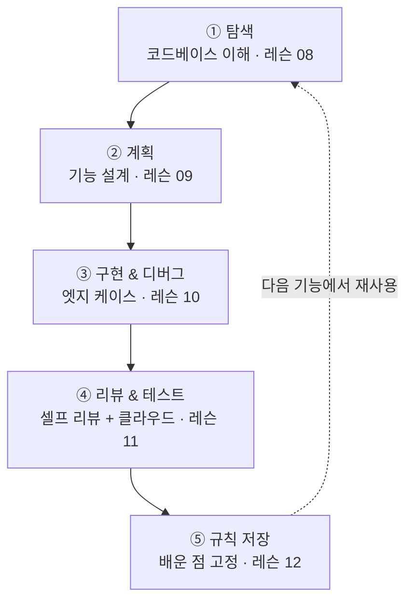
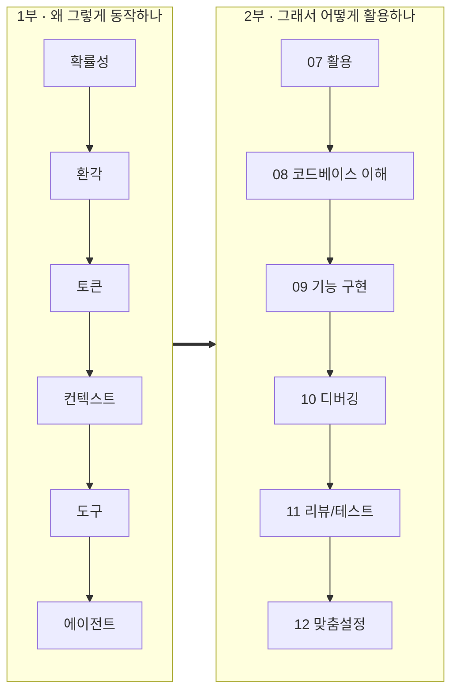

# 레슨 13 · 전체 정리 & 다음 단계

여기까지 오느라 정말 고생 많으셨습니다. 👏 1부에서 **"AI가 왜 그렇게 동작하는가"**의 멘탈 모델을 쌓고, 2부에서 **"그래서 코딩 에이전트를 어떻게 활용하는가"**의 실전 감각을 익혔습니다. 이번 마지막 레슨은 그 두 부분을 하나의 흐름으로 잇고, 다음 무대인 **8주 심화 과정**으로 가는 다리를 놓습니다.

## 학습 목표

- 탐색 → 계획 → 구현 → 디버그 → 리뷰 → 규칙으로 이어지는 한 사이클을 엔드 투 엔드로 따라갈 수 있다.
- 1부 6개 멘탈 모델과 2부 6개 실전 역량이 **"왜 그렇게 동작하나 / 그래서 어떻게 활용하나"**로 연결되는지 설명할 수 있다.
- 입문에서 배운 것이 심화 과정의 어느 세션으로 이어지는지 안다.

---

## 엔드 투 엔드 예제 — 할인 코드 기능

당신은 어느 이커머스 팀에 막 합류했습니다. 결제 플로우에 **할인 코드**를 추가해야 하는데, 코드베이스는 아직 낯설고 마감은 이번 주 말입니다. 현실적인 상황이죠. 구현하기 전에 살펴보고, 코드를 쓰기 전에 계획하고, 배포 전에 테스트하고, 머지 전에 리뷰해야 합니다. 2부에서 배운 흐름을 그대로 한 바퀴 돌려봅시다.



**① 코드베이스 이해하기 (레슨 08)** — 무엇을 고치기 전에, 먼저 체크아웃 플로우를 ==탐색==하세요. "변경하기 전에, 지금 체크아웃이 어떻게 동작하는지 단계별로 설명해 줘. 어떤 컴포넌트·API 라우트·서비스가 관여하지?"라고 물으면, 에이전트가 grep과 시맨틱 검색을 결합해 장바구니→결제 완료까지의 흐름을 요약해 줍니다. 후속 질문으로 "주문 총액은 어디서 계산하고, 할인은 그 흐름의 어디에 들어가야 하지?"까지 채워 머릿속에 구조를 그립니다.

**② 기능 설계하기 (레슨 09)** — 이해했으니 ==계획부터==. 코드를 쓰기 전에 **사전 계획 단계**를 먼저 거칩니다 — 에이전트가 먼저 명확화 질문을 던지고("할인은 비율·정액 둘 다? 사용 한도는 어디 저장?"), 거기에 답해 수정 가능한 계획 문서를 만든 다음에야 실행에 들어갑니다. "이 작업을 단계로 나눠 계획부터 세워줘. 애매한 건 먼저 물어봐"처럼 요청하면 됩니다. 그 결과 작업 개요는 이렇게 정리됩니다. 만료일·사용 한도를 검증하는 `DiscountService` 추가, 할인 인자를 받도록 `PricingService.calculateTotal()` 수정, 입력 UI 추가, `/api/discount/validate` 엔드포인트 추가. 첫 이터레이션에 너무 큰 단계는 덜어내고, **코드 적용 → 할인 계산 → 요약 표시**라는 핵심 플로우에만 집중합니다. 큰 요청을 작고 검증 가능한 단계로 쪼개는 것이 핵심이었죠.

**③ 실패하는 엣지 케이스 디버깅 (레슨 10)** — 빌드 후 테스트 하나가 계속 실패합니다. 비율 할인과 정액 할인을 함께 적용하면, **같은 조합이라도 적용 순서에 따라 합계가 달라집니다.** 증상을 덮지 말고 ==근본 원인==을 찾으세요. "할인 중첩 테스트가 순서에 따라 결과가 달라져. 이유를 찾고 `DiscountService.ts`의 적용 순서를 고쳐 줘. 변경 전후 값을 보여 줘"라고 증거 우선으로 요청합니다.

**④ 검토 및 테스트 (레슨 11)** — 푸시 전에 ==셀프 리뷰==를 돌립니다. "내가 만든 모든 변경을 리뷰해 줘. 버그·누락된 오류 처리·엣지 케이스·기존 패턴과의 일관성을 봐 줘. 리뷰어라면 뭘 지적할까?" 클라우드 에이전트가 있다면 놓쳤을 케이스(코드 속 유니코드 문자, 큰 할인 금액, 동시 사용 등)를 테스트하게 돌려 머지 전에 빈틈을 메웁니다.

**⑤ 배운 점을 규칙으로 저장 (레슨 12)** — 이번에 하나 배웠습니다. **입력 순서와 상관없이 결과가 일관되도록, 항상 퍼센트 할인을 정액 할인보다 먼저 적용해야 한다.** 이 깨달음을 규칙으로 적어 두면 에이전트가 다음에도 알아서 지킵니다. 규칙 파일은 거창할 필요 없이 짧은 문장 몇 줄이면 됩니다.

```text
# 가격 규칙
- 퍼센트 할인을 정액 할인보다 먼저 적용한다
- 주문 총액은 절대 $0 밑으로 내려가지 않는다
- 표준 계산 패턴은 src/services/PricingService.ts 참조
```

> [!EXAMPLE] 도구 예시 (Cursor)
> Cursor라면 ②에서 Plan Mode(Shift+Tab)로 `discount-codes.md` 계획을 세운 뒤 Build로 첫 버전을 만들고, ⑤의 규칙은 `Pricing rules` 형태로 저장합니다.
> ```
> # Pricing rules
> - Apply percentage discounts before fixed-amount discounts
> - Order total must never go below $0
> - See src/services/PricingService.ts for the canonical calculation pattern
> ```

이렇게 한 사이클을 완전히 돌았습니다. ==탐색 → 계획 → 구현 → 디버그 → 리뷰 → 규칙==. 그리고 마지막의 규칙은 다음 기능을 만들 때 다시 ①의 탐색을 더 똑똑하게 만들어 줍니다. [[chip:info: 한 사이클 = 1부+2부]]

---

## 한 장으로 보는 전체 멘탈 모델

우리가 쌓은 12개 개념은 사실 ==하나의 이야기==입니다. **1부는 "왜 그렇게 동작하나"**, **2부는 "그래서 어떻게 활용하나"** — 1부가 토대고, 2부는 그 위에서 일하는 방법입니다.

```kpi
1부 | 기초 멘탈 모델 | 확률성 · 환각 · 토큰 · 컨텍스트 · 도구 · 에이전트
2부 | 실전 역량 | 활용 · 코드베이스 이해 · 기능 구현 · 디버깅 · 리뷰/테스트 · 맞춤설정
```

AI는 확률적으로 답을 만들고(그래서 틀리기도 하고), 입출력은 토큰으로 계산되며, 모델은 컨텍스트만 보고, 도구를 주면 행동하며, 그 도구 사용을 반복하면 에이전트가 됩니다(1부). 그 에이전트를 잘 부려 코드를 탐색하고, 기능을 짓고, 버그를 잡고, 리뷰하고, 우리 팀에 맞게 길들이는 것이 2부입니다.



**1부 6개 멘탈 모델 — 한 문장씩** (기초를 다시 한번 되짚습니다)

| 레슨 | 한 문장 요약 |
|------|-------------|
| 01 동작 방식 | AI는 결정론이 아니라 **확률적으로 다음 토큰을 예측**한다. |
| 02 환각 | 모델은 모를 때도 그럴듯하게 답하므로 **모든 답은 출발점이지 정답이 아니다**. |
| 03 토큰 | 입력·출력은 **토큰 단위로 과금**되며 출력이 보통 2~4배 비싸다. |
| 04 컨텍스트 | 모델은 **컨텍스트(작업 메모리)에 있는 것만** 보고 답한다. |
| 05 도구 호출 | 도구를 정의하면 모델이 **JSON으로 도구를 요청**하고 앱이 실행해 결과를 돌려준다. |
| 06 에이전트 | 에이전트는 **도구 호출을 반복**하며 스스로 목표를 향해 나아간다. |

**2부 6개 실전 역량 — 한 문장씩** (그래서 어떻게 일하나)

| 레슨 | 한 문장 요약 |
|------|-------------|
| 07 활용 | 에이전트가 사는 환경(하니스)을 알고 프롬프트·컨텍스트를 다뤄 **잘 맡긴다**. |
| 08 코드베이스 이해 | grep과 시맨틱 검색으로 **고치기 전에 먼저 탐색**한다. |
| 09 기능 구현 | 큰 요청을 **검증 가능한 작은 단계**로 쪼개 계획부터 시작한다. |
| 10 디버깅 | 증상이 아니라 **근본 원인**을 증거 우선으로 찾는다. |
| 11 리뷰/테스트 | 누가 썼든 **머지 기준은 동일** — 셀프·동료·자동 리뷰로 지킨다. |
| 12 맞춤설정 | **규칙(정적)과 스킬(동적)**로 에이전트를 우리 팀에 맞게 길들인다. |

---

## 다음 단계: 8주 심화 과정으로

입문이 **"왜 그렇게 동작하고, 어떻게 활용하나"**였다면, 심화 과정은 **"그래서 어떻게 직접 만드나"**입니다. 입문에서는 잘 만들어진 에이전트를 ==활용==했다면, 심화에서는 raw API부터 시작해 에이전트 루프를 ==직접 빌드==합니다.

| 입문에서 배운 것 | 심화 과정에서 깊게 |
|------------------|---------------------|
| 01 확률적 동작 · 06 에이전트 · 07 활용 | **세션 1** — 에이전트 개요 & 패러다임(Workflow vs Agent) |
| 05 도구 호출 · 08 코드베이스 이해 | **세션 2** — Tool Use를 raw API로 직접 구현(에이전트 루프) |
| 09 계획 우선 · 10 디버깅 | **세션 3** — 추론 & 계획 패턴(ReAct, Reflection) |
| 03 토큰 · 04 컨텍스트 · 07 컨텍스트 관리 | **세션 4** — 메모리 & 컨텍스트 관리 |
| (추상화의 맛보기) | **세션 5·세션 6** — LangChain / LangGraph로 추상화 |
| 06 위임 · 다중 작업 | **세션 7** — 멀티 에이전트 & 오케스트레이션 |
| 02 환각/검증 · 11 리뷰/테스트 · 12 맞춤설정 | **세션 8** — 평가·관찰가능성·가드레일·프로덕션 |

> [!EXAMPLE] 심화 과정의 진행 방식
> 심화 과정은 같은 예제(==리서치 어시스턴트==)가 **raw API → LangChain → LangGraph**로 진화하는 모습을 따라가며, 입문에서 익힌 개념을 코드로 직접 확인합니다.

## 💡 한 문장 요약

> [!IMPORTANT] 한 문장 요약
> 1부의 6개 멘탈 모델(==왜 동작하나==)과 2부의 6개 실전 역량(==어떻게 활용하나==)은 **탐색 → 계획 → 구현 → 디버그 → 리뷰 → 규칙** 한 사이클로 이어지고, 심화 과정에서 ==직접 빌드하는 기술==로 확장된다.

## ✅ 확인 문제

**Q1. 할인 코드 기능을 마친 뒤, 팀원이 "기프트 카드를 추가해 달라"고 요청합니다. 첫 번째로 무엇을 하나요?**

정답: **에이전트에게 기프트 카드가 기존 할인·결제 시스템과 어떻게 상호작용하는지 먼저 탐색하게 한 다음, 계획을 세운다.**

해설: 결제 흐름이 비슷해 보여도 바로 코드를 쓰거나 기존 할인 작업을 복사·수정하면 숨은 상호작용을 놓칩니다. **이해 → 계획 → 구현** 순서(레슨 08·09)가 핵심이며, 이것이 엔드 투 엔드 사이클의 출발점입니다.

**Q2. 모델이 어떤 답을 내놓았을 때 가장 먼저 가져야 할 태도는?**

정답: **일단 의심하고 문서·실행 결과로 검증한다(검증 중심 사고).**

해설: 확률적 생성(레슨 01)과 환각(레슨 02) 때문에, 모든 출력은 최종 답이 아니라 출발점입니다. 이 태도가 2부의 리뷰·테스트(레슨 11)로 그대로 이어집니다.

## 🔗 다음 / 심화 연결

배우는 가장 좋은 방법은 여기서 배운 것을 ==실제로 적용해 보는 것==입니다. 도구와 모델은 매우 빠르게 발전하고, 구체적인 실천 방식은 시간이 지나며 달라질 겁니다. 하지만 **코딩 에이전트와 협업하는 핵심 역량**은 계속해서 더 큰 효과를 낼 것이고, 이미 소프트웨어 엔지니어링에서 가장 중요한 기술 중 하나가 되어 가고 있습니다.

- 입문 과정 완료! 👏 이제 **8주 심화 과정**(`../../advanced/site/index.html`)으로 이어가세요.
- 코딩 에이전트가 할 수 있는 일의 한계를 계속 넓혀 가면, 새로 나오는 최신 도구와 모델을 최대한 활용할 수 있습니다. 행운을 빌고, 늘 호기심을 잃지 마세요!
