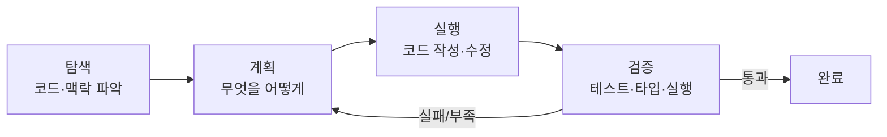

# 세션 01 — 워크플로 손에 익히기

> 코딩 에이전트 실전 트랙의 첫 세션. 명령·스킬·멀티 에이전트로 들어가기 전에, **모든 작업의 뼈대가 되는 한 가지 리듬** — 탐색 → 계획 → 실행 → 검증 루프 — 를 손에 익힌다. 이 리듬이 잡히면 나머지는 다 그 위에 얹힌다.
>
> [[chip:info: 기준 시점 2026-06]] 명령·UI 같은 구체 사용법은 빠르게 바뀐다. 여기서는 ==변하지 않는 워크플로 원리==를 중심에 두고, 명령은 예시로 든다.

## 학습 목표

- 한 작업을 ==탐색 → 계획 → 실행 → 검증== 루프로 돌릴 수 있다
- **플랜 모드**로 실행 전에 계획을 받아 검토·승인할 수 있다
- 컨텍스트를 운용한다 — 언제 `/clear`로 리셋하고 언제 `/compact`로 압축할지 판단한다
- 작업을 쪼개 ==스코프 폭주==를 막는다
- 막연한 지시 대신 **경로·기대 출력·기존 패턴 참조**를 명시하는 프롬프트를 쓴다

## 회차 타임라인 (총 90분)

| 시간 | 구간 | 내용 |
|------|------|------|
| 0–8분 | 프레이밍 | "에이전트는 한 번에 안 끝난다" — 작업은 루프다 |
| 8–30분 | 핵심① | 탐색 → 계획 → 실행 → 검증 루프 |
| 30–50분 | 핵심② | 플랜 모드 — 실행 전에 계획을 받기 |
| 50–68분 | 핵심③ | 컨텍스트 운용 (`/clear` vs `/compact`, 새 대화 신호) |
| 68–80분 | 핵심④ | 스코프 관리 + 복붙 프롬프트 패턴 |
| 80–90분 | 실습·정리 | 같은 작업을 "막 시키기" vs "루프로" 비교 |

---

## 1. 한 작업 = 루프

입문 레슨 06에서 "에이전트는 도구를 반복 호출하는 루프"라고 배웠다. **여러분이 에이전트를 쓰는 방식도 똑같이 루프여야 한다.** 한 줄 던지고 결과를 그대로 받는 게 아니라, 작은 사이클을 여러 번 돈다.



| 단계 | 무엇을 | 흔한 실수 |
|------|--------|-----------|
| **탐색** | 관련 파일·기존 패턴·제약을 먼저 읽힌다 | 탐색 없이 바로 코드 시킴 → 엉뚱한 가정 |
| **계획** | 변경 범위·순서·접근을 말로 확정 | 계획 없이 큰 작업 한 번에 |
| **실행** | 계획대로 작성·수정 | 계획에서 벗어나도 방치 |
| **검증** | 테스트·타입·린트·실제 실행으로 확인 | "됐다는데 안 돌아감"을 안 잡음 |

> [!TIP] 가장 큰 레버는 "탐색"이다
> 에이전트가 헤매는 대부분의 이유는 머리가 나빠서가 아니라 ==맥락이 없어서==다. "이 기능 고쳐줘" 전에 "관련 파일부터 찾아서 어떻게 동작하는지 설명해줘"를 한 번 끼우면 결과가 크게 달라진다. (입문 레슨 08의 코드베이스 탐색과 직결)

---

## 2. 플랜 모드 — 실행 전에 계획을 받기

큰 작업일수록, 바로 코드를 만들게 두지 말고 **계획을 먼저 받아 검토**한다. 많은 코딩 에이전트가 "계획만 세우고 멈추는" 모드를 제공한다(예: Claude Code의 **플랜 모드**).

```bash
# 흐름
1. 작업을 설명 + "먼저 계획만 세워줘" (또는 플랜 모드 진입)
2. 에이전트가 변경 파일·접근·순서를 제시
3. 내가 검토 → 수정 요청 또는 승인
4. 승인 후에야 실제 편집 시작
```

> [!IMPORTANT] 계획 검토가 가장 싼 교정 지점
> 잘못된 방향은 ==코드가 만들어지기 전==에 잡는 게 제일 싸다. 100줄을 짠 뒤 "그게 아니라"보다, 계획 단계에서 한 줄 고치는 게 낫다. 비가역·대규모 작업일수록 플랜 모드를 기본값으로.

---

## 3. 컨텍스트 운용 — `/clear` vs `/compact`

대화가 길어지면 컨텍스트가 ==오염되거나 가득 찬다==(입문 레슨 04·07). 두 가지 손잡이를 구분해 쓴다.

| 명령/행동 | 언제 | 효과 |
|-----------|------|------|
| **`/clear`** (또는 새 대화) | 작업이 ==바뀔 때== — 다른 기능/버그로 넘어감 | 맥락을 완전히 비움. 이전 작업 잔상이 새 작업을 오염시키지 않음 |
| **`/compact`** | 같은 작업을 ==계속==하는데 길어져 한도 임박 | 오래된 대화를 요약 압축, 최근 맥락 유지 |
| 그대로 진행 | 짧고 한 가지 작업 | 불필요한 개입 안 함 |

> [!WARNING] 잔상이 만드는 silent 오류
> 앞 작업의 결정·파일이 컨텍스트에 남아 있으면, 새 작업에서 ==엉뚱한 파일을 건드리거나 옛 가정을 끌고 온다==. "이제 다른 일 할게" 싶으면 미련 없이 `/clear`. 컨텍스트는 길수록 좋은 게 아니다.

---

## 4. 스코프 관리 — "한 번에 다 시키기"의 함정

큰 덩어리를 통째로 시키면, 에이전트는 중간에 길을 잃고 ==여러 곳을 어설프게== 건드린다. (입문 레슨 09의 "계획 우선"과 같은 교훈)

```
나쁨:  "로그인, 회원가입, 비밀번호 찾기, 프로필 편집 다 만들어줘"
       → 절반만 되고, 공유 파일 충돌, 검증 불가

좋음:  "① 로그인부터. 관련 파일 찾아 → 계획 → 구현 → 테스트"
       (통과 후) "② 다음은 회원가입…"
```

> [!NOTE] 쪼개기 = 검증 가능 단위로
> 한 사이클의 끝에 =="이게 됐다"를 확인==할 수 있어야 한다. 검증 가능한 가장 작은 단위로 쪼개면, 매 단계가 녹색인 채로 다음으로 간다. 멀티 기능·멀티 파일은 세션 4(멀티 에이전트)에서 본격적으로 다룬다.

---

## 5. 복붙해 쓰는 프롬프트 패턴

막연한 지시는 탐색 시간을 낭비시키고 엉뚱한 결과를 부른다. ==경로 · 기대 출력 · 기존 패턴 참조==를 명시한다.

```text
[좋은 작업 프롬프트 골격]
- 맥락:  지금 무엇을 하려는지 한 줄
- 위치:  관련 파일/디렉터리 경로 (알면 명시)
- 요구:  기대하는 동작·출력 형식 (필드명까지 구체적으로)
- 참조:  "기존 X와 동일한 패턴으로" (일관성 유지)
- 검증:  무엇으로 됐다고 판단하나 (테스트/실행 결과)
```

```text
[예시 — 막연 vs 구체]
✗  "검색 기능 추가해줘"
✓  "상품 검색을 추가해줘.
    - 위치: src/routes/products.js, 프런트는 src/pages/Products.jsx
    - 요구: GET /products/search?q= → { products, total } 반환
    - 참조: 기존 /products 목록 라우트와 동일한 에러 처리 패턴
    - 검증: q='shoe'로 호출해 results가 오는지"
```

> [!TIP] 에이전트는 이전 대화 맥락을 모른다고 가정하라
> 특히 새 대화·서브에이전트는 ==백지 상태==다. "아까 그거"는 안 통한다. 경로와 현재 상태를 적어주는 30초가 5분의 헛탐색을 막는다.

---

## 📚 실전 예제 모음

§5의 골격을 작업 유형별로 적용해 본다. 각 예제는 ==✗ 막연== 버전과 ==✓ 구체== 버전(경로·기대 출력·참조·검증 명시)을 나란히 둔다.

**① 신규 기능 추가** — 무엇을 만들지보다 "어디에·어떤 계약으로·어떻게 검증"이 핵심.

```text
✗  "댓글 기능 추가해줘"
✓  "게시글에 댓글 기능을 추가해줘.
    - 위치: src/routes/comments.js(신규), 프런트는 src/pages/PostDetail.jsx
    - 요구: POST /posts/:id/comments { body } → 생성된 comment 객체 반환
    - 참조: src/routes/posts.js 의 인증 미들웨어·에러 처리 패턴 그대로
    - 검증: 게시글 상세에서 댓글 작성 → 목록에 즉시 반영되는지 브라우저로"
```

**② 버그 수정** — 증상·재현 경로를 주면 탐색이 곧장 원인으로 향한다.

```text
✗  "로그인이 가끔 안 돼, 고쳐줘"
✓  "로그인 후 새로고침하면 로그아웃되는 버그를 잡아줘.
    - 증상: 로그인 직후엔 정상, F5 누르면 로그인 화면으로 튕김
    - 단서: 토큰은 localStorage에 있는데 새로고침 시 초기 인증 체크가 비는 듯
    - 위치: src/context/AuthContext.jsx 의 초기화 로직부터 봐줘
    - 검증: 로그인 → 새로고침 → 세션 유지되는지 확인"
```

**③ 리팩터** — "동작 보존"과 검증 수단을 못 박는 게 생명.

```text
✗  "이 파일 좀 깔끔하게 정리해줘"
✓  "src/utils/api.js 의 중복된 fetch 래퍼를 하나로 합쳐줘.
    - 요구: 동작·시그니처는 그대로, 4곳에 흩어진 에러 처리만 단일 헬퍼로
    - 제약: 외부에서 import하는 export 이름은 바꾸지 말 것
    - 검증: 기존 호출부가 그대로 동작하는지 `npm test` 통과로 확인"
```

**④ 코드베이스 조사** — 코드를 만들기 전, 탐색만 단독으로 시키는 패턴(§1).

```text
✗  "결제 어떻게 돌아가?"
✓  "결제 흐름을 코드로 추적해 설명해줘. (수정은 하지 말 것)
    - 시작점: 프런트 '결제하기' 버튼 → 어떤 API → 어떤 모듈을 거치는지
    - 산출: 관련 파일 경로 목록 + 호출 순서를 단계별로
    - 목적: 환불 기능을 어디에 끼워야 할지 판단하려는 것"
```

**⑤ 의존성 업그레이드** — 범위·롤백 기준·검증을 주지 않으면 광범위하게 망가뜨린다.

```text
✗  "라이브러리 최신으로 올려줘"
✓  "react-router를 v5에서 v6으로 올려줘.
    - 먼저 계획: breaking change(Switch→Routes 등)와 영향 파일을 먼저 나열
    - 범위: 라우팅 관련 파일만, 한 번에 다 말고 단계적으로
    - 검증: 각 단계마다 `npm run build` 통과 + 주요 경로 수동 클릭
    - 막히면: 진행 멈추고 어디서 걸렸는지 보고"
```

> [!TIP] 다섯 예제를 관통하는 패턴
> 작업 유형이 달라도 보강하는 축은 같다 — ==위치(경로) · 기대 출력(계약) · 참조(기존 패턴) · 검증(됐다는 판단 기준)==. 특히 비가역·광범위 작업(④ 조사·⑤ 업그레이드)은 "먼저 계획만"·"수정 금지"·"단계적으로"를 명시해 ==플랜 모드의 안전장치==(§2)를 프롬프트에 직접 박아 넣는다.

## ✅ 한 문장 요약

> [!TIP] 한 문장 요약
> ==코딩 에이전트를 잘 쓴다는 건, 한 줄 잘 던지는 게 아니라 탐색→계획→실행→검증 루프를 작은 단위로 돌리는 것이다.== 탐색으로 맥락을 주고, 플랜 모드로 방향을 잡고, `/clear`·`/compact`로 컨텍스트를 관리하고, 스코프를 쪼갠다.

## 확인 문제

**Q1.** 큰 기능 하나를 통째로 "다 만들어줘"라고 시켰더니 절반만 되고 여러 파일이 어설프게 바뀌었다. 워크플로 관점에서 무엇이 빠졌나?

> **정답:** 스코프 쪼개기 + 단계별 검증.
> **해설:** 검증 가능한 가장 작은 단위로 나눠 매 사이클 끝에 "됐다"를 확인하며 진행해야 한다(§4). 큰 덩어리는 계획·검증이 불가능해 길을 잃는다.

**Q2.** 로그인 기능을 한참 작업하다 끝냈고, 이제 전혀 다른 결제 버그를 잡으려 한다. `/compact`와 `/clear` 중 무엇이 맞나?

> **정답:** `/clear`(또는 새 대화).
> **해설:** 작업이 *바뀌었다*. `/compact`는 같은 작업을 이어갈 때 압축용이고, 작업 전환에는 잔상 오염을 막는 `/clear`가 맞다(§3).

**Q3.** "검색 기능 추가해줘"가 왜 약한 프롬프트인가? 한 가지만 보강한다면?

> **정답:** 경로·기대 출력·참조 패턴·검증 기준이 없다. 최소한 ==기대 출력(응답 형식/필드)==을 명시.
> **해설:** 에이전트는 백지 상태로 가정해야 한다. 구체적 계약(예: `{ products, total }`)을 주면 탐색 낭비와 silent 불일치를 막는다(§5).

---

## 다음 세션 예고

다음 세션(**세션 2 — 자주 쓰는 명령 & 슬래시 커맨드**)에서는 오늘의 루프를 ==실제 명령==으로 돌리는 법을 익힌다 — 자주 쓰는 내장 명령, `!` 셸 활용, 그리고 반복 작업을 한 방에 처리하는 **커스텀 슬래시 커맨드** 만들기.
