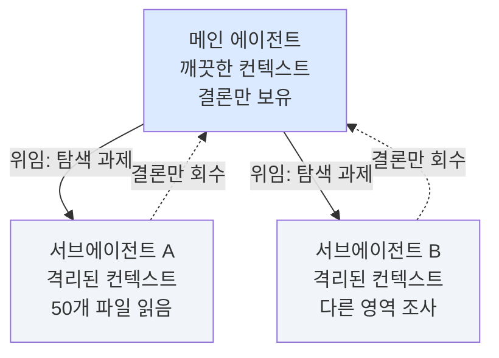

# 세션 04 — 서브에이전트 & 멀티 에이전트

> 이 트랙의 플래그십 세션. 세션 1의 ==탐색→계획→실행→검증 루프==를 **여러 에이전트로 확장**한다. 무거운 탐색은 서브에이전트에게 위임해 컨텍스트를 격리하고, 큰 기능은 멀티 에이전트로 나눠 병렬로 짓는다. 단, 병렬은 공짜가 아니다 — ==배치를 잘못하면 마지막 에이전트가 앞 작업을 덮어쓴다==. 그래서 오늘의 절반은 "어떻게 나누고, 끝나고 무엇을 검증하나"다.
>
> [[chip:info: 기준 시점 2026-06]] 서브에이전트·병렬 실행 같은 구체 기능은 버전마다 다르다. 여기서는 ==변하지 않는 분할·격리·통합 검증 원리==를 중심에 두고, 도구 동작은 대표 예시로 든다.

## 학습 목표

- 서브에이전트로 무거운 탐색을 ==위임하고 컨텍스트를 격리==한다 — 결론만 회수해 메인을 깨끗이 유지한다
- 여러 서브에이전트로 다른 영역을 **병렬 탐색**하고, 언제 위임·언제 메인에서 직접 할지 판단한다
- 멀티 에이전트 **배치 전략**을 세운다 — ==수정 파일로 그룹핑==하고, 공유 파일 충돌과 의존성 순서를 통제한다
- 구현 / 코드리뷰 / 테스트로 **역할을 분담**한다
- 병렬 구현 후 **통합 검증 체크리스트**로 마무리한다 — API 인터페이스·공유 파일·라우트 순서·브라우저 E2E까지

## 회차 타임라인 (총 90분)

| 시간 | 구간 | 내용 |
|------|------|------|
| 0–8분 | 프레이밍 | "혼자 다 읽지 마라" — 위임과 격리 |
| 8–24분 | 핵심① | 서브에이전트 = 컨텍스트 격리 |
| 24–38분 | 핵심② | 병렬 탐색 패턴 — 언제 위임·언제 직접 |
| 38–62분 | 핵심③ | 멀티 에이전트 배치 전략 (오늘의 핵심) |
| 62–72분 | 핵심④ | 역할 분담 — 구현·리뷰·테스트 |
| 72–84분 | 핵심⑤ | 통합 검증 체크리스트 + silent failure 방지 |
| 84–90분 | 실습·정리 | 한 기능을 3개 에이전트로 나눠보기 |

---

## 1. 서브에이전트 = 컨텍스트 격리

서브에이전트는 메인 에이전트가 **별도의 깨끗한 컨텍스트**를 가진 보조 에이전트에게 일을 맡기는 기능이다(Claude Code에서는 **Task 도구**로 호출). 핵심 가치는 "병렬"보다 ==**컨텍스트 격리**==에 있다.

무거운 탐색 — 수십 개 파일을 훑어 "이 기능이 어디서 어떻게 동작하는가"를 알아내는 일 — 을 메인에서 직접 하면, 읽은 파일 내용이 전부 메인 컨텍스트에 쌓인다. 정작 필요한 건 ==결론 한 단락==인데, 나머지 99%가 컨텍스트를 채워 세션 1에서 배운 "오염·포화"를 앞당긴다.



| | 메인에서 직접 탐색 | 서브에이전트에 위임 |
|---|---|---|
| **읽은 파일** | 전부 메인 컨텍스트에 쌓임 | 서브 컨텍스트에만 쌓이고 버려짐 |
| **메인이 받는 것** | 파일 더미 + 결론 | ==결론만== |
| **메인 컨텍스트** | 빠르게 오염·포화 | 깨끗하게 유지 |

> [!TIP] 위임의 본질은 "결론만 회수"
> 서브에이전트는 50개 파일을 읽어도, 메인에는 ="인증은 `auth/middleware.js`의 `verifyToken`을 거치고, 토큰은 `jwt.sign`으로 발급된다"= 같은 ==요약 결론만== 돌려준다. 메인은 그 결론 위에서 계획을 세운다. 탐색의 짐을 격리한 채 판단만 가져오는 것 — 이게 컨텍스트 운용의 고급 기술이다(세션 1의 `/clear`·`/compact`가 "내 컨텍스트 관리"였다면, 서브에이전트는 "남에게 짐을 떼어내는" 관리다).

심화 과정의 멀티 에이전트·하네스 세션은 이 위임을 더 큰 그림 — 여러 에이전트가 한 팀처럼 협업하는 구조 — 으로 다룬다. 이 세션은 ==실전에서 손으로 굴리는 분할·격리·통합== 쪽에 집중한다.

---

## 2. 병렬 탐색 패턴 — 언제 위임, 언제 직접

서브에이전트는 ==동시에 여러 개== 띄울 수 있다. 서로 다른 영역을 병렬로 조사시키면, 순차로 하나씩 읽는 것보다 빠르게 전체 그림을 모은다.

```text
[병렬 탐색 예시 — 결제 버그 추적]
메인: "다음 세 영역을 각각 서브에이전트로 동시에 조사해줘"
  ├─ 서브 A: 프런트엔드 결제 폼이 어떤 API를 어떤 형식으로 호출하나
  ├─ 서브 B: 백엔드 /payment 라우트가 무엇을 검증하고 무엇을 반환하나
  └─ 서브 C: 결제 관련 DB 스키마·트랜잭션 처리는 어떻게 되나
→ 세 결론을 모아 메인이 "불일치 지점"을 짚는다
```

언제 위임하고 언제 메인에서 직접 할지가 판단의 핵심이다.

| 상황 | 권장 | 이유 |
|------|------|------|
| 넓은 범위를 훑어 "어디 있나"부터 찾을 때 | ==위임== | 파일 더미를 격리하고 위치·결론만 회수 |
| 독립된 여러 영역을 동시에 조사 | ==병렬 위임== | 순차보다 빠르게 전체 그림 |
| 한두 파일만 보면 되는 작은 확인 | **메인에서 직접** | 위임 오버헤드가 더 큼 |
| 회수한 결론을 바탕으로 ==실제 결정·편집== | **메인에서 직접** | 판단·실행은 메인의 몫 |

> [!NOTE] 위임은 "조사", 결정은 "메인"
> 서브에이전트에게 ==탐색·수집==을 맡기되, "그래서 어떻게 고칠까"라는 ==판단과 실제 편집은 메인==이 한다. 서브가 코드를 직접 고치게 할 수도 있지만(§3·§4), 탐색 위임과 구현 위임은 구분해서 생각하라. 작은 확인까지 매번 위임하면 오히려 느려진다 — 위임에는 띄우고 회수하는 비용이 든다.

---

## 3. 멀티 에이전트 배치 전략 (오늘의 핵심)

탐색을 넘어 ==여러 에이전트가 동시에 코드를 짓게== 하면 속도가 붙는다. 하지만 여기서부터는 ==충돌==이라는 새 위험이 생긴다. 병렬 구현의 성패는 **배치를 어떻게 나누느냐**에서 거의 결정된다.

### 3-1. 절대 규칙 — 같은 파일을 동시에 건드리지 마라

> [!WARNING] ==동일 파일을 여러 에이전트가 동시에 수정하면 안 된다==
> 두 에이전트가 같은 파일을 각자 고치면, ==마지막에 저장한 에이전트의 결과만 남고== 앞 작업은 통째로 덮어써진다. 조용히 사라지므로 더 위험하다. 이게 멀티 에이전트의 1번 사고 유형이다.

그래서 배치의 제1원칙은 ==**수정 파일 기준 그룹핑**==이다. 같은 파일을 건드리는 작업은 ==반드시 같은 에이전트에== 몰아넣는다.

| 충돌 위험 | 대처 |
|-----------|------|
| 공유 파일 — `index.js`·`database.js`·`App.jsx`·전역 CSS 등을 여러 작업이 건드림 | ==한 에이전트에 몰거나==, 병렬은 각자 짓고 **메인에서 통합** |
| 여러 에이전트가 DB 테이블 추가 → `database.js` 충돌 | 한 에이전트가 **모든 테이블**을 만들거나, 각자 `ALTER TABLE`로 분리 |
| `npm install`을 에이전트들이 동시에 실행 → lock 충돌 | ==에이전트 실행 **전에** 메인에서 미리 설치 완료== |

> [!IMPORTANT] `npm install`은 에이전트 실행 전에 미리
> 여러 에이전트가 동시에 `npm install`을 돌리면 lock 파일이 충돌해 설치가 깨진다. ==의존성 설치는 병렬 시작 전, 메인에서 한 번에== 끝내 둔다. 같은 이유로 마이그레이션·빌드 같은 ==전역 상태를 바꾸는 작업도 직렬화==한다.

### 3-2. 의존성 있는 작업은 순차로

배치 = "동시에 할 수 있는 것"을 묶는 일이다. ==서로 의존하면 병렬이 아니라 순차==다.

```text
[의존성 → 순차 실행 예]
✗ 병렬:  [리뷰 기능 구현] || [거래 기능 구현]
         → 거래가 "리뷰 데이터"에 의존하면, 리뷰 미완성 상태에서 거래가 깨짐

✓ 순차:  [리뷰 기능] → (완료·검증) → [거래 기능]
         의존하는 쪽은 의존 대상이 끝난 뒤 시작
```

라우트 등록 순서도 같은 함정이다. ==구체 라우트가 와일드카드보다 먼저== 등록돼야 한다.

```text
✗  app.get('/products/:id', ...)        // 먼저 등록되면
   app.get('/products/suggest', ...)    // 'suggest'가 :id로 먹힘

✓  app.get('/products/suggest', ...)    // 구체 라우트 먼저
   app.get('/products/:id', ...)        // 와일드카드 뒤
```

### 3-3. 에이전트 프롬프트 작성 원칙

==서브에이전트는 이전 대화 맥락을 모른다== — 백지 상태다(세션 1 §5의 그 원칙이 여기서 결정적이 된다). 그래서 각 에이전트 프롬프트에 다음을 반드시 박는다.

| 넣을 것 | 안 넣으면 |
|---------|-----------|
| ==구체적 파일 경로·줄 번호== | 탐색에 시간 낭비, 엉뚱한 파일 수정 |
| ==기존 코드의 현재 상태== | "아까 그거"가 안 통해 잘못된 가정 |
| ==API 응답 형식 — 필드명까지== | 프런트↔백 불일치로 silent fail (§5) |
| ==기존 패턴 참조== ("AuthContext.jsx와 동일하게") | 에이전트마다 스타일이 갈라짐 |
| "Read로 먼저 읽고 Edit으로 수정" 명시 | 파일을 안 읽고 작업하는 경우 발생 |

> [!TIP] 응답 형식은 필드명까지 못 박아라
> 병렬 에이전트는 서로의 코드를 못 본다. "검색 API 만들어줘"가 아니라 ="`GET /products/search?q=` → `{ products, total }` 반환, 기존 `/products` 라우트와 동일한 에러 처리"=처럼 ==계약을 필드명까지== 적어야, 프런트 담당 에이전트와 백엔드 담당 에이전트의 결과가 맞물린다. 이 한 줄이 §5의 통합 검증 부담을 절반으로 줄인다.

---

## 4. 역할 분담 — 구현 · 리뷰 · 테스트

병렬은 "영역별"로만 나누는 게 아니라 ==역할별==로도 나눌 수 있다. 한 작업을 단계가 다른 에이전트들이 릴레이한다.

| 역할 | 하는 일 | 받는 입력 |
|------|---------|-----------|
| **구현 에이전트** | 계획대로 코드 작성·수정 | 명확한 경로·계약·참조 패턴(§3-3) |
| **코드리뷰 에이전트** | 버그·엣지케이스·==빈 catch== 점검 | 구현 결과의 diff |
| **테스트 에이전트** | 테스트 작성·실행, 통과 확인 | 구현된 기능과 검증 기준 |

> [!NOTE] 역할 분담도 "격리"의 이점을 쓴다
> 리뷰·테스트 에이전트는 구현 컨텍스트에 물들지 않은 ==신선한 눈==으로 본다. 구현하던 에이전트는 자기 코드의 가정을 의심하기 어렵지만, 별도 컨텍스트의 리뷰어는 "이 가정이 맞나"를 새로 묻는다. ==구현 → 리뷰 → 테스트==는 의존 관계이므로 보통 **순차**로 굴린다(§3-2).

---

## 5. 통합 검증 체크리스트 + silent failure 방지

병렬 구현이 끝났다고 끝이 아니다. ==각 에이전트는 자기 담당 파일만 보고 전체 맥락을 모른다.== 그래서 병렬 후에는 **반드시** 메인에서 교차 검증을 한다. 이 단계를 건너뛰면 "각자는 맞는데 합치면 안 도는" 상황이 난다.

### 5-1. 통합 검증 체크리스트

| # | 점검 | 안 하면 생기는 일 |
|---|------|-------------------|
| ① | **API 인터페이스** — 서버 응답 필드 ↔ 클라이언트 기대값 일치 | 서버가 `{ messages }`인데 클라가 `res.data.room` 기대 → ==silent fail== |
| ② | **공유 파일 병합** — `index.js`·`database.js`·`App.jsx`가 정상 병합됐나 | 마지막 에이전트가 앞 변경을 덮어씀(§3-1) |
| ③ | **import/require 누락** — 새 모듈의 import가 빠지지 않았나 | 런타임 `undefined`·모듈 못 찾음 |
| ④ | **라우트 순서** — 와일드카드(`:id`)가 구체 라우트보다 뒤인가 | 구체 경로가 와일드카드에 먹힘(§3-2) |
| ⑤ | **DB 스키마** — 모든 테이블·컬럼이 정상 생성되나 | 일부 테이블 누락으로 쿼리 실패 |
| ⑥ | **브라우저 E2E** — 실제 화면에서 시각적으로 동작하나 | ==API 테스트만으로는 불충분== — UI 단에서만 드러나는 불일치 |

> [!IMPORTANT] ⑥ 브라우저 E2E를 생략하지 마라
> API가 200을 주고 단위 테스트가 녹색이어도, ==실제 화면에서는 안 보이거나 안 눌리는== 경우가 흔하다. 응답 구조 불일치·CSS 레이아웃·렌더링 조건 같은 건 ==브라우저에서 눈으로 확인==해야만 잡힌다. 병렬 구현의 마지막 관문은 언제나 E2E다.

### 5-2. silent failure 방지

> [!WARNING] ==빈 `catch(e) {}` 금지==
> 빈 catch는 에러를 ==조용히 삼켜== 문제를 숨긴다. 멀티 에이전트에선 더 치명적이다 — 한 에이전트가 만든 불일치를 다른 쪽 빈 catch가 덮어버리면, ==아무 에러 없이 기능만 안 되는== 최악의 디버깅 상황이 된다.

```text
✗  try { await api.post('/payment', body) }
   catch (e) {}                              // 무슨 일이 났는지 영영 모름

✓  try { await api.post('/payment', body) }
   catch (e) { console.error('결제 호출 실패', e) }   // 최소한 흔적
```

API 호출의 catch에는 ==최소 `console.error`==를 넣어 흔적을 남긴다. silent fail의 주범은 대개 ==API 응답 구조 불일치==(체크리스트 ①)이므로, 에러가 보여야 그 불일치를 추적할 수 있다.

### 5-3. 미니 멀티에이전트 시나리오

한 기능("상품 리뷰")을 3개 에이전트로 나눠 통합까지 가는 전체 흐름이다(모두 mock — 신규 인프라 없음).

```text
[사전] 메인에서 npm install 완료 · DB 마이그레이션 직렬 실행

[병렬 배치 — 수정 파일로 그룹핑]
  에이전트 1 (백엔드):  routes/reviews.js (신규)
     계약: POST /reviews { productId, rating, text } → { review }
           GET  /reviews?productId= → { reviews, avg }
  에이전트 2 (프런트):  pages/ProductDetail.jsx · components/ReviewList.jsx (신규)
     위 계약대로 호출, 에러는 console.error
  ※ database.js(공유 파일)는 메인이 단독으로 reviews 테이블 추가 → 충돌 회피

[순차 — 의존성]
  리뷰 기능 완료·검증 후에야 "평점 기반 추천" 에이전트 시작

[통합 검증 — 메인에서]
  ① POST/GET 응답 필드 ↔ ReviewList가 기대하는 필드 일치?  (avg vs average 같은 오타 점검)
  ② database.js에 reviews 테이블 병합됐나
  ③ ReviewList import가 ProductDetail에 들어갔나
  ④ /reviews 라우트가 /products/:id 같은 와일드카드보다 먼저인가
  ⑤ reviews 테이블 생성 확인
  ⑥ 브라우저에서 리뷰 작성 → 목록·평균 평점 표시까지 눈으로 확인
```

> [!TIP] 배치 → 병렬 → 통합, 이 세 박자
> 멀티 에이전트는 ==잘 나누고(배치) · 동시에 짓고(병렬) · 반드시 합쳐 검증(통합)==하는 세 박자다. 가운데 병렬만 보고 좋아하면 통합에서 무너진다. 시간을 아끼는 건 병렬이지만, 결과를 지키는 건 배치와 통합 검증이다.

---

## 📚 실전 예제 모음

==같은 작업도 배치를 어떻게 나누느냐==에 따라 깨지기도 하고 매끄럽게 합쳐지기도 한다. 아래는 자주 만나는 네 가지 시나리오를, ✗ 나쁜 배치(왜 깨지나)와 ✓ 좋은 배치(파일 기준 그룹핑·의존성 순차·공유 파일 몰기)로 짝지어 본 갤러리다.

### 예제 1 — CRUD 기능을 엔티티별로 분할

상품·주문·쿠폰처럼 ==서로 다른 엔티티의 CRUD==를 한꺼번에 만들 때. 엔티티마다 라우트·모델 파일이 갈리므로 병렬에 적합하다 — 단, 공유 파일을 건드리는 순간 깨진다.

```text
✗ 나쁜 배치
  에이전트 1: 상품 CRUD — routes/products.js + database.js(테이블 추가)
  에이전트 2: 주문 CRUD — routes/orders.js   + database.js(테이블 추가)
  에이전트 3: 쿠폰 CRUD — routes/coupons.js  + database.js(테이블 추가)
  → 셋 다 database.js를 동시에 수정 → 마지막 에이전트 것만 남고
    상품·주문 테이블 정의가 통째로 사라짐(§3-1)

✓ 좋은 배치 (파일 기준 그룹핑 + 공유 파일 몰기)
  [사전] 메인이 database.js에 products·orders·coupons 테이블을 한 번에 추가
  에이전트 1: routes/products.js (신규) — DB는 이미 있다고 전제
  에이전트 2: routes/orders.js   (신규)
  에이전트 3: routes/coupons.js  (신규)
  → 각자 자기 라우트 파일만 만짐. 공유 파일은 메인이 단독 처리 → 충돌 0
```

### 예제 2 — 풀스택 기능 (프런트 + 백엔드, 인터페이스 계약 먼저)

"리뷰 작성" 같은 기능을 ==프런트와 백엔드로 나눠== 동시에 짤 때. 둘은 같은 파일을 안 건드리니 병렬은 쉽지만, ==API 계약이 어긋나면 합칠 때 silent fail==이다(§5).

```text
✗ 나쁜 배치
  에이전트 1(백): "리뷰 저장 API 만들어줘"
  에이전트 2(프): "리뷰 폼 만들어 API 호출해줘"
  → 백은 { review }, 프는 res.data.data를 기대 → 화면에 아무것도 안 뜸.
    200은 오는데 데이터가 안 보임 → 디버깅 지옥

✓ 좋은 배치 (인터페이스 계약을 먼저 못 박고 분할)
  [사전] 메인이 계약 확정:
     POST /reviews { productId, rating, text } → { review }
     GET  /reviews?productId= → { reviews, avg }
  에이전트 1(백): routes/reviews.js — 위 계약대로 반환, 에러는 console.error
  에이전트 2(프): components/ReviewList.jsx — 위 계약의 필드명 그대로 사용
  → 양쪽 프롬프트에 동일한 계약(필드명까지)을 박았으므로 결과가 맞물림(§3-3)
```

### 예제 3 — 대규모 리네이밍·마이그레이션

`user` → `member`로 ==전역 리네이밍==하거나 스키마를 마이그레이션할 때. 변경이 ==파일 경계를 가로지르고 서로 의존==하므로, 순진하게 병렬로 쪼개면 절반만 바뀐 채 빌드가 깨진다.

```text
✗ 나쁜 배치
  에이전트 1: 모델·DB에서 user→member
  에이전트 2: 라우트에서 user→member
  에이전트 3: 프런트에서 user→member
  → 같은 시점에 절반은 user, 절반은 member 참조 → import·쿼리 깨짐.
    어디까지 바뀌었는지 아무도 전체를 못 봄

✓ 좋은 배치 (전역 변경은 직렬화 + 단계별 검증)
  [원칙] 전역 상태를 가로지르는 변경은 한 손으로, 또는 엄격히 순차
  1) 메인(또는 단일 에이전트)이 리네이밍을 한 번에 수행
       — 정규식/심볼 단위로 전 파일 일괄, 중간 상태를 남기지 않음
  2) 빌드·타입체크로 "절반만 바뀐 곳"이 없는지 검증
  3) 마이그레이션 스크립트는 직렬 실행(병렬 금지) 후 스키마 확인(§3-1)
```

### 예제 4 — 공유 파일 동시 수정 안티패턴 (라우터·DB·전역 CSS)

기능은 달라도 ==진입점·전역 설정 파일에 등록·import==해야 하는 경우. 여기가 멀티 에이전트 1번 사고 지점이다.

```text
✗ 나쁜 배치
  에이전트 1: 기능 A — app.js에 라우트 등록 + global.css에 스타일 추가
  에이전트 2: 기능 B — app.js에 라우트 등록 + global.css에 스타일 추가
  → app.js·global.css를 둘이 동시에 수정 → 한쪽 등록·스타일이 증발.
    더 나쁜 건 라우트 등록 순서까지 뒤엉켜 /items/:id가 /items/new를 먹음(§3-2)

✓ 좋은 배치 (공유 파일은 메인이 통합 + 라우트 순서 통제)
  에이전트 1: features/a/ 아래 자기 모듈만 (export만, 등록은 안 함)
  에이전트 2: features/b/ 아래 자기 모듈만
  [통합] 메인이 app.js에 두 라우트를 등록 — 구체 라우트(/items/new)를
         와일드카드(/items/:id)보다 먼저, global.css도 메인이 한 번에 병합
  → 공유 파일은 단일 작성자, 등록 순서는 메인이 한눈에 통제
```

> [!WARNING] 배치가 끝이 아니다 — 합친 뒤 반드시 교차 검증
> 위 ✓ 배치들도 ==병렬이 끝나면 메인에서 통합 검증을 거쳐야== 완성된다(§5). 최소한 네 가지: ① ==API 응답 필드명== ↔ 클라이언트 기대값 일치(예: `avg` vs `average` 오타), ② 새 모듈의 ==import/require 누락==, ③ ==라우트 등록 순서==(구체 > 와일드카드), ④ ==브라우저 E2E==로 실제 화면 확인 — API 200·녹색 테스트만으로는 불충분하다. 그리고 어느 에이전트도 ==빈 `catch(e) {}`==를 남기지 않게 하라. 빈 catch는 위 모든 불일치를 조용히 삼켜, "아무 에러 없이 기능만 안 되는" 최악의 상황을 만든다(§5-2).

## ✅ 한 문장 요약

> [!TIP] 한 문장 요약
> ==멀티 에이전트의 힘은 병렬이 아니라 "잘 나누고 반드시 합치는" 데서 나온다.== 무거운 탐색은 서브에이전트에 위임해 결론만 회수하고, 구현은 ==수정 파일로 그룹핑==해 같은 파일 충돌을 막고, 의존성은 순차로 풀고, 끝나면 API 인터페이스·공유 파일·라우트 순서·브라우저 E2E까지 ==통합 검증 체크리스트==로 마무리한다.

## 확인 문제

**Q1.** 두 에이전트에게 각각 "기능 A 추가"·"기능 B 추가"를 시켰는데, 둘 다 `App.jsx`를 수정한다. 무엇이 문제이고 어떻게 배치해야 하나?

> **정답:** 같은 공유 파일을 동시에 수정 → 마지막 에이전트가 앞 변경을 덮어씀. `App.jsx` 작업을 ==한 에이전트에 몰거나==, 병렬로 짓되 ==메인에서 통합==한다.
> **해설:** 배치 제1원칙은 ==수정 파일 기준 그룹핑==이다(§3-1). 같은 파일을 건드리는 작업은 같은 에이전트에 넣어 충돌을 원천 차단한다.

**Q2.** 병렬로 프런트·백엔드를 짰고 API도 200을 주고 단위 테스트도 녹색이다. 그런데 화면엔 데이터가 안 뜬다. 가장 의심할 것과, 이를 잡는 마지막 관문은?

> **정답:** ==API 응답 구조 불일치==(예: 서버 `{ messages }` ↔ 클라 `res.data.room`)를 의심. 마지막 관문은 ==브라우저 E2E==.
> **해설:** 각 에이전트는 자기 파일만 본다. 필드명 불일치가 silent fail을 만들고(§5-2), 이런 건 API 테스트가 아니라 ==브라우저에서 눈으로== 확인해야 잡힌다(체크리스트 ①·⑥).

**Q3.** 무거운 코드베이스 탐색을 메인에서 직접 하는 것과 서브에이전트에 위임하는 것의 본질적 차이는?

> **정답:** ==컨텍스트 격리==. 위임하면 읽은 파일 더미는 서브 컨텍스트에만 쌓이고, 메인은 ==결론만 회수==해 깨끗하게 유지된다.
> **해설:** 서브에이전트의 1차 가치는 "병렬"이 아니라 "격리"다(§1). 탐색의 짐을 떼어내고 판단 재료만 가져오는 게 고급 컨텍스트 운용이다.

---

## 다음 세션 예고

다음 세션(**세션 5 — 커스터마이징: 규칙 · 훅 · MCP**)에서는 에이전트의 동작 자체를 내 손에 맞춘다 — 항상 적용되는 ==프로젝트 규칙(`CLAUDE.md`)==, 특정 이벤트에 자동 실행되는 ==훅==, 그리고 외부 도구·데이터를 끌어오는 ==MCP 서버==까지. 오늘의 멀티 에이전트 규칙(빈 catch 금지·패턴 일관성 등)을 ==규칙으로 굳혀== 모든 에이전트가 따르게 만드는 법도 여기서 이어진다.
