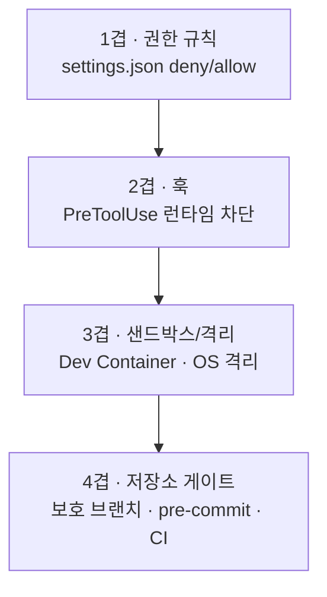

# 세션 07 — 안전하게 운영하기: 환경으로 강제하는 가드레일

> 트랙의 마지막 세션. 지금까지 코딩 에이전트를 **빠르게** 쓰는 법을 배웠다. 마지막은 ==안전==이다. 그런데 핵심은 이거다 — 안전은 "조심하자"는 **습관**이 아니라, ==프로젝트 환경 구성으로 강제==하는 것이다. 내가 쓰는 코딩 에이전트(하나의 **하네스**)를 설정·훅·샌드박스·저장소 게이트로 구조적으로 가둔다.
>
> [[chip:info: 기준 시점 2026-06]] 설정 키·문법은 버전마다 바뀐다. 아래는 ==대표 형태==이고, 정확한 스키마는 항상 공식 문서와 `/hooks`·`/permissions`로 확인한다.

## 학습 목표

- 안전을 습관이 아니라 ==설정으로 강제==하는 **4겹 방어**를 이해한다
- `settings.json` 권한 규칙(allow/deny/ask)으로 위험 명령·시크릿 접근을 차단한다
- **PreToolUse 훅**으로 deny 규칙이 못 잡는 동적 위험을 런타임에 차단한다
- **샌드박스·Dev Container**로 실행 환경 자체를 격리한다
- 보호 브랜치·pre-commit·CI 같은 ==저장소 차원 게이트==로 이중화한다
- 설정 계층(공유 vs 로컬 vs managed)으로 팀 전체에 정책을 강제한다

## 회차 타임라인 (총 90분)

| 시간 | 구간 | 내용 |
|------|------|------|
| 0–10분 | 프레이밍 | 습관 → 환경: 안전을 설정으로 강제 |
| 10–32분 | 1겹 | 권한 규칙(settings.json) + 설정 계층 |
| 32–52분 | 2겹 | 훅(PreToolUse)으로 런타임 차단 |
| 52–68분 | 3겹 | 샌드박스 · Dev Container 격리 |
| 68–80분 | 4겹 | 저장소 게이트(에이전트 밖) |
| 80–90분 | 정리 | 마지막 한 겹(습관) + 트랙 종합 |

---

## 1. 습관 → 환경: 왜 설정으로 강제하나

"위험한 명령은 조심하자"는 ==지침==이다. 지침은 샌다 — 바쁠 때, 자동 승인을 켰을 때, 새 팀원이 모를 때. 진짜 안전은 ==환경이 막아주는== 것이다. 벽에 "금고 열지 마시오" 안내문을 붙이는 것과, 금고를 ==잠그는== 것은 다르다.

> [!IMPORTANT] 이 세션의 한 줄
> ==가드레일은 프롬프트에 부탁하는 게 아니라, 프로젝트 환경에 박아 강제한다.== 내가 쓰는 코딩 에이전트는 모델+루프+컨텍스트+도구+권한의 묶음, 즉 **하네스**다. 그 하네스를 설정으로 가두는 게 안전 엔지니어링이다. (하네스를 직접 *설계*하는 건 심화 과정의 하네스 엔지니어링 세션에서 다룬다 — 여기선 *구성해 강제*한다.)

### 4겹 방어



| 겹 | 무엇을 막나 | 우회 가능성 |
|----|------------|------------|
| 1 권한 규칙 | 위험 도구·명령·파일을 ==정적 규칙==으로 | 규칙에 없는 변형은 통과 → 2겹 |
| 2 훅 | 규칙으로 못 쓰는 ==동적 패턴==(파이프·인자) | 스크립트 로직 한계 → 3겹 |
| 3 샌드박스 | 실행돼도 ==접근 범위==를 OS가 제한 | 격리 밖 자원 → 4겹 |
| 4 저장소 게이트 | 에이전트가 ==우회 못 하는== 최종선(push·머지) | — (사람·CI가 관문) |

> [!TIP] 겹쳐서 쓴다
> 한 겹은 반드시 구멍이 있다. ==deny + 훅 + 격리 + 저장소 게이트==를 겹치면, 한 겹을 뚫어도 다음 겹이 잡는다.

---

## 2. 1겹 — 권한 규칙 (`settings.json`)

코딩 에이전트는 보통 `.claude/settings.json`의 `permissions`로 ==무엇을 허용/차단/확인할지==를 규칙으로 정한다.

```json
// .claude/settings.json
{
  "permissions": {
    "deny": [
      "Bash(rm -rf *)",
      "Bash(git push --force *)",
      "Bash(git reset --hard *)",
      "Read(.env)",
      "Read(~/.ssh/**)"
    ],
    "ask": [
      "Bash(git push *)"
    ],
    "allow": [
      "Bash(npm run test)",
      "Bash(git commit *)"
    ]
  }
}
```

> [!IMPORTANT] deny가 최우선이다
> 평가 순서는 ==deny → ask → allow==. **deny에 걸리면 즉시 차단**되고, 어떤 allow도 이를 못 되살린다. 그래서 "위험 명령·시크릿 파일"은 deny에 박아두는 게 1차 방어다. (`Read(.env)`로 시크릿 읽기를 원천 차단)

### 설정 계층 — 어디에 두느냐가 곧 "누구에게 강제"

| 파일 | 범위 | git | 용도 |
|------|------|-----|------|
| `~/.claude/settings.json` | 내 모든 프로젝트 | ✗ | 개인 기본값 |
| `.claude/settings.json` | 이 저장소 전체 | ==✓ 커밋== | **팀 전체 강제**(권한·훅) |
| `.claude/settings.local.json` | 이 저장소·나만 | ✗(gitignore) | 개인 실험 |
| managed (조직 배포) | 조직 전체 | IT | ==오버라이드 불가== 정책 |

> [!TIP] 팀 가드레일은 커밋으로 강제
> `.claude/settings.json`을 ==저장소에 커밋==하면 deny 규칙이 팀 전원에게 적용된다. "각자 조심"이 아니라 "레포가 막는다". 개인 예외는 `settings.local.json`(gitignore)으로.

### 권한 모드 — 작업 위험도에 맞춰

| 모드 | 자동 실행 범위 | 언제 |
|------|---------------|------|
| `default` | 읽기만 | 일상·민감 작업(기본) |
| `plan` | 읽기·탐색만(수정 X) | 큰 변경 전 분석(세션 1) |
| `acceptEdits` | 파일 수정까지 | 신뢰되는 반복 편집 |
| `dontAsk` | `allow`된 것만 | CI·스크립트 |
| `bypassPermissions` | ==전부(검사 없음)== | **격리 환경에서만**(§4 Dev Container) |

---

## 3. 2겹 — 훅(PreToolUse)으로 런타임 차단

정적 규칙은 ==변형==을 못 잡는다(`rm -rf`는 막아도 `find . -delete`는?). **PreToolUse 훅**은 도구가 실행되기 ==직전== 스크립트를 돌려, 입력을 검사하고 막는다.

```json
// .claude/settings.json
{
  "hooks": {
    "PreToolUse": [
      {
        "matcher": "Bash",
        "hooks": [
          { "type": "command",
            "command": "${CLAUDE_PROJECT_DIR}/.claude/hooks/block-destructive.sh" }
        ]
      }
    ]
  }
}
```

```bash
#!/bin/bash
# .claude/hooks/block-destructive.sh
# 도구 입력은 stdin으로 JSON이 들어온다. jq로 명령을 꺼내 검사.
COMMAND=$(jq -r '.tool_input.command // ""')

if echo "$COMMAND" | grep -Eq '(rm[[:space:]]+-rf|find[[:space:]].*-delete|git[[:space:]]+push[[:space:]]+--force)'; then
  echo "파괴적/비가역 명령은 차단됩니다: $COMMAND" >&2
  exit 2   # ← exit 2 = 차단. stderr 메시지가 사용자에게 전달된다.
fi
exit 0
```

> [!NOTE] 차단 방식 (대표 형태 — 문서/`/hooks`로 확인)
> 가장 단순·안정적인 차단은 ==`exit 2`==(blocking error)다. stdout으로 JSON 결정(`{"hookSpecificOutput":{"permissionDecision":"deny", ...}}`)을 내보내는 방식도 있다. 정확한 필드는 버전에 따라 다르니 ==공식 hooks 문서를 확인==하고, 우선 exit 2부터 쓰면 된다.

> [!WARNING] 훅은 권한 규칙보다 약하다
> deny 규칙이 더 강하다(훅보다 먼저 차단). 그래서 ==정적으로 가능한 건 deny에==, deny로 표현 못 하는 동적 패턴만 훅으로 잡는 게 맞다. 둘은 경쟁이 아니라 ==보완==이다.

---

## 4. 3겹 — 샌드박스 · Dev Container 격리

규칙·훅을 뚫어도, ==실행 환경 자체를 격리==하면 피해가 갇힌다. 두 층위가 있다.

### (a) 내장 샌드박스 — 접근 범위를 OS가 제한

```json
// .claude/settings.json (대표 형태)
{
  "sandbox": {
    "enabled": true,
    "filesystem": {
      "allowWrite": ["./", "/tmp/build"],
      "denyRead": ["~/.aws", "~/.ssh"]
    },
    "network": { "allowedDomains": ["github.com", "registry.npmjs.org"] }
  }
}
```

- 기본: 쓰기는 작업 디렉터리+임시폴더로 제한, 시크릿 읽기 차단, 네트워크는 허용 도메인만.
- macOS(Seatbelt)·Linux(bubblewrap) OS 수준 강제. **Windows는 WSL2**.

### (b) Dev Container — 호스트에서 통째로 분리

```json
// .devcontainer/devcontainer.json
{
  "image": "mcr.microsoft.com/devcontainers/base:ubuntu",
  "features": { "ghcr.io/anthropics/devcontainer-features/claude-code:1.0": {} },
  "remoteUser": "node"
}
```

- 컨테이너 안에선 ==호스트 파일시스템·자격증명에 접근 불가==. 방화벽(init-firewall)으로 아웃바운드를 필수 도메인만 허용.
- ==격리됐을 때만== `bypassPermissions`(`--dangerously-skip-permissions`)가 안전하다 — 사고가 나도 컨테이너에 갇힌다.

> [!IMPORTANT] "전부 자동 승인"의 올바른 자리
> 빠르게 가려고 `bypassPermissions`를 켜고 싶다면, ==호스트가 아니라 격리 컨테이너 안==에서만. 호스트에서의 bypass는 한 번의 사고로 전체를 날린다.

---

## 5. 4겹 — 저장소 게이트 (에이전트 밖)

핵심 사실 하나 — ==에이전트 설정만으로는 잘못된 코드가 main에 들어가는 걸 막지 못한다==. 에이전트가 우회할 수 없는 ==플랫폼 차원==의 관문을 둔다.

| 게이트 | 무엇을 막나 | 어떻게 |
|--------|------------|--------|
| 보호 브랜치 | main 직접 push·강제 push | GitHub Branch protection(필수 리뷰·CI·관리자 포함) |
| pre-commit 훅 | 시크릿·금지 패턴 커밋 | `gitleaks`/lefthook/husky로 커밋 시 스캔 |
| CI 게이트 | 테스트·시크릿 스캔 미통과 머지 | PR에서 `gitleaks detect`·테스트 필수 |

```yaml
# .github/workflows/gate.yml (요지)
on: pull_request
jobs:
  scan:
    runs-on: ubuntu-latest
    steps:
      - uses: actions/checkout@v4
      - run: gitleaks detect --no-banner   # 시크릿 유출 차단
```

> [!TIP] 1~3겹은 "에이전트가 사고치는 것", 4겹은 "사고가 배포되는 것"을 막는다
> 둘은 층이 다르다. 에이전트가 실수해도, ==보호 브랜치+CI==가 마지막 관문에서 거른다. 에이전트를 신뢰하든 안 하든 이 관문은 늘 둔다.

---

## 6. 마지막 한 겹 — 습관·프롬프트 (보조)

설정·훅·격리·게이트를 깔았으면, 그 위에 ==보조==로 습관을 얹는다. 단, 이건 ==지침이지 강제가 아니다==.

- **외부 데이터 = 신뢰 불가**: fetch한 웹/이슈/의존성의 숨은 지시(프롬프트 인젝션)를 "정보"로만 취급. → 진짜 방어는 1겹의 `Read` deny·권한 최소화·3겹 네트워크 제한.
- **비가역 작업은 한 번 멈춰 확인**: 좋은 습관이지만, 정말 막아야 하면 §2 훅으로 강제.

> [!WARNING] 규칙 파일에 적었다고 막히는 게 아니다
> `CLAUDE.md`에 "rm 하지 마"라고 적는 건 ==지침==이다(세션 5). 항상 막으려면 ==`deny` 규칙·훅·보호 브랜치== 같은 강제 수단으로 이중화해야 한다. "적었으니 됐다"가 안전의 silent fail이다.

---

## 📚 실전 예제 모음

복붙해서 ==레포에 박아두는== 설정 모음이다. 위에서 아래로 갈수록 강하게 격리된다.

**① 팀 공유 권한 — `.claude/settings.json` (커밋)**

```json
{
  "permissions": {
    "deny": [
      "Bash(rm -rf *)", "Bash(git push --force *)",
      "Read(.env)", "Read(./secrets/**)", "Read(~/.ssh/**)"
    ],
    "ask": ["Bash(git push *)", "Bash(npm publish *)"],
    "allow": ["Bash(npm run *)", "Bash(git commit *)", "Bash(git status)"]
  }
}
```

**② 동적 위험 차단 훅 — `.claude/hooks/block-destructive.sh`** (§3의 스크립트 + settings의 `hooks.PreToolUse` 등록)

```bash
COMMAND=$(jq -r '.tool_input.command // ""')
echo "$COMMAND" | grep -Eq '(rm[[:space:]]+-rf|--force|DROP[[:space:]]+TABLE)' \
  && { echo "차단: $COMMAND" >&2; exit 2; }
exit 0
```

**③ 격리 실행 — `.devcontainer/devcontainer.json`** (호스트 분리 후에만 bypass)

```json
{
  "image": "mcr.microsoft.com/devcontainers/base:ubuntu",
  "features": { "ghcr.io/anthropics/devcontainer-features/claude-code:1.0": {} },
  "remoteUser": "node"
}
```

**④ 저장소 최종 관문 — 보호 브랜치 + 시크릿 스캔 CI**

```text
GitHub → Settings → Branches → main 보호:
  ✓ Require pull request review   ✓ Require status checks (CI)
  ✓ Include administrators        ✗ Allow force pushes
+ PR마다 gitleaks detect 로 시크릿 유출 차단
```

> [!TIP] 위험도에 맞춰 겹 수를 고른다
> 개인 토이 프로젝트면 ①②로 충분. 팀·프로덕션·민감 데이터면 ①②③④ 전부. ==위험이 클수록 격리를 강하게==.

## ✅ 한 문장 요약

> [!TIP] 한 문장 요약
> ==안전은 습관이 아니라 환경 구성으로 강제한다== — `settings.json` 권한(deny 우선)·PreToolUse 훅·샌드박스/Dev Container 격리·저장소 게이트의 4겹을 겹쳐, 코딩 에이전트라는 하네스를 구조적으로 가둔다. 위험도가 클수록 겹을 늘린다.

## 확인 문제

**Q1.** `CLAUDE.md`에 "rm -rf 쓰지 마"라고 적었는데도 에이전트가 실행했다. 무엇이 문제이고 제대로 강제하려면?

> **정답:** `CLAUDE.md`는 ==지침==이지 강제가 아니다. `settings.json`의 ==`deny: ["Bash(rm -rf *)"]`==(+ PreToolUse 훅)로 막는다.
> **해설:** deny 규칙은 평가 1순위로 즉시 차단된다. 규칙으로 표현 못 하는 변형은 훅으로 보완(§2·§6).

**Q2.** 팀 전원에게 동일한 위험 명령 차단을 적용하려면 권한 설정을 어디에 두나?

> **정답:** ==`.claude/settings.json`에 두고 저장소에 커밋==.
> **해설:** 공유 프로젝트 설정은 팀 전원에 적용된다. 개인 예외는 gitignore되는 `settings.local.json`, 조직 강제는 managed 설정(§2).

**Q3.** 빠르게 가려고 `bypassPermissions`(전부 자동 승인)를 쓰고 싶다. 안전하게 쓰는 유일한 조건은?

> **정답:** ==격리 환경(Dev Container/VM) 안에서만==.
> **해설:** 호스트에서의 bypass는 한 번의 사고로 전체를 날린다. 컨테이너로 호스트 파일시스템·자격증명을 분리하면 사고가 갇힌다(§4).

---

## 마무리

> [!IMPORTANT] 트랙을 마칩니다
> 일곱 세션을 끝까지 함께해주셔서 고맙습니다. 트랙 전체를 두 단어로 묶으면 — ==빠르게, 그리고 환경으로 안전하게==입니다. 세션 1~6에서 탐색→커밋 흐름을 명령·스킬·멀티 에이전트로 빠르게 굴리는 법을, 마지막 세션에서 그 힘을 ==설정·훅·격리·저장소 게이트==로 가두는 법을 익혔어요. 핵심은 하나예요 — 안전은 "조심하는 마음"이 아니라 ==레포에 박아 강제하는 환경==입니다. 강력한 도구일수록 핸들과 브레이크를 구조로 갖춰야 합니다. 이제 여러분의 레포에 첫 `deny` 규칙 한 줄부터 박아보세요. 그게 진짜 시작입니다.
