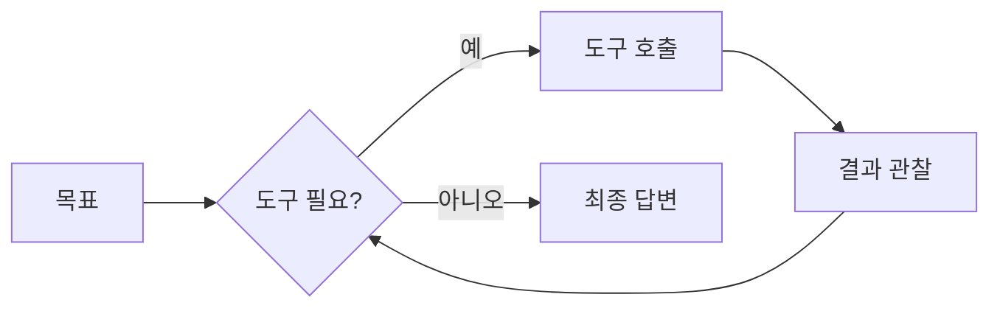
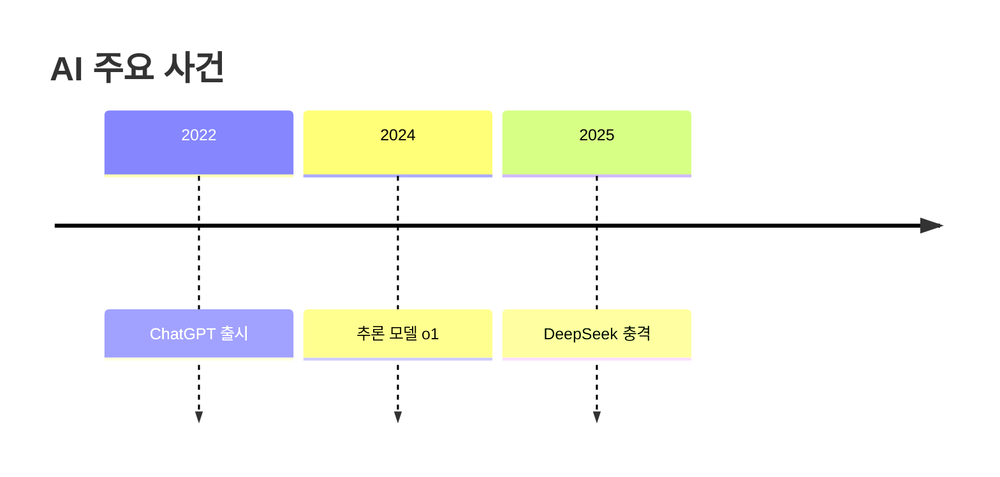

# 강의 자료 디자인 문법 가이드

두 사이트(기초/심화) 공통. 마크다운에 아래 문법을 쓰면 빌드된 HTML에서 자동으로 강조 요소로 렌더된다.
**원칙: 사실·수치·출처는 바꾸지 말고, 표현/강조만 강화한다. 과용 금지(가독성 우선).**

## 1. 콜아웃 박스
GitHub 스타일 alert. blockquote 첫 줄에 태그를 넣는다.

```markdown
> [!TIP] 선택적 제목
> 본문 내용. 여러 줄 가능.
```

종류: `[!TIP]`(초록) · `[!NOTE]`(파랑) · `[!IMPORTANT]`(인디고) · `[!WARNING]`(주황) · `[!EXAMPLE]`(보라) · `[!DANGER]`(빨강)

> 기존 이모지 blockquote(`> 💡 …`, `> ⚠️ …`)도 자동으로 콜아웃으로 매핑되지만, 신규 작성은 `[!TAG]` 사용 권장.

## 2. 형광 하이라이트 / 칩
- 형광: `==강조할 문구==` → 노란 형광펜
- 칩(배지): `[[chip: 라벨]]` 기본 / `[[chip:info: 라벨]]` / `[[chip:warn: 라벨]]` / `[[chip:new: 라벨]]`

예: `이것은 ==핵심== 입니다 [[chip:new: 2026]]`

## 3. KPI 카드 (수치 강조)
` ```kpi ` 코드펜스. 한 줄 = 카드 1개, `값 | 라벨 | 보조설명(선택)`.

````markdown
```kpi
5일 | 100만 사용자 돌파 | ChatGPT 출시 직후
1,445% | 멀티에이전트 문의 증가 | 2024 Q1 → 2025 Q2
30~50% | 코딩 시간 절감 | 에이전트 도입 보고
```
````

## 4. Mermaid 다이어그램
` ```mermaid ` 코드펜스. 플로우차트/타임라인/시퀀스 등.

````markdown

````

타임라인 예:
````markdown

````

## 5. 차트 (Chart.js)
` ```chart ` 코드펜스에 **Chart.js 네이티브 JSON config**. `caption` 키(선택)는 캡션으로 표시.

````markdown
```chart
{
  "type": "bar",
  "data": {
    "labels": ["OpenAI", "Anthropic", "Google"],
    "datasets": [{ "label": "컨텍스트(만 토큰)", "data": [100, 100, 105] }]
  },
  "caption": "2026년 5월 기준, 대략치"
}
````

> JSON은 **반드시 유효한 JSON**(키/문자열 큰따옴표). 색상은 생략 가능(기본 팔레트).

## 6. 표
일반 GFM 표를 쓰면 자동으로 헤더 컬러·zebra·라운드·가로스크롤이 적용된다. 추가 문법 불필요.

---
### 렌더 실패 시
Mermaid/Chart가 실패해도 페이지는 깨지지 않고 오류 메시지 또는 원본이 표시된다(graceful fallback). JSON/문법 오타 주의.
